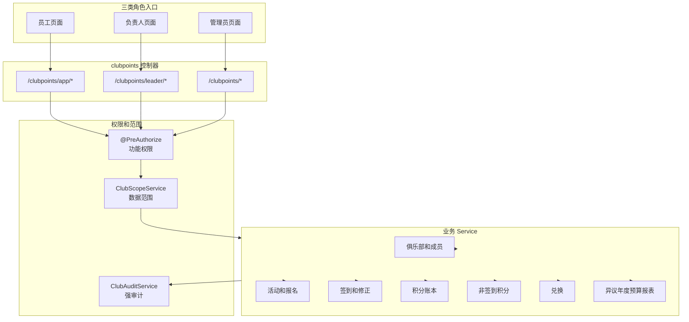
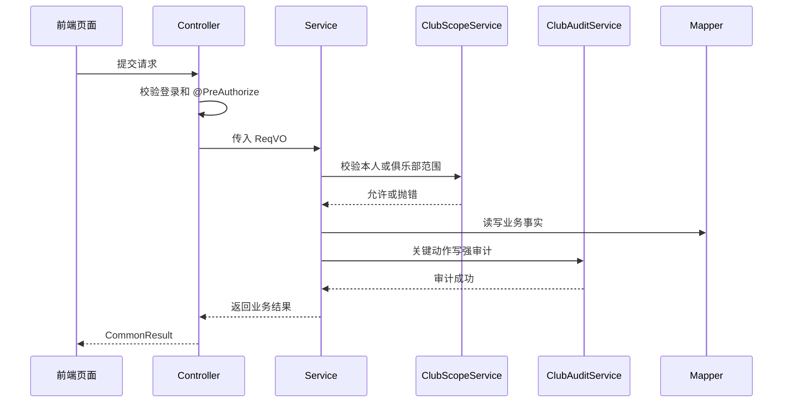

# 俱乐部员工积分系统 API 设计

## 设计结论

接口风格跟本地 `C:\jobs\ruoyi` 保持一致，不强行改成纯 REST 风格。

| 项 | 结论 |
| --- | --- |
| 返回包装 | 统一 `CommonResult<T>` |
| 分页返回 | 统一 `CommonResult<PageResult<T>>` |
| 分页入参 | 继承或复用芋道 `PageParam` 语义 |
| 创建路径 | `/create` |
| 修改路径 | `/update` |
| 详情路径 | `/get` |
| 分页路径 | `/page` |
| 删除路径 | `/delete`，允许物理删除但必须按业务规则保存快照 |
| 导出路径 | `/export-excel` |
| 员工自助前缀 | `/clubpoints/app/...` |
| 负责人前缀 | `/clubpoints/leader/...` |
| 管理员前缀 | `/clubpoints/...` 或 `/clubpoints/admin/...` |
| 功能权限 | 控制器使用 `@PreAuthorize("@ss.hasPermission('clubpoints:...')")` |
| 数据范围 | 服务层调用 `ClubScopeService` 显式校验 |
| 当前登录人 | 使用芋道 `SecurityFrameworkUtils.getLoginUserId()` |

接口设计必须接受一个事实：`v-hasPermi` 只能隐藏按钮，不能当权限系统。每个写接口和敏感读接口都必须在后端做功能权限和数据范围双重校验。

## 接口调用总图



## 通用约定

### 路径和控制器命名

| 入口 | 控制器包 | 路径前缀 | 用途 |
| --- | --- | --- | --- |
| 员工 | `controller/app` | `/clubpoints/app` | 员工本人操作和已加入俱乐部可见数据 |
| 负责人 | `controller/admin` | `/clubpoints/leader` | 负责人管理自己负责俱乐部 |
| 管理员 | `controller/admin` | `/clubpoints` | 管理员全局管理、审核、导出、审计 |

第一版即使三类角色共用一个 Vue3 后台，也建议后端路径保持三类入口分开。这样前端后续拆移动端或员工端时，不用重构业务接口。

### 响应格式

普通响应：

```java
CommonResult<T>
```

分页响应：

```java
CommonResult<PageResult<T>>
```

布尔动作响应：

```java
CommonResult<Boolean>
```

创建动作响应：

```java
CommonResult<Long>
```

导出响应直接写 `HttpServletResponse`，不包 `CommonResult`。

### 字段类型

| 业务类型 | Java 建议 | 前端 JSON | 说明 |
| --- | --- | --- | --- |
| 主键 ID | `Long` | number/string | 前端如有精度风险可按字符串处理 |
| 积分 | `Integer` | number | 积分按整数，不做小数 |
| 金额 | `Long` | number | 预算金额建议用分，展示时前端格式化 |
| 状态 | `Integer` | number | 配套枚举字典 |
| 时间点 | `LocalDateTime` | string | 业务口径统一按北京时间（Asia/Shanghai），格式按芋道全局配置 |
| 日期 | `LocalDate` | string | 年度、预算日期等 |
| 附件 | `AttachmentInputVO` | object | 支持文件和外部链接 |
| 强确认 | `StrongConfirmReqVO` | object | 仅物理删除俱乐部使用 |

### 分页查询基类

所有分页请求默认包含：

| 字段 | 类型 | 必填 | 说明 |
| --- | --- | --- | --- |
| `pageNo` | Integer | 是 | 页码 |
| `pageSize` | Integer | 是 | 每页条数 |

列表筛选时间段统一使用，筛选边界按北京时间（Asia/Shanghai）解释：

| 字段 | 类型 | 必填 | 说明 |
| --- | --- | --- | --- |
| `startTime` | LocalDateTime | 否 | 开始时间 |
| `endTime` | LocalDateTime | 否 | 结束时间 |

### 通用请求对象

`IdReqVO`：

| 字段 | 类型 | 必填 | 说明 |
| --- | --- | --- | --- |
| `id` | Long | 是 | 业务对象 ID |

`StrongConfirmReqVO`：

| 字段 | 类型 | 必填 | 说明 |
| --- | --- | --- | --- |
| `confirmText` | String | 是 | 前端要求用户输入或确认的文本 |
| `confirmedAt` | LocalDateTime | 是 | 用户完成强确认的时间 |

`AttachmentInputVO`：

| 字段 | 类型 | 必填 | 说明 |
| --- | --- | --- | --- |
| `type` | Integer | 是 | `1` 文件，`2` 外部链接 |
| `fileId` | Long | 否 | 文件 ID，文件类型必填 |
| `url` | String | 否 | 外部链接地址，链接类型必填 |
| `name` | String | 是 | 展示名称 |
| `remark` | String | 否 | 备注 |

`ReviewReqVO`：

| 字段 | 类型 | 必填 | 说明 |
| --- | --- | --- | --- |
| `id` | Long | 是 | 待审核对象 ID |
| `result` | Integer | 是 | `1` 通过，`2` 驳回 |
| `reason` | String | 驳回必填 | 审核意见 |

### 权限和范围调用序列



强审计失败时，当前业务动作必须失败并回滚。普通操作日志不能替代强审计。

### 幂等约定

| 场景 | 幂等键建议 | 要求 |
| --- | --- | --- |
| 活动结算 | `ACTIVITY_SETTLEMENT:{activityId}:{userId}:{itemType}` | 重跑不能重复发分 |
| 非签到积分审核通过 | `CONTRIBUTION:{materialId}:{itemId}:{userId}` | 审核重复提交不能重复发分 |
| 管理员代录积分 | `DIRECT_CONTRIBUTION:{requestNo}` | 前端重复提交不能重复发分 |
| 兑换申请 | `REDEMPTION_APPLY:{batchId}:{giftId}:{userId}:{requestNo}` | 重复点击不能重复冻结和锁库存 |
| 兑换审核通过 | `REDEMPTION_APPROVE:{applicationId}` | 重复审核不能重复扣减 |
| 年度清零 | `ANNUAL_CLEARING:{year}:{userId}` | 重跑不能重复清零 |
| 积分调整 | `LEDGER_ADJUST:{requestNo}` | 重复提交不能重复调整 |
| 撤销流水 | `LEDGER_REVERSE:{sourceTransactionId}` | 同一原流水不能重复撤销 |

Redis 幂等可以防重复点击，但积分事实必须由数据库唯一约束兜底。这里先定义业务幂等键，具体唯一约束放数据库设计文档。

## 状态和错误码

### 状态枚举

| 枚举 | 值建议 | 说明 |
| --- | --- | --- |
| 俱乐部状态 | `1` 启用，`2` 停用，`3` 已删除 | 已删除只用于历史快照展示 |
| 负责人状态 | `1` 有效，`2` 解除 | 允许多负责人 |
| 活动状态 | `1` 草稿，`2` 待审核，`3` 已驳回，`4` 已发布，`5` 已取消，`6` 已结束，`7` 已删除 | 员工只看已发布活动 |
| 报名状态 | `1` 已报名，`2` 已取消 | 取消的原因用取消原因枚举单独表达 |
| 取消原因 | `1` 员工自助，`2` 退出俱乐部自动，`3` 管理员移除，`4` 活动取消 | 仅已取消时有值；员工自助、退出俱乐部自动、活动取消都不计无故缺席 |
| 签到状态 | `0` 未签到，`1` 已签到 | 二元事实，结算只看是否已签到；签退状态同理 |
| 签到来源 | `1` 自助，`2` 补录，`3` 修正 | 仅已签到时有值；签退来源同理 |
| 结算状态 | `1` 待结算，`2` 结算中，`3` 已结算，`4` 结算失败，`5` 人工处理 | 后台任务可重试 |
| 流水方向 | `1` 增加，`2` 扣减 | 调整和撤销也是流水 |
| 冻结状态 | `1` 冻结中，`2` 已扣减，`3` 已释放 | 兑换申请驱动 |
| 材料状态 | `1` 草稿，`2` 待审核，`3` 已撤回，`4` 已驳回，`5` 已通过，`6` 已删除 | 审核通过后附件锁定 |
| 兑换申请状态 | `1` 待审核，`2` 已取消，`3` 已通过，`4` 已拒绝 | 通过即发放，不做领取状态 |
| 异议状态 | `1` 待处理，`2` 已回复，`3` 已关闭 | 需要积分变化时走调整或撤销 |

### 错误码分组

错误码具体数字按芋道格式 `new ErrorCode(1_0XX_YYY_ZZZ, "...")` 分配，clubpoints 领 `1_300_000_000` 段（避开芋道已占段，system 占 `1_002_xxx_xxx`），统一放模块内 `enums/ErrorCodeConstants.java`。这里先定错误语义。

| 错误码名 | 触发场景 | 前端处理 |
| --- | --- | --- |
| `CLUB_NOT_FOUND` | 俱乐部不存在或已物理删除 | 提示并刷新列表 |
| `CLUB_DISABLED` | 俱乐部已停用 | 禁止加入和新建活动 |
| `CLUB_SCOPE_DENIED` | 访问非本人、非负责俱乐部数据或无权限操作俱乐部 | 提示无权限 |
| `CLUB_ALREADY_JOINED` | 重复加入俱乐部 | 提示已加入 |
| `CLUB_NOT_MEMBER` | 未加入俱乐部访问内部活动 | 提示先加入 |
| `CLUB_LEADER_ALREADY_EXISTS` | 重复设置负责人 | 提示已是负责人 |
| `CLUB_LEADER_NOT_EXISTS` | 移除或查询不存在的负责人关系 | 提示负责人不存在并刷新 |
| `CLUB_STRONG_CONFIRM_INVALID` | 物理删除俱乐部强确认文本或时间无效 | 提示重新强确认 |
| `CLUB_DELETE_HAS_REFERENCES` | 俱乐部已有成员、活动、流水、材料、排名或激励等历史关联 | 禁止物理删除，提示保留历史 |
| `CLUB_CODE_DUPLICATED` | 俱乐部编号重复 | 提示更换编号 |
| `CLUB_NAME_DUPLICATED` | 俱乐部名称重复 | 提示更换名称 |
| `ACTIVITY_NOT_FOUND` | 活动不存在或已删除 | 提示并刷新列表 |
| `ACTIVITY_NOT_PUBLISHED` | 员工访问草稿、待审或驳回活动 | 提示不可见 |
| `ACTIVITY_REVIEW_STATE_INVALID` | 审核状态不允许当前动作 | 刷新详情 |
| `ACTIVITY_REGISTRATION_CLOSED` | 当前时间超过报名截止 | 禁止报名 |
| `ACTIVITY_CANCEL_WINDOW_CLOSED` | 当前时间超过取消窗口 | 禁止取消报名 |
| `REGISTRATION_NOT_FOUND` | 报名记录不存在、已取消或不属于本人 | 提示刷新报名记录 |
| `ATTENDANCE_WINDOW_CLOSED` | 不在签到或签退窗口 | 提示窗口时间 |
| `ATTENDANCE_ALREADY_EXISTS` | 重复签到或签退 | 显示已有记录 |
| `SETTLEMENT_ALREADY_DONE` | 活动已结算，不能改原流水 | 引导走调整或撤销 |
| `LEDGER_INSUFFICIENT_AVAILABLE` | 可用积分不足 | 禁止兑换或扣减 |
| `LEDGER_TRANSACTION_IMMUTABLE` | 尝试修改原流水 | 后端拒绝 |
| `CONTRIBUTION_REVIEW_STATE_INVALID` | 材料状态不允许审核或撤回 | 刷新详情 |
| `ATTACHMENT_LOCKED` | 审核通过后上传人替换附件 | 禁止操作 |
| `REDEMPTION_BATCH_CLOSED` | 兑换批次未开放或已关闭 | 禁止申请 |
| `REDEMPTION_GIFT_STOCK_NOT_ENOUGH` | 礼品库存不足 | 显示已兑完或库存不足 |
| `REDEMPTION_APPLICATION_STATE_INVALID` | 兑换申请状态不允许取消或审核 | 刷新详情 |
| `RULE_VERSION_INVALID` | 规则版本未发布、停用或不适用 | 提示规则不可用 |
| `AUDIT_WRITE_FAILED` | 强审计写入失败 | 业务失败 |
| `IDEMPOTENT_CONFLICT` | 同一幂等键重复但参数不一致 | 提示重复请求异常 |

## 员工端接口

### 员工工作台和积分

| 功能 | 方法 | 路径 | 权限 | 范围校验 |
| --- | --- | --- | --- | --- |
| 我的工作台 | `GET` | `/clubpoints/app/dashboard/summary` | 登录 | 本人 |
| 我的积分概览 | `GET` | `/clubpoints/app/ledger/summary` | 登录 | 本人 |
| 我的积分流水 | `GET` | `/clubpoints/app/ledger/page` | 登录 | 本人 |
| 我的通知 | `GET` | `/clubpoints/app/notify/my-page` | 登录 | 本人 |
| 标记通知已读 | `PUT` | `/clubpoints/app/notify/update-read` | 登录 | 本人 |

`AppDashboardSummaryRespVO`：

| 字段 | 类型 | 说明 |
| --- | --- | --- |
| `availablePoints` | Integer | 当前可用积分 |
| `frozenPoints` | Integer | 当前冻结积分 |
| `totalEarnedPoints` | Integer | 年度累计获取积分 |
| `joinedClubCount` | Integer | 已加入俱乐部数量 |
| `registeredActivityCount` | Integer | 已报名未结束活动数量 |
| `pendingRedemptionCount` | Integer | 待审核兑换申请数量 |
| `unreadNotifyCount` | Integer | 未读通知数 |

`LedgerSummaryRespVO`：

| 字段 | 类型 | 说明 |
| --- | --- | --- |
| `availablePoints` | Integer | 当前可用积分 |
| `frozenPoints` | Integer | 冻结积分 |
| `totalPositivePoints` | Integer | 累计增加积分 |
| `totalNegativePoints` | Integer | 累计扣减积分 |
| `annualClearedPoints` | Integer | 年度已清零积分 |
| `lastTransactionTime` | LocalDateTime | 最近流水时间 |

`LedgerTransactionPageReqVO`：

| 字段 | 类型 | 必填 | 说明 |
| --- | --- | --- | --- |
| `pageNo` | Integer | 是 | 页码 |
| `pageSize` | Integer | 是 | 每页条数 |
| `direction` | Integer | 否 | `1` 增加，`2` 扣减 |
| `pointCategory` | Integer | 否 | 积分类型，来源统计按此筛选 |
| `sourceType` | Integer | 否 | 活动、非签到、兑换、调整、年度清零等 |
| `clubId` | Long | 否 | 来源俱乐部 |
| `startTime` | LocalDateTime | 否 | 业务发生开始时间，按 `occurred_at`（非登记时间）|
| `endTime` | LocalDateTime | 否 | 业务发生结束时间，按 `occurred_at` |

`LedgerTransactionRespVO`：

| 字段 | 类型 | 说明 |
| --- | --- | --- |
| `id` | Long | 流水 ID |
| `direction` | Integer | 方向 |
| `points` | Integer | 积分值 |
| `pointCategory` | Integer | 积分类型：基础参与/主动贡献/特殊奖励/积分扣除/兑换/清零 |
| `sourceType` | Integer | 来源类型 |
| `sourceId` | Long | 来源对象 ID |
| `issuingClubId` | Long | 发放俱乐部 ID，可为空 |
| `issuingClubNameSnapshot` | String | 发放俱乐部名称快照 |
| `ruleVersionId` | Long | 规则版本 ID |
| `evidenceType` | Integer | 证明材料类型：system_checkin/photo/document/admin_confirmed |
| `reason` | String | 原因 |
| `materialSummary` | String | 材料摘要 |
| `occurredTime` | LocalDateTime | 业务发生时间（`occurred_at`）|
| `createdTime` | LocalDateTime | 记录创建时间，仅展示与审计 |
| `reversed` | Boolean | 是否已被撤销 |
| `reverseTransactionId` | Long | 撤销流水 ID |

积分流水只携带本笔增减，不携带“可用积分 after”。可用积分 = 账户净积分 − 当前冻结，是账户级实时值；冻结增减不产生流水，所以可用积分不是单条流水的函数，不能快照到流水行上。员工当前可用、冻结、净积分统一在概览接口 `/clubpoints/app/ledger/summary` 展示。

时间口径：流水有 `occurredTime`（业务发生）、`createdTime`（记录创建）两个时间。**周期筛选、来源统计、年度归属、俱乐部排名一律按 `occurred_at`**（`createdTime` 只用于展示登记时间和审计）。补登记或补结算导致 `created_at` 晚于 `occurred_at` 时，仍按 `occurred_at` 归属原周期。

### 员工俱乐部

| 功能 | 方法 | 路径 | 权限 | 范围校验 |
| --- | --- | --- | --- | --- |
| 我的俱乐部 | `GET` | `/clubpoints/app/club/my-list` | 登录 | 本人 |
| 可加入俱乐部 | `GET` | `/clubpoints/app/club/joinable-page` | 登录 | 本人 |
| 加入俱乐部 | `POST` | `/clubpoints/app/club/join` | `clubpoints:club-member:join` | 本人 |
| 退出俱乐部 | `POST` | `/clubpoints/app/club/exit` | `clubpoints:club-member:exit` | 本人 |
| 俱乐部成员 | `GET` | `/clubpoints/app/club/member-page` | `clubpoints:club-member:query` | 已加入俱乐部 |

`ClubJoinReqVO`：

| 字段 | 类型 | 必填 | 说明 |
| --- | --- | --- | --- |
| `clubId` | Long | 是 | 俱乐部 ID |

`ClubExitReqVO`：

| 字段 | 类型 | 必填 | 说明 |
| --- | --- | --- | --- |
| `clubId` | Long | 是 | 俱乐部 ID |

退出俱乐部后，系统自动取消该俱乐部下员工已报名但未开始或可取消的活动。业务不扣分。

`ClubRespVO`：

| 字段 | 类型 | 说明 |
| --- | --- | --- |
| `id` | Long | 俱乐部 ID |
| `name` | String | 俱乐部名称 |
| `status` | Integer | 状态 |
| `description` | String | 介绍 |
| `memberCount` | Integer | 成员数量 |
| `leaderNames` | List<String> | 负责人名称 |
| `joined` | Boolean | 当前员工是否已加入 |
| `joinedTime` | LocalDateTime | 加入时间 |

`ClubMemberRespVO`：

| 字段 | 类型 | 说明 |
| --- | --- | --- |
| `userId` | Long | 员工用户 ID |
| `nickname` | String | 姓名或昵称 |
| `deptName` | String | 部门 |
| `mobile` | String | 手机号或联系方式 |
| `availablePoints` | Integer | 当前可用积分 |
| `joinedTime` | LocalDateTime | 加入时间 |
| `leader` | Boolean | 是否负责人 |

员工只能看已加入俱乐部的成员名单。历史已退出俱乐部时，员工只能看自己参与过的历史活动和流水，不能再看新活动和成员名单。

### 员工活动、报名、签到

| 功能 | 方法 | 路径 | 权限 | 范围校验 |
| --- | --- | --- | --- | --- |
| 俱乐部活动分页 | `GET` | `/clubpoints/app/activity/page` | 登录 | 已加入俱乐部 |
| 活动详情 | `GET` | `/clubpoints/app/activity/get` | 登录 | 已加入俱乐部或本人历史参与 |
| 我的参与历史 | `GET` | `/clubpoints/app/activity/my-history-page` | 登录 | 本人 |
| 报名活动 | `POST` | `/clubpoints/app/registration/create` | `clubpoints:registration:create` | 已加入俱乐部 |
| 取消报名 | `POST` | `/clubpoints/app/registration/cancel` | `clubpoints:registration:cancel` | 本人 |
| 我的报名 | `GET` | `/clubpoints/app/registration/my-page` | 登录 | 本人 |
| 签到 | `POST` | `/clubpoints/app/attendance/check-in` | `clubpoints:attendance:check-in` | 本人报名记录 |
| 签退 | `POST` | `/clubpoints/app/attendance/check-out` | `clubpoints:attendance:check-out` | 本人报名记录 |

`AppActivityPageReqVO`：

| 字段 | 类型 | 必填 | 说明 |
| --- | --- | --- | --- |
| `pageNo` | Integer | 是 | 页码 |
| `pageSize` | Integer | 是 | 每页条数 |
| `clubId` | Long | 否 | 俱乐部 ID，不传则查已加入俱乐部 |
| `keyword` | String | 否 | 活动名称关键词 |
| `activityStatus` | Integer | 否 | 员工端默认只返回已发布、已结束、已取消中可见范围 |
| `startTime` | LocalDateTime | 否 | 活动开始时间 |
| `endTime` | LocalDateTime | 否 | 活动结束时间 |

`ActivityRespVO`：

| 字段 | 类型 | 说明 |
| --- | --- | --- |
| `id` | Long | 活动 ID |
| `clubId` | Long | 所属俱乐部 |
| `clubNameSnapshot` | String | 俱乐部名称快照 |
| `title` | String | 活动标题 |
| `description` | String | 活动说明 |
| `location` | String | 活动地点 |
| `startTime` | LocalDateTime | 开始时间 |
| `endTime` | LocalDateTime | 结束时间 |
| `registrationDeadline` | LocalDateTime | 报名截止时间 |
| `cancelDeadline` | LocalDateTime | 员工取消报名截止时间 |
| `checkInWindowStart` | LocalDateTime | 签到窗口开始 |
| `checkInWindowEnd` | LocalDateTime | 签到窗口结束 |
| `checkOutWindowStart` | LocalDateTime | 签退窗口开始 |
| `checkOutWindowEnd` | LocalDateTime | 签退窗口结束 |
| `basePoints` | Integer | 基础参与积分 |
| `fullAttendanceExtraPoints` | Integer | 全程参与额外积分 |
| `status` | Integer | 活动状态 |
| `registered` | Boolean | 当前员工是否已报名 |
| `registrationStatus` | Integer | 当前员工报名状态：已报名 / 已取消 |
| `checkInStatus` | Integer | 当前员工签到状态：未签到 / 已签到 |
| `checkInSource` | Integer | 当前员工签到来源：自助 / 补录 / 修正 |
| `checkOutStatus` | Integer | 当前员工签退状态：未签退 / 已签退 |
| `checkOutSource` | Integer | 当前员工签退来源：自助 / 补录 / 修正 |
| `settlementStatus` | Integer | 结算状态 |

`RegistrationCreateReqVO`：

| 字段 | 类型 | 必填 | 说明 |
| --- | --- | --- | --- |
| `activityId` | Long | 是 | 活动 ID |

报名资格按当前有效报名截止时间判断。活动延期后，员工取消窗口随之顺延；活动提前后，取消窗口按新时间收紧。

`RegistrationCancelReqVO`：

| 字段 | 类型 | 必填 | 说明 |
| --- | --- | --- | --- |
| `registrationId` | Long | 是 | 报名 ID |
| `reason` | String | 否 | 取消原因 |

`AttendanceCheckReqVO`：

| 字段 | 类型 | 必填 | 说明 |
| --- | --- | --- | --- |
| `registrationId` | Long | 是 | 报名 ID |
| `clientTime` | LocalDateTime | 是 | 前端当前时间，仅用于辅助展示，不作为事实时间 |
| `locationText` | String | 否 | 位置文本，第一版不做强定位 |
| `remark` | String | 否 | 备注 |

签到签退从本人报名记录进入。后端按 `registrationId` 加载本人报名记录和对应活动窗口，并按服务端北京时间（Asia/Shanghai）判断窗口，不能信任 `clientTime`。

### 员工兑换

| 功能 | 方法 | 路径 | 权限 | 范围校验 |
| --- | --- | --- | --- | --- |
| 开放批次分页 | `GET` | `/clubpoints/app/redemption/batch-page` | 登录 | 本人 |
| 礼品分页 | `GET` | `/clubpoints/app/redemption/gift-page` | 登录 | 本人 |
| 提交兑换 | `POST` | `/clubpoints/app/redemption/apply` | `clubpoints:redemption:apply` | 本人 |
| 取消兑换 | `POST` | `/clubpoints/app/redemption/cancel` | `clubpoints:redemption:cancel-own` | 本人 |
| 我的兑换 | `GET` | `/clubpoints/app/redemption/my-page` | 登录 | 本人 |

`RedemptionApplyReqVO`：

| 字段 | 类型 | 必填 | 说明 |
| --- | --- | --- | --- |
| `batchId` | Long | 是 | 兑换批次 ID |
| `giftId` | Long | 是 | 礼品 ID |
| `quantity` | Integer | 是 | 数量，第一版通常为 `1` |
| `requestNo` | String | 是 | 前端生成请求号，用于幂等 |
| `remark` | String | 否 | 备注 |

提交兑换申请时，后端必须同事务完成资格校验、可用积分校验、冻结积分、锁定库存、创建申请。库存不足时，前端显示“已兑完/库存不足”，不能继续提交。

`RedemptionApplicationRespVO`：

| 字段 | 类型 | 说明 |
| --- | --- | --- |
| `id` | Long | 申请 ID |
| `batchId` | Long | 批次 ID |
| `batchNameSnapshot` | String | 批次名称快照 |
| `giftId` | Long | 礼品 ID |
| `giftNameSnapshot` | String | 礼品名称快照 |
| `pointsCostSnapshot` | Integer | 兑换积分快照 |
| `quantity` | Integer | 数量 |
| `frozenPoints` | Integer | 冻结积分 |
| `status` | Integer | 申请状态 |
| `applyTime` | LocalDateTime | 申请时间 |
| `reviewTime` | LocalDateTime | 审核时间 |
| `reviewReason` | String | 审核意见 |

`RedemptionCancelReqVO`：

| 字段 | 类型 | 必填 | 说明 |
| --- | --- | --- | --- |
| `id` | Long | 是 | 兑换申请 ID |
| `reason` | String | 否 | 取消原因 |

审核前可以取消，取消后释放冻结积分和锁定库存。审核通过后不能取消。

### 员工异议

| 功能 | 方法 | 路径 | 权限 | 范围校验 |
| --- | --- | --- | --- | --- |
| 提交异议 | `POST` | `/clubpoints/app/dispute/create` | 登录 | 本人 |
| 我的异议 | `GET` | `/clubpoints/app/dispute/my-page` | 登录 | 本人 |
| 异议详情 | `GET` | `/clubpoints/app/dispute/get` | 登录 | 本人 |

`DisputeCreateReqVO`：

| 字段 | 类型 | 必填 | 说明 |
| --- | --- | --- | --- |
| `targetType` | Integer | 是 | 关联对象类型：流水、活动、兑换等 |
| `targetId` | Long | 是 | 关联对象 ID |
| `content` | String | 是 | 异议内容 |
| `attachments` | List<AttachmentInputVO> | 否 | 附件或链接 |

`DisputeRespVO`：

| 字段 | 类型 | 说明 |
| --- | --- | --- |
| `id` | Long | 异议 ID |
| `targetType` | Integer | 关联对象类型 |
| `targetId` | Long | 关联对象 ID |
| `content` | String | 异议内容 |
| `status` | Integer | 状态 |
| `replyContent` | String | 管理员回复 |
| `relatedTransactionId` | Long | 关联调整或撤销流水 |
| `createdTime` | LocalDateTime | 提交时间 |
| `handledTime` | LocalDateTime | 处理时间 |

## 负责人端接口

### 负责人工作台和俱乐部运营

| 功能 | 方法 | 路径 | 权限 | 范围校验 |
| --- | --- | --- | --- | --- |
| 负责人首页 | `GET` | `/clubpoints/leader/dashboard/summary` | `clubpoints:leader` | 负责俱乐部 |
| 负责俱乐部列表 | `GET` | `/clubpoints/leader/club/my-managed-list` | `clubpoints:club-leader` | 负责俱乐部 |
| 俱乐部详情 | `GET` | `/clubpoints/leader/club/get` | `clubpoints:club-leader` | 负责俱乐部 |
| 修改俱乐部信息 | `PUT` | `/clubpoints/leader/club/update` | `clubpoints:club:update` | 负责俱乐部 |
| 成员分页 | `GET` | `/clubpoints/leader/member/page` | `clubpoints:club-member:query` | 负责俱乐部 |
| 成员积分摘要 | `GET` | `/clubpoints/leader/ledger/member-summary-page` | `clubpoints:leader` | 负责俱乐部发放来源 |
| 负责俱乐部积分流水 | `GET` | `/clubpoints/leader/ledger/transaction-page` | `clubpoints:leader` | 负责俱乐部发放来源 |

负责人账本范围：负责人只能查询自己负责俱乐部作为 `issuingClubId` 发放来源产生的积分流水，以及基于该来源汇总出的成员积分摘要。这里“他人/其他”不是指本俱乐部分发给成员的积分，而是指其他俱乐部、无俱乐部来源或全局调整来源；即使某员工是该俱乐部成员，负责人也不能通过本接口查看该员工这些来源下的流水原因、材料和来源快照。

`LeaderDashboardSummaryRespVO`：

| 字段 | 类型 | 说明 |
| --- | --- | --- |
| `managedClubCount` | Integer | 负责俱乐部数量 |
| `draftActivityCount` | Integer | 活动草稿数量 |
| `rejectedActivityCount` | Integer | 被驳回活动数量 |
| `attendanceExceptionCount` | Integer | 签到异常数量 |
| `pendingContributionSubmitCount` | Integer | 待提交材料数量 |
| `todoCount` | Integer | 待办数量 |

`LeaderClubUpdateReqVO`：

| 字段 | 类型 | 必填 | 说明 |
| --- | --- | --- | --- |
| `id` | Long | 是 | 俱乐部 ID |
| `name` | String | 否 | 俱乐部名称 |
| `description` | String | 否 | 介绍 |
| `contactText` | String | 否 | 联系方式展示文本 |
| `coverFileId` | Long | 否 | 封面文件 |

负责人不能创建、停用、删除俱乐部，也不能维护负责人。俱乐部创建、停用、删除和负责人任免只归管理员。

### 负责人活动管理

| 功能 | 方法 | 路径 | 权限 | 范围校验 |
| --- | --- | --- | --- | --- |
| 活动分页 | `GET` | `/clubpoints/leader/activity/page` | `clubpoints:activity:query` | 负责俱乐部 |
| 活动详情 | `GET` | `/clubpoints/leader/activity/get` | `clubpoints:activity:query` | 负责俱乐部 |
| 创建活动草稿 | `POST` | `/clubpoints/leader/activity/create` | `clubpoints:activity:create` | 负责俱乐部 |
| 修改活动 | `PUT` | `/clubpoints/leader/activity/update` | `clubpoints:activity:update` | 负责俱乐部 |
| 提交发布审核 | `POST` | `/clubpoints/leader/activity/submit` | `clubpoints:activity:submit` | 负责俱乐部 |
| 撤回待审活动 | `POST` | `/clubpoints/leader/activity/withdraw` | `clubpoints:activity:submit` | 负责俱乐部 |
| 取消活动 | `POST` | `/clubpoints/leader/activity/cancel` | `clubpoints:activity:cancel` | 负责俱乐部 |
| 物理删除活动 | `DELETE` | `/clubpoints/leader/activity/delete` | `clubpoints:activity:delete` | 负责俱乐部 |

`ActivitySaveReqVO`：

| 字段 | 类型 | 必填 | 说明 |
| --- | --- | --- | --- |
| `id` | Long | 修改必填 | 活动 ID |
| `clubId` | Long | 创建必填 | 所属俱乐部 |
| `title` | String | 是 | 标题 |
| `description` | String | 是 | 说明 |
| `location` | String | 否 | 地点 |
| `startTime` | LocalDateTime | 是 | 开始时间 |
| `endTime` | LocalDateTime | 是 | 结束时间 |
| `registrationDeadline` | LocalDateTime | 是 | 报名截止 |
| `cancelDeadline` | LocalDateTime | 是 | 取消报名截止 |
| `checkInStartOffsetMinutes` | Integer | 是 | 活动开始前后多少分钟开始签到 |
| `checkInEndOffsetMinutes` | Integer | 是 | 活动开始前后多少分钟结束签到 |
| `checkOutMode` | Integer | 是 | `1` 活动结束前后，`2` 活动开始后多少时间 |
| `checkOutStartOffsetMinutes` | Integer | 是 | 签退窗口开始偏移 |
| `checkOutEndOffsetMinutes` | Integer | 是 | 签退窗口结束偏移 |
| `basePoints` | Integer | 是 | 基础参与积分 |
| `fullAttendanceExtraPoints` | Integer | 否 | 全程参与额外积分 |
| `ruleVersionId` | Long | 是 | 规则版本 |
| `attachments` | List<AttachmentInputVO> | 否 | 活动附件 |

活动发布后负责人和管理员都可以直接改普通信息。关键信息也可改，但必须写审计，不需要管理员审核。

`ActivitySubmitReqVO`：

| 字段 | 类型 | 必填 | 说明 |
| --- | --- | --- | --- |
| `id` | Long | 是 | 活动 ID |
| `submitRemark` | String | 否 | 提交说明 |

活动发布审核失败后，员工不可见。负责人可以修改并重新提交；管理员也可以直接修改并发布。

`ActivityCancelReqVO`：

| 字段 | 类型 | 必填 | 说明 |
| --- | --- | --- | --- |
| `id` | Long | 是 | 活动 ID |

负责人可直接取消活动，不需要管理员审核；管理员也可以取消。取消不自动扣员工积分。

### 负责人报名、签到和修正

| 功能 | 方法 | 路径 | 权限 | 范围校验 |
| --- | --- | --- | --- | --- |
| 报名名单 | `GET` | `/clubpoints/leader/registration/page` | `clubpoints:registration:query` | 负责俱乐部 |
| 签到签退分页 | `GET` | `/clubpoints/leader/attendance/page` | `clubpoints:attendance:query` | 负责俱乐部 |
| 补录签到签退 | `POST` | `/clubpoints/leader/attendance/supplement` | `clubpoints:attendance:correct` | 负责俱乐部 |
| 修正签到签退 | `POST` | `/clubpoints/leader/attendance/correct` | `clubpoints:attendance:correct` | 负责俱乐部 |

`AttendanceRecordRespVO`：

| 字段 | 类型 | 说明 |
| --- | --- | --- |
| `registrationId` | Long | 报名 ID |
| `activityId` | Long | 活动 ID |
| `userId` | Long | 员工 ID |
| `nickname` | String | 姓名 |
| `deptName` | String | 部门 |
| `registrationStatus` | Integer | 报名状态：已报名 / 已取消 |
| `cancelReason` | Integer | 取消原因，仅已取消时有值 |
| `checkInStatus` | Integer | 签到状态：未签到 / 已签到 |
| `checkInSource` | Integer | 签到来源：自助 / 补录 / 修正，仅已签到时有值 |
| `checkInTime` | LocalDateTime | 签到时间 |
| `checkOutStatus` | Integer | 签退状态：未签退 / 已签退 |
| `checkOutSource` | Integer | 签退来源：自助 / 补录 / 修正，仅已签退时有值 |
| `checkOutTime` | LocalDateTime | 签退时间 |
| `settlementStatus` | Integer | 结算状态 |

`AttendanceSupplementReqVO`：

| 字段 | 类型 | 必填 | 说明 |
| --- | --- | --- | --- |
| `activityId` | Long | 是 | 活动 ID |
| `registrationId` | Long | 是 | 报名 ID |
| `userId` | Long | 是 | 员工 ID |
| `targetType` | Integer | 是 | `1` 签到，`2` 签退 |
| `recordTime` | LocalDateTime | 是 | 补录时间 |
| `reason` | String | 是 | 原因 |
| `attachments` | List<AttachmentInputVO> | 否 | 材料 |

`AttendanceCorrectReqVO`：

| 字段 | 类型 | 必填 | 说明 |
| --- | --- | --- | --- |
| `recordId` | Long | 是 | 原签到或签退记录 ID |
| `newRecordTime` | LocalDateTime | 是 | 修正后的时间 |
| `reason` | String | 是 | 修正原因 |
| `attachments` | List<AttachmentInputVO> | 否 | 材料 |

签到签退记录可以由负责人和管理员修改。结算前修改影响后续结算；结算后修改不能改原流水，只能由管理员通过补发、撤销或调整流水处理。

### 负责人非签到积分材料

| 功能 | 方法 | 路径 | 权限 | 范围校验 |
| --- | --- | --- | --- | --- |
| 材料分页 | `GET` | `/clubpoints/leader/contribution/page` | `clubpoints:contribution:query` | 负责俱乐部 |
| 保存草稿 | `POST` | `/clubpoints/leader/contribution/create` | `clubpoints:contribution:submit` | 负责俱乐部 |
| 修改材料 | `PUT` | `/clubpoints/leader/contribution/update` | `clubpoints:contribution:submit` | 负责俱乐部 |
| 提交材料 | `POST` | `/clubpoints/leader/contribution/submit` | `clubpoints:contribution:submit` | 负责俱乐部 |
| 撤回材料 | `POST` | `/clubpoints/leader/contribution/withdraw` | `clubpoints:contribution:withdraw` | 负责俱乐部 |
| 物理删除材料 | `DELETE` | `/clubpoints/leader/contribution/delete` | `clubpoints:contribution:delete` | 负责俱乐部 |

`ContributionSaveReqVO`：

| 字段 | 类型 | 必填 | 说明 |
| --- | --- | --- | --- |
| `id` | Long | 修改必填 | 材料 ID |
| `clubId` | Long | 是 | 俱乐部 ID |
| `type` | Integer | 是 | 宣传、策划、特殊贡献等 |
| `title` | String | 是 | 材料标题 |
| `description` | String | 是 | 材料说明 |
| `ruleVersionId` | Long | 是 | 规则版本 |
| `items` | List<ContributionItemReqVO> | 是 | 积分明细 |
| `attachments` | List<AttachmentInputVO> | 否 | 材料附件或链接 |

`ContributionItemReqVO`：

| 字段 | 类型 | 必填 | 说明 |
| --- | --- | --- | --- |
| `userId` | Long | 是 | 员工 ID |
| `points` | Integer | 是 | 申请积分 |
| `reason` | String | 是 | 发放原因 |
| `materialSummary` | String | 否 | 材料摘要 |

目前所有非签到类积分材料都由俱乐部负责人提交，管理员审核。员工不提交这类材料。

## 管理员端接口

### 管理员俱乐部和成员

| 功能 | 方法 | 路径 | 权限 | 范围校验 |
| --- | --- | --- | --- | --- |
| 俱乐部分页 | `GET` | `/clubpoints/club/page` | `clubpoints:club:query` | 管理员 |
| 俱乐部详情 | `GET` | `/clubpoints/club/get` | `clubpoints:club:query` | 管理员 |
| 创建俱乐部 | `POST` | `/clubpoints/club/create` | `clubpoints:club:create` | 管理员 |
| 修改俱乐部 | `PUT` | `/clubpoints/club/update` | `clubpoints:club:update` | 管理员 |
| 停用俱乐部 | `POST` | `/clubpoints/club/disable` | `clubpoints:club:disable` | 管理员 |
| 物理删除俱乐部 | `DELETE` | `/clubpoints/club/delete` | `clubpoints:club:delete` | 管理员 |
| 维护负责人 | `POST` | `/clubpoints/club-leader/assign` | `clubpoints:club-leader:update` | 管理员 |
| 添加成员 | `POST` | `/clubpoints/club-member/add` | `clubpoints:club-member:add` | 管理员 |
| 移除成员 | `POST` | `/clubpoints/club-member/remove` | `clubpoints:club-member:remove` | 管理员 |

`ClubSaveReqVO`：

| 字段 | 类型 | 必填 | 说明 |
| --- | --- | --- | --- |
| `id` | Long | 修改必填 | 俱乐部 ID |
| `code` | String | 创建必填 | 俱乐部编号，历史快照使用，创建后不建议频繁修改 |
| `name` | String | 是 | 名称 |
| `description` | String | 否 | 介绍 |
| `contactText` | String | 否 | 联系方式展示文本 |
| `coverFileId` | Long | 否 | 封面 |
| `sort` | Integer | 否 | 排序 |
| `remark` | String | 否 | 备注 |

`ClubDeleteReqVO`：

| 字段 | 类型 | 必填 | 说明 |
| --- | --- | --- | --- |
| `id` | Long | 是 | 俱乐部 ID |
| `strongConfirm` | StrongConfirmReqVO | 是 | 物理删除前强确认 |

俱乐部可以停用和物理删除。删除后普通用户不可见，但历史报表和审计保留名称快照。

`ClubLeaderAssignReqVO`：

| 字段 | 类型 | 必填 | 说明 |
| --- | --- | --- | --- |
| `clubId` | Long | 是 | 俱乐部 ID |
| `leaderUserIds` | List<Long> | 是 | 负责人用户 ID 列表 |
| `reason` | String | 是 | 任免原因 |

允许多个负责人，由系统管理员维护。

`ClubMemberAddReqVO`：

| 字段 | 类型 | 必填 | 说明 |
| --- | --- | --- | --- |
| `clubId` | Long | 是 | 俱乐部 ID |
| `userId` | Long | 是 | 员工 ID |
| `reason` | String | 是 | 添加原因，进入成员变更审计 |

`ClubMemberRemoveReqVO`：

| 字段 | 类型 | 必填 | 说明 |
| --- | --- | --- | --- |
| `clubId` | Long | 是 | 俱乐部 ID |
| `userId` | Long | 是 | 员工 ID |
| `reason` | String | 是 | 移除原因 |

只有管理员能添加或踢人。停用俱乐部禁止新增成员；同一员工不能重复成为同一俱乐部有效成员。移除成员后自动取消相关活动报名，不扣分。

### 管理员活动和审核

| 功能 | 方法 | 路径 | 权限 | 范围校验 |
| --- | --- | --- | --- | --- |
| 全局活动分页 | `GET` | `/clubpoints/activity/page` | `clubpoints:activity:query` | 管理员 |
| 管理员创建活动 | `POST` | `/clubpoints/activity/create` | `clubpoints:activity:create` | 管理员 |
| 管理员修改活动 | `PUT` | `/clubpoints/activity/update` | `clubpoints:activity:update` | 管理员 |
| 管理员直接发布 | `POST` | `/clubpoints/activity/publish` | `clubpoints:activity:publish` | 管理员 |
| 审核活动发布 | `POST` | `/clubpoints/activity/review` | `clubpoints:activity:review` | 管理员 |
| 管理员取消活动 | `POST` | `/clubpoints/activity/cancel` | `clubpoints:activity:cancel` | 管理员 |
| 管理员物理删除活动 | `DELETE` | `/clubpoints/activity/delete` | `clubpoints:activity:delete` | 管理员 |

管理员创建活动可以直接发布，也可以保存草稿。

`ActivityReviewReqVO` 复用 `ReviewReqVO`，审核通过后活动发布，审核驳回后负责人可修改重提。

`ActivityPublishReqVO`：

| 字段 | 类型 | 必填 | 说明 |
| --- | --- | --- | --- |
| `id` | Long | 是 | 活动 ID |
| `publishRemark` | String | 否 | 发布说明 |

### 管理员结算和账本

| 功能 | 方法 | 路径 | 权限 | 范围校验 |
| --- | --- | --- | --- | --- |
| 手动触发活动结算 | `POST` | `/clubpoints/settlement/run` | `clubpoints:settlement:run` | 管理员 |
| 结算记录分页 | `GET` | `/clubpoints/settlement/page` | `clubpoints:settlement:query` | 管理员 |
| 积分账户分页 | `GET` | `/clubpoints/ledger/account-page` | `clubpoints:ledger:query` | 管理员 |
| 积分流水分页 | `GET` | `/clubpoints/ledger/transaction-page` | `clubpoints:ledger:query` | 管理员 |
| 积分调整 | `POST` | `/clubpoints/ledger/adjust` | `clubpoints:ledger:adjust` | 管理员 |
| 撤销流水 | `POST` | `/clubpoints/ledger/reverse` | `clubpoints:ledger:reverse` | 管理员 |

`SettlementRunReqVO`：

| 字段 | 类型 | 必填 | 说明 |
| --- | --- | --- | --- |
| `activityId` | Long | 是 | 活动 ID |
| `force` | Boolean | 否 | 是否强制触发，默认 `false` |
| `reason` | String | 是 | 触发原因 |

活动积分自动结算时间是签退窗口关闭后加缓冲时间。结算前，负责人和管理员可以修正签到签退记录。结算后，再修正签到签退只能通过补发、撤销或调整流水处理。

`LedgerAdjustReqVO`：

| 字段 | 类型 | 必填 | 说明 |
| --- | --- | --- | --- |
| `requestNo` | String | 是 | 请求号，用于幂等 |
| `userId` | Long | 是 | 员工 ID |
| `adjustType` | Integer | 是 | 调整类型 |
| `direction` | Integer | 是 | 增加或扣减 |
| `points` | Integer | 是 | 积分 |
| `issuingClubId` | Long | 否 | 发放俱乐部 ID |
| `ruleVersionId` | Long | 是 | 规则版本 |
| `reason` | String | 是 | 原因 |
| `attachments` | List<AttachmentInputVO> | 是 | 材料 |

管理员可以手工调整积分，但必须选择调整类型、填写原因、上传材料，生成调整流水。员工需要收到系统内通知，并能在流水中看到调整原因。

`LedgerReverseReqVO`：

| 字段 | 类型 | 必填 | 说明 |
| --- | --- | --- | --- |
| `sourceTransactionId` | Long | 是 | 原流水 ID |
| `reason` | String | 是 | 撤销原因 |
| `attachments` | List<AttachmentInputVO> | 否 | 材料 |

撤销流水带原 `issuingClubId`，俱乐部发放积分同步扣回。不能修改或删除原流水。

### 管理员非签到积分

| 功能 | 方法 | 路径 | 权限 | 范围校验 |
| --- | --- | --- | --- | --- |
| 待审核材料分页 | `GET` | `/clubpoints/contribution/review-page` | `clubpoints:contribution:review` | 管理员 |
| 材料详情 | `GET` | `/clubpoints/contribution/get` | `clubpoints:contribution:review` | 管理员 |
| 审核材料 | `POST` | `/clubpoints/contribution/review` | `clubpoints:contribution:review` | 管理员 |
| 管理员代录积分 | `POST` | `/clubpoints/contribution/direct-create` | `clubpoints:contribution:direct-create` | 管理员 |
| 管理员物理删除材料 | `DELETE` | `/clubpoints/contribution/delete` | `clubpoints:contribution:delete` | 管理员 |

`ContributionReviewReqVO`：

| 字段 | 类型 | 必填 | 说明 |
| --- | --- | --- | --- |
| `id` | Long | 是 | 材料 ID |
| `result` | Integer | 是 | `1` 通过，`2` 驳回 |
| `reason` | String | 驳回必填 | 审核意见 |

审核前，负责人可以撤回或修改后重新提交。审核通过后不能修改，只能由管理员撤销或调整。

`ContributionDirectCreateReqVO`：

| 字段 | 类型 | 必填 | 说明 |
| --- | --- | --- | --- |
| `requestNo` | String | 是 | 请求号 |
| `clubId` | Long | 否 | 发放俱乐部 ID |
| `type` | Integer | 是 | 非签到积分类型 |
| `userId` | Long | 是 | 员工 ID |
| `points` | Integer | 是 | 积分 |
| `ruleVersionId` | Long | 是 | 规则版本 |
| `reason` | String | 是 | 原因 |
| `attachments` | List<AttachmentInputVO> | 是 | 材料 |

管理员代录非签到类积分可以直接生效，但必须填写原因、材料和规则版本，并写审计日志。

### 管理员兑换

| 功能 | 方法 | 路径 | 权限 | 范围校验 |
| --- | --- | --- | --- | --- |
| 批次分页 | `GET` | `/clubpoints/redemption-batch/page` | `clubpoints:redemption-batch:manage` | 管理员 |
| 创建批次 | `POST` | `/clubpoints/redemption-batch/create` | `clubpoints:redemption-batch:manage` | 管理员 |
| 修改批次 | `PUT` | `/clubpoints/redemption-batch/update` | `clubpoints:redemption-batch:manage` | 管理员 |
| 开启批次 | `POST` | `/clubpoints/redemption-batch/open` | `clubpoints:redemption-batch:manage` | 管理员 |
| 关闭批次 | `POST` | `/clubpoints/redemption-batch/close` | `clubpoints:redemption-batch:manage` | 管理员 |
| 礼品分页 | `GET` | `/clubpoints/redemption-gift/page` | `clubpoints:redemption-gift:manage` | 管理员 |
| 创建礼品 | `POST` | `/clubpoints/redemption-gift/create` | `clubpoints:redemption-gift:manage` | 管理员 |
| 修改礼品 | `PUT` | `/clubpoints/redemption-gift/update` | `clubpoints:redemption-gift:manage` | 管理员 |
| 礼品上架下架 | `POST` | `/clubpoints/redemption-gift/update-status` | `clubpoints:redemption-gift:manage` | 管理员 |
| 兑换申请分页 | `GET` | `/clubpoints/redemption-application/page` | `clubpoints:redemption:review` | 管理员 |
| 审核兑换申请 | `POST` | `/clubpoints/redemption-application/review` | `clubpoints:redemption:review` | 管理员 |

`RedemptionBatchSaveReqVO`：

| 字段 | 类型 | 必填 | 说明 |
| --- | --- | --- | --- |
| `id` | Long | 修改必填 | 批次 ID |
| `name` | String | 是 | 批次名称 |
| `openTime` | LocalDateTime | 是 | 开放时间 |
| `closeTime` | LocalDateTime | 是 | 关闭时间 |
| `description` | String | 否 | 说明 |
| `qualificationRule` | String | 是 | 资格规则描述 |

只有系统管理员可以创建、修改、开启、关闭兑换批次。可以改开放时间、说明、礼品上下架；修改资格规则必须写审计。

`RedemptionGiftSaveReqVO`：

| 字段 | 类型 | 必填 | 说明 |
| --- | --- | --- | --- |
| `id` | Long | 修改必填 | 礼品 ID |
| `batchId` | Long | 是 | 批次 ID |
| `name` | String | 是 | 礼品名称 |
| `pointsCost` | Integer | 是 | 所需积分 |
| `stockTotal` | Integer | 是 | 总库存 |
| `imageFileId` | Long | 否 | 图片 |
| `description` | String | 否 | 说明 |
| `status` | Integer | 是 | 上架或下架 |

`RedemptionReviewReqVO`：

| 字段 | 类型 | 必填 | 说明 |
| --- | --- | --- | --- |
| `id` | Long | 是 | 申请 ID |
| `result` | Integer | 是 | `1` 通过，`2` 拒绝 |
| `reason` | String | 拒绝必填 | 审核意见 |

管理员审核兑换只能通过或拒绝，不能改申请内容。审核通过直接发放，不需要领取状态。拒绝后冻结积分释放，且这部分积分不参与年末清零丢失。

### 管理员规则、异议、年度、预算、报表、审计

| 功能 | 方法 | 路径 | 权限 | 范围校验 |
| --- | --- | --- | --- | --- |
| 规则版本分页 | `GET` | `/clubpoints/rule/page` | `clubpoints:rule:manage` | 管理员 |
| 创建规则版本 | `POST` | `/clubpoints/rule/create` | `clubpoints:rule:manage` | 管理员 |
| 修改规则版本 | `PUT` | `/clubpoints/rule/update` | `clubpoints:rule:manage` | 管理员 |
| 发布规则版本 | `POST` | `/clubpoints/rule/publish` | `clubpoints:rule:manage` | 管理员 |
| 撤回规则版本 | `POST` | `/clubpoints/rule/withdraw` | `clubpoints:rule:manage` | 管理员 |
| 停用规则版本 | `POST` | `/clubpoints/rule/disable` | `clubpoints:rule:manage` | 管理员 |
| 异议分页 | `GET` | `/clubpoints/dispute/page` | `clubpoints:dispute:handle` | 管理员 |
| 处理异议 | `POST` | `/clubpoints/dispute/handle` | `clubpoints:dispute:handle` | 管理员 |
| 年度清零 | `POST` | `/clubpoints/annual/clear` | `clubpoints:annual:clear` | 管理员 |
| 年度排名 | `GET` | `/clubpoints/annual/ranking-page` | `clubpoints:annual:query` | 管理员 |
| 生成激励建议 | `POST` | `/clubpoints/annual/incentive-suggest` | `clubpoints:annual:manage` | 管理员 |
| 预算分页 | `GET` | `/clubpoints/budget/page` | `clubpoints:budget:manage` | 管理员 |
| 创建预算记录 | `POST` | `/clubpoints/budget/create` | `clubpoints:budget:manage` | 管理员 |
| 修改预算记录 | `PUT` | `/clubpoints/budget/update` | `clubpoints:budget:manage` | 管理员 |
| 报表导出 | `GET` | `/clubpoints/report/export-excel` | `clubpoints:report:export` | 管理员 |
| 审计分页 | `GET` | `/clubpoints/audit/page` | `clubpoints:audit:query` | 管理员 |
| 任务运行分页 | `GET` | `/clubpoints/job-run/page` | `clubpoints:job:query` | 管理员 |
| 人工处理任务 | `POST` | `/clubpoints/job-run/handle` | `clubpoints:job:handle` | 管理员 |

`RuleVersionSaveReqVO`：

| 字段 | 类型 | 必填 | 说明 |
| --- | --- | --- | --- |
| `id` | Long | 修改必填 | 规则版本 ID |
| `name` | String | 是 | 规则名称 |
| `versionNo` | String | 是 | 版本号 |
| `effectiveTime` | LocalDateTime | 是 | 生效时间 |
| `content` | String | 是 | 规则内容 |
| `attachments` | List<AttachmentInputVO> | 否 | 附件或链接 |

规则版本发布后立即生效。未生效规则版本可以撤回；已生效规则版本只能停用或发布新版本替代。历史流水不重算。

`DisputeHandleReqVO`：

| 字段 | 类型 | 必填 | 说明 |
| --- | --- | --- | --- |
| `id` | Long | 是 | 异议 ID |
| `replyContent` | String | 是 | 回复内容 |
| `relatedActionType` | Integer | 否 | 无动作、调整、撤销 |
| `relatedTransactionId` | Long | 否 | 关联流水 |

`AnnualClearReqVO`：

| 字段 | 类型 | 必填 | 说明 |
| --- | --- | --- | --- |
| `year` | Integer | 是 | 清零年度 |
| `reason` | String | 是 | 原因 |

年度清零只清未冻结可用积分。冻结中的兑换申请后续审核通过仍发奖品；审核不通过则退回账户，不因管理员晚审核而丢失。

`BudgetSaveReqVO`：

| 字段 | 类型 | 必填 | 说明 |
| --- | --- | --- | --- |
| `id` | Long | 修改必填 | 预算记录 ID |
| `category` | Integer | 是 | 预算分类 |
| `budgetAmount` | Long | 是 | 预算金额，单位分 |
| `actualAmount` | Long | 否 | 实际支出，单位分 |
| `occurDate` | LocalDate | 否 | 发生日期 |
| `remark` | String | 否 | 备注 |
| `attachments` | List<AttachmentInputVO> | 否 | 附件 |

预算只记录预算分类、预算金额、实际支出、附件和备注，不做审批流。只有管理员可以维护预算记录。

`ReportExportReqVO`：

| 字段 | 类型 | 必填 | 说明 |
| --- | --- | --- | --- |
| `reportType` | Integer | 是 | 积分明细、兑换记录、总台账、俱乐部排名、预算统计 |
| `clubId` | Long | 否 | 俱乐部 |
| `userId` | Long | 否 | 员工 |
| `year` | Integer | 否 | 年度 |
| `startTime` | LocalDateTime | 否 | 开始时间 |
| `endTime` | LocalDateTime | 否 | 结束时间 |

导出功能只有管理员能做，导出时必须记录导出人、时间、类型和筛选条件。

## 强确认接口规则

只有这个接口必须带 `StrongConfirmReqVO`：

| 接口 | 原因 |
| --- | --- |
| `/clubpoints/club/delete` | 俱乐部物理删除，需要保留快照 |

强确认不等于管理员审核。

## 审计接口规则

这些动作必须写 `ClubAuditService` 强审计：

| 动作 | 审计内容 |
| --- | --- |
| 修改已发布活动关键信息 | 修改前、修改后、原因、操作人 |
| 取消活动 | 活动快照、原因、影响报名数 |
| 物理删除俱乐部、活动、材料 | 删除前快照、操作人 |
| 补录或修正签到签退 | 原记录、新记录、原因、附件 |
| 非签到材料审核 | 审核结果、材料快照、生成流水 |
| 管理员代录积分 | 员工、积分、规则版本、材料 |
| 兑换审核 | 申请快照、结果、冻结和库存处理 |
| 积分调整或撤销 | 原流水、调整流水、原因 |
| 修改兑换资格规则 | 修改前、修改后、操作人 |
| 年度清零 | 年度、影响人数、清零积分汇总 |
| 报表导出 | 导出类型、筛选条件、导出人 |

审计日志只允许系统管理员查看，暂定保留三年。

## 接口开发顺序

第一批不要把所有接口一起开发。建议顺序：

1. 先做 `ClubScopeService` 和权限菜单，否则所有接口都会埋越权坑。
2. 再做规则版本和账本最小接口，否则活动结算、非签到积分、兑换都没有事实源。
3. 再做俱乐部、成员、负责人接口。
4. 再做活动创建、审核、报名、签到、修正。
5. 再做活动结算和账本流水查询。
6. 再做非签到材料提交、审核、代录。
7. 再做兑换批次、礼品、申请、审核。
8. 最后做异议、年度、预算、报表、审计、任务页面接口。

## 数据库设计已确认的接口落地约束

这些约束已经由 `club-points-database-design.md` 固定，接口实现不能再自行改口径：

| 问题 | 已确认口径 |
| --- | --- |
| 业务主键策略 | MySQL 下 `club_points_*` 主键统一 `bigint NOT NULL AUTO_INCREMENT`，Java DO 使用 `@TableId private Long id;`。 |
| 账本唯一键 | `club_points_transaction.idempotency_key` 兜底防重复发分、扣分、清零、兑换扣减；`reverse_of_transaction_id` 保证同一原流水最多撤销一次。 |
| 冻结和库存锁定 | 兑换申请提交同事务创建 `club_points_redemption_application`、`club_points_freeze`、`club_points_stock_lock`，并用 `club_points_redemption_gift` 条件更新兜底防超兑。 |
| 物理删除快照 | 关键历史页面依赖业务表快照字段和 `snapshot_json`，不是删除后再依赖主表关联查询。 |
| 附件绑定 | 文件本体复用 infra 文件表，业务绑定、锁定、替换和管理员追加写 `club_points_attachment_ref`。 |
| 任务运行记录 | 技术调度复用 `infra_job` / `infra_job_log`，业务幂等、重试、结果和人工处理写 `club_points_job_run`。 |
| 报表性能 | 第一版不新增汇总表，按数据库设计中的查询视图和服务层聚合实现；导出动作写强审计。 |
| 前端页面 | 页面、字段、按钮权限、接口映射和强确认规则以 `club-points-frontend-page-design.md` 为准。 |
