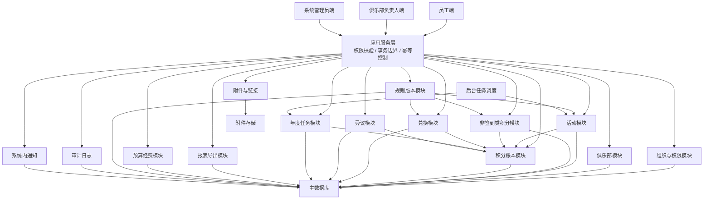
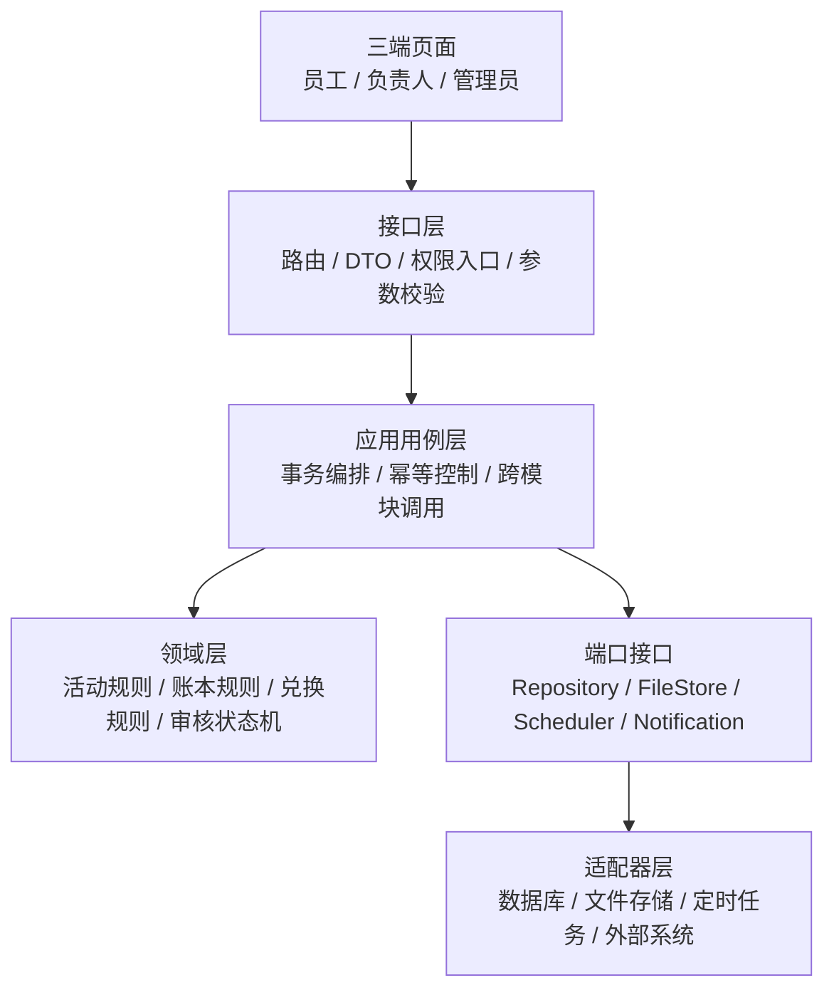
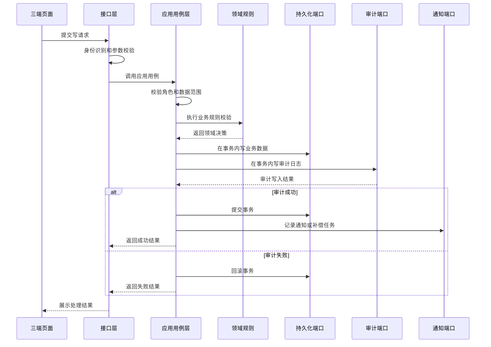
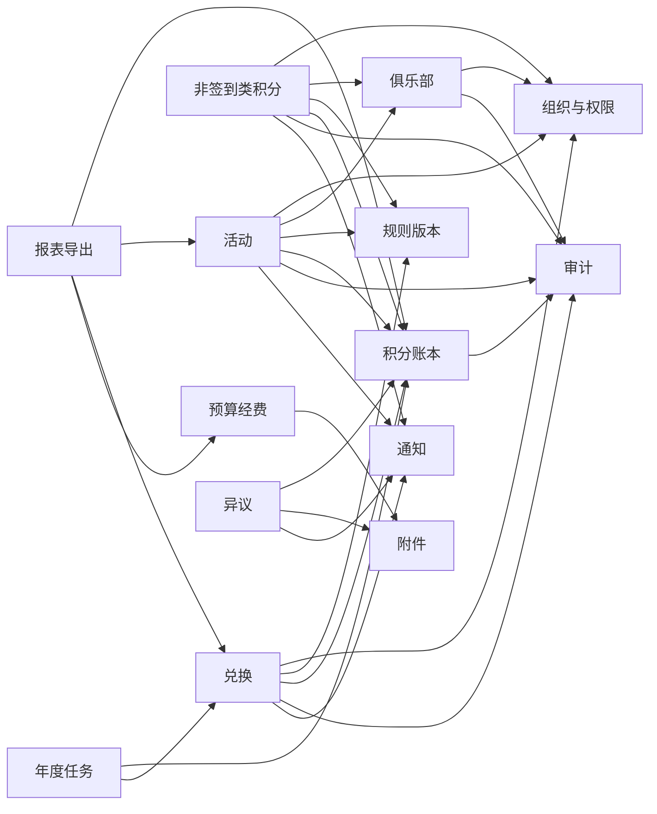
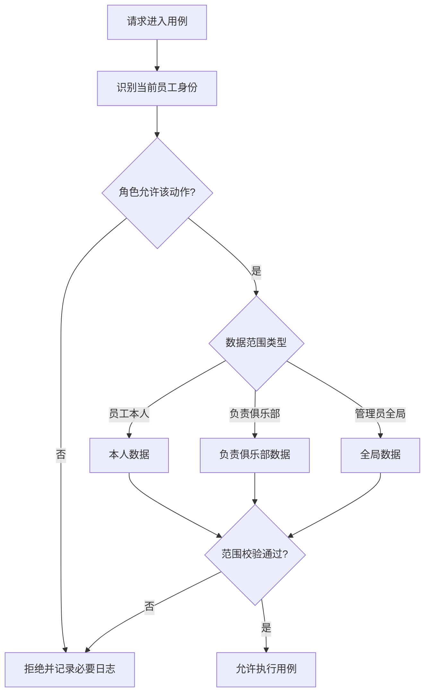
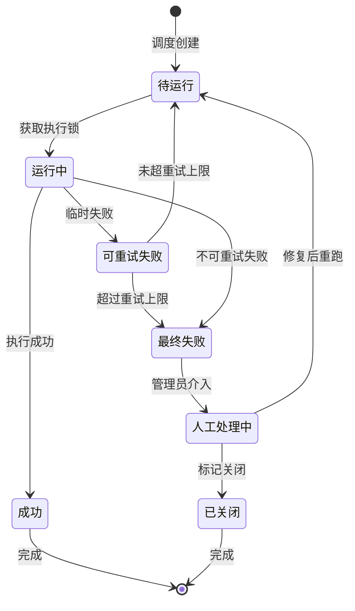
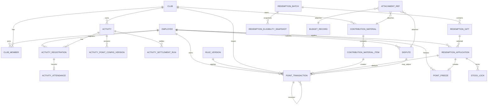

# 俱乐部员工积分系统架构设计

_本文档描述系统架构、事务边界和数据建模约束。业务需求见 `club-points-prd.md`，流程图见 `club-points-flow-design.md`，模块拆分见 `club-points-module-design.md`。_

---

## 架构决策

架构基线：

- 一个应用后端。
- 一个主数据库。
- 一个附件存储能力。
- 一个后台任务调度能力。
- 一个系统内通知能力。
- 三类角色共用同一套认证身份，通过角色和数据范围控制功能。

## 总体架构

## 分层设计

分层规则：

- 接口层只做身份识别、权限入口、参数校验和结果转换，不写积分、兑换、结算业务规则。
- 应用用例层负责事务边界，例如提交兑换、审核兑换、活动结算、审核非签到类积分、年度清零。
- 领域层保存核心规则，例如活动状态机、报名资格、签到签退有效性、积分流水不可改写、冻结积分不等于流水。
- 适配器层负责数据库、文件存储、定时任务和未来外部系统接入，不能反向影响领域规则。
- 报表和导出只能读业务事实和汇总结果，不能作为业务事实写入口。

### 写用例调用序列

### 应用用例层目录

应用用例层按业务动作拆，不按页面拆。页面可以组合多个用例，但不能把业务规则写在页面或控制器里。

| 模块 | 核心用例 | 事务特征 |
| --- | --- | --- |
| 俱乐部 | 加入俱乐部、退出俱乐部、管理员移除成员、停用俱乐部、物理删除俱乐部、维护负责人 | 退出和移除要同步取消未结束活动报名 |
| 活动 | 创建草稿、提交审核、管理员审核、发布后修改、取消活动、物理删除活动、配置签到签退窗口 | 关键修改、取消和删除必须写审计 |
| 报名签到 | 报名活动、取消报名、自助签到、自助签退、补录修正、标记特殊缺席 | 补录修正必须校验已有报名和权限范围 |
| 活动结算 | 结算基础参与积分、结算全程额外积分、结算缺席扣分、检查月度累计缺席 | 必须按活动和员工维度幂等 |
| 非签到积分 | 提交材料、撤回材料、重提材料、审核材料、管理员代录、物理删除材料 | 审核通过要同时锁定材料并生成流水 |
| 积分账本 | 生成流水、撤销流水、调整流水、冻结积分、释放冻结、查询余额 | 不允许直接修改余额 |
| 兑换 | 创建批次、维护礼品、生成资格快照、提交申请、取消申请、审核通过、审核拒绝 | 提交申请必须同时冻结积分和锁定库存 |
| 规则版本 | 创建草稿、发布版本、撤回未生效版本、停用版本、发布新版本替代 | 已生效版本不回改历史流水 |
| 年度任务 | 年度清零、跨年冻结处理、年度排名、激励建议生成 | 任务运行必须有幂等键和运行记录 |
| 异议 | 提交异议、处理异议、回复异议、触发调整或撤销流水 | 异议不直接改历史流水 |
| 预算经费 | 登记预算、登记支出、确认激励建议生成经费记录 | 第一版不做审批流 |
| 报表导出 | 生成积分明细、兑换记录、总台账、俱乐部排名、预算统计 | 只读业务数据，必须记录导出日志 |

### 端口接口边界

端口是领域和应用层依赖的抽象，不是具体技术选型。

| 端口 | 用途 | 约束 |
| --- | --- | --- |
| `TransactionPort` | 开启、提交、回滚事务 | 关键业务写和审计写必须在同一事务边界内 |
| `ClockPort` | 提供当前时间和业务时区 | 年度边界统一使用 Asia/Hong_Kong |
| `IdempotencyPort` | 记录幂等键和处理结果 | 活动结算、兑换审核、年度清零必须使用 |
| `EmployeeDirectoryPort` | 读取员工、部门、联系方式 | 当前只定义抽象，数据来源后续确认 |
| `FileStorePort` | 保存附件文件 | 附件元数据属于业务库，文件内容可在外部存储 |
| `NotificationPort` | 创建系统内通知和补偿记录 | 通知失败不应篡改已成功业务结果 |
| `SchedulerPort` | 调度后台任务 | 任务必须有运行记录、失败原因和重试策略 |
| `AuditPort` | 写审计日志 | 关键写操作审计失败则业务失败 |
| `ExportPort` | 生成导出文件 | 导出文件不是事实源，导出动作必须留痕 |

## 模块边界

模块详细拆分、17 个一级模块清单、模块依赖矩阵和优先级见 `club-points-module-design.md`。本节只保留架构层面的模块边界摘要。

### 模块清单

| 模块 | 主要职责 | 不负责 |
| --- | --- | --- |
| M01 组织、身份与权限 | 员工、部门、角色、数据范围、外部组织字段预留 | 积分余额计算 |
| M02 俱乐部管理 | 俱乐部创建、停用、删除、加入、退出、负责人维护 | 活动签到和兑换 |
| M03 活动管理 | 活动草稿、审核、发布、取消、修改、配置版本 | 报名事实、签到事实、积分余额 |
| M04 报名与参与 | 活动报名、自助取消、退出或移除后的自动取消 | 签到签退事实和积分流水 |
| M05 签到签退与修正 | 自助签到签退、补录修正、窗口使用 | 发放积分和自动补报名 |
| M06 活动结算 | 参与积分、全程额外积分、缺席扣分、月度累计缺席 | 保存余额或修改签到事实 |
| M07 积分账本 | 流水、冻结、撤销、调整、余额推导、统计口径 | 活动报名事实和兑换申请状态 |
| M08 非签到类积分 | 材料提交、撤回、重提、审核、代录、材料快照 | 基础参与积分和员工直接提交 |
| M09 兑换管理 | 批次、礼品、资格快照、申请、库存锁定、审核、直接发放 | 领取、签收、质量问题 |
| M10 规则版本 | 创建、发布、撤回、停用、替代规则版本 | 自动重算历史流水 |
| M11 异议处理 | 员工异议、管理员处理、必要时触发调整或撤销流水 | 直接改写历史流水 |
| M12 年度清零、排名与激励建议 | 年度清零、跨年冻结口径、俱乐部排名、激励建议 | 预算审批 |
| M13 预算经费 | 预算分类、预算金额、实际支出、附件和备注 | 审批流和自动预算压缩 |
| M14 报表与导出 | 明细、兑换、总台账、排名、预算统计和导出日志 | 作为事实源或反写业务状态 |
| M15 通知与待办 | 系统内通知、已读未读、负责人和管理员待办 | 业务主状态 |
| M16 附件与链接 | 文件上传、外部链接、附件锁定 | 业务审核决策 |
| M17 审计与后台任务 | 审计日志、任务运行记录、失败重试、人工处理 | 代替业务流水或业务状态机 |

### 模块依赖图

下图是压缩依赖视图。M03-M06 在图中合并展示为“活动”，M16-M17 以横切能力展示；完整依赖矩阵见 `club-points-module-design.md`。

依赖约束：

- 积分账本模块是积分事实源，其他模块只能通过账本用例生成流水、撤销流水、调整流水和冻结记录，不能直接改余额。
- 活动模块可以请求账本生成基础参与积分、全程参与积分和缺席扣分，但活动模块不保存余额。
- 非签到类积分模块可以在审核通过或管理员代录时请求账本生成流水，但材料本身不是流水。
- 兑换模块可以请求账本冻结积分、释放冻结、生成兑换扣减流水，但兑换申请状态不放进账本模块。
- 年度任务模块可以请求账本生成年度清零流水，但年度清零任务本身需要单独记录执行批次和幂等标识。
- 报表导出模块只读，不拥有业务状态。导出日志属于审计或导出记录，不反向改变业务结果。
- 附件、通知、审计是横切能力。业务模块可以引用它们，但附件、通知、审计不能承载业务主状态。

## 权限和数据范围

权限判断必须拆成两层：先判断角色是否有动作权限，再判断该动作是否落在允许的数据范围内。

### 权限矩阵

| 能力 | 员工 | 俱乐部负责人 | 系统管理员 |
| --- | --- | --- | --- |
| 加入俱乐部 | 可操作 | 可操作 | 可代管或查看 |
| 退出俱乐部 | 可操作 | 可操作 | 可移除成员 |
| 查看成员名单 | 仅已加入俱乐部 | 仅负责俱乐部，含联系方式 | 全局 |
| 创建活动 | 不可 | 仅负责俱乐部 | 全局 |
| 审核活动发布 | 不可 | 不可 | 全局 |
| 修改已发布活动 | 不可 | 仅负责俱乐部 | 全局 |
| 取消活动 | 不可 | 仅负责俱乐部，强确认 | 全局，强确认 |
| 物理删除活动 | 不可 | 仅负责俱乐部，强确认和快照 | 全局，强确认和快照 |
| 报名、取消、签到、签退 | 仅本人 | 作为员工仅本人 | 可查看全局并修正 |
| 补录修正签到签退 | 不可 | 仅负责俱乐部活动 | 全局 |
| 提交非签到材料 | 不可 | 仅负责俱乐部 | 可代录并直接生效 |
| 审核非签到材料 | 不可 | 不可 | 全局 |
| 兑换申请 | 仅本人 | 作为员工仅本人 | 可审核全局申请 |
| 手工积分调整 | 不可 | 不可 | 全局 |
| 报表导出 | 不可 | 不可 | 全局 |
| 审计日志查看 | 不可 | 不可 | 全局 |

### 数据范围原则

- 员工只能操作本人报名、签到、签退、兑换和异议。
- 员工能查看已加入俱乐部的成员名单和已发布活动，但不能查看未加入俱乐部的新活动和成员名单。
- 俱乐部负责人只能管理自己负责俱乐部的数据，不能越权看员工全量兑换或其他俱乐部积分明细。
- 系统管理员拥有全局范围，但关键操作仍必须写原因、材料和审计。
- 数据范围校验应在应用用例层完成，不能只依赖前端隐藏按钮。

## 核心一致性设计

必须同事务完成的操作：

- 提交兑换申请时，冻结积分和锁定库存必须在同一事务里完成。
- 审核通过兑换申请时，关闭冻结、生成兑换扣减流水、记录直接发放必须在同一事务里完成。
- 非签到类积分审核通过时，材料状态变更和积分流水生成必须在同一事务里完成。
- 管理员代录非签到类积分时，原因、材料、规则版本、积分流水和审计日志必须一起落库。
- 撤销或调整积分时，不能改写原流水，只能新增撤销流水或调整流水。
- 所有关键写操作必须同时写审计日志；如果审计写入失败，业务操作应失败。

必须幂等的操作：

- 活动自动结算，同一活动、同一员工、同一积分类型只能生成一次有效流水。
- 月度累计无故缺席扣分，同一员工、同一自然月只能触发一次累计扣分。
- 年度清零，同一员工、同一年度只能生成一次清零流水。
- 兑换审核通过，同一兑换申请只能生成一次兑换扣减流水。
- 非签到类积分审核通过，同一材料明细只能生成一次有效积分流水。

### 锁和并发策略

| 场景 | 并发风险 | 处理策略 |
| --- | --- | --- |
| 兑换提交 | 多人同时兑换最后一件礼品导致超兑 | 锁定礼品库存记录，冻结积分和库存锁定同事务完成 |
| 兑换审核 | 管理员重复点击通过导致重复扣分 | 使用兑换申请状态和扣减流水幂等键 |
| 活动结算 | 任务重跑导致重复发分或重复扣分 | 使用活动、员工、积分类型组合幂等键 |
| 年度清零 | 定时任务重复触发导致重复清零 | 使用年度、员工、清零类型组合幂等键 |
| 月度累计缺席 | 多个活动同时结算触发重复累计扣分 | 使用员工、自然月、累计缺席扣分类型组合幂等键 |
| 物理删除 | 删除后历史报表无法展示名称和上下文 | 删除前校验并补写快照，快照成功后才允许删除 |
| 余额缓存 | 缓存和流水不一致 | 余额缓存可重建，查询异常时以流水和冻结重算为准 |

### 账本写入规则

- 正向积分、扣分、兑换扣减、年度清零、撤销和调整都必须进入 `POINT_TRANSACTION`。
- `POINT_TRANSACTION` 不允许业务功能直接更新积分数值、员工、来源、规则版本和发放俱乐部。
- 撤销不是删除原流水，而是新增一条指向原流水的反向流水。
- 调整不是改余额，而是新增调整流水，并记录原因、材料、规则版本和操作人。
- 冻结不是流水，只进入冻结记录；冻结释放也不是流水。
- 余额读取可以使用缓存，但缓存必须能用有效流水和有效冻结重算。

### 失败处理原则

- 审计失败：关键业务写必须回滚，不能产生无审计的关键变更。
- 通知失败：业务结果不回滚，但必须进入通知补偿队列。
- 附件上传失败：依赖附件的业务提交失败；非必填附件失败不影响业务草稿保存。
- 导出失败：不改变业务数据，只记录失败导出日志或错误原因。
- 后台任务失败：记录运行失败、错误原因和可重试标记，不能靠重复执行产生重复流水。

## 后台任务设计

| 任务 | 触发时间 | 关键规则 |
| --- | --- | --- |
| 活动基础参与积分结算 | `max(活动结束时间, 签退窗口关闭时间) + settlement_delay` | 使用结算时活动有效积分配置版本 |
| 无故缺席扣分 | 与活动结算同一时间点 | 活动取消、已取消报名、特殊缺席不扣分 |
| 月度累计缺席扣分 | 每次缺席结算后检查，或月度批处理 | 同一员工同一自然月只触发一次累计扣分 |
| 年度清零 | 每年 1 月 1 日 00:00:00 Asia/Hong_Kong | 只清未冻结可用积分，冻结兑换不参与 |
| 俱乐部年度排名 | 年度结束后或管理员触发 | 按有效正向发放积分扣除撤销流水 |
| 通知补偿 | 定时扫描失败记录 | 通知是告知，不是业务状态源 |
| 异常结算扫描 | 定时扫描 | 检查重复结算、冻结超时、库存锁定异常 |

### 后台任务状态机

### 后台任务运行记录

后台任务必须有独立运行记录，不能只靠业务表状态猜测任务是否跑过。

| 字段类别 | 内容 | 用途 |
| --- | --- | --- |
| 任务身份 | 任务类型、业务对象 ID、运行批次、幂等键 | 防止重复执行产生重复业务结果 |
| 时间信息 | 计划执行时间、实际开始时间、结束时间、业务时区 | 支撑年度清零和活动结算时间口径 |
| 运行状态 | 待运行、运行中、成功、可重试失败、最终失败、人工处理中 | 支撑重试和后台待办 |
| 结果摘要 | 处理数量、成功数量、跳过数量、失败数量 | 支撑管理员排查 |
| 错误信息 | 错误类型、错误消息、是否可重试 | 支撑重试策略 |
| 操作信息 | 触发来源、处理人、人工关闭原因 | 支撑审计 |

## 概念数据边界

这里是概念数据边界，不是物理数据库设计。后续可以拆表、合表或调整字段，但不能破坏事实源边界。

建模硬约束：

- `POINT_TRANSACTION` 是唯一积分事实源。余额缓存可以有，但不是事实源。
- `POINT_FREEZE` 不是积分流水。冻结只影响当前可用积分，不改变账户净积分。
- `CLUB_MEMBER` 和 `ACTIVITY_REGISTRATION` 必须分开。加入俱乐部不等于报名活动。
- `ACTIVITY_REGISTRATION` 和 `ACTIVITY_ATTENDANCE` 必须分开。报名事实和签到签退事实不是一回事。
- `ACTIVITY_POINT_CONFIG_VERSION` 必须独立。活动发布后改积分规则时，结算要知道使用哪个配置版本。
- 兑换资格快照、兑换申请、积分冻结、库存锁定和兑换扣减流水必须分开建模。
- 非签到类积分材料和最终积分流水必须分开建模。
- 物理删除俱乐部、活动、非签到类积分材料前，必须保证相关流水、审计、报表、历史页面所需快照已经保存。
- 后台任务必须有运行记录和幂等键，尤其是活动结算、月度累计缺席扣分、年度清零和年度排名。

## 快照策略

快照不是为了替代主表，而是为了允许物理删除后历史仍然可读。只要某条流水、报表、审计或历史页面需要展示某个名称、时间、归属或材料摘要，就不能只依赖主表 join。

| 业务对象 | 删除或变更风险 | 必须快照的内容 |
| --- | --- | --- |
| 俱乐部 | 俱乐部物理删除后历史报表无法显示俱乐部 | 俱乐部 ID、名称、编号、状态、删除标记 |
| 活动 | 活动物理删除后参与记录和流水失去上下文 | 活动 ID、标题、所属俱乐部快照、开始结束时间、活动等级 |
| 活动积分配置 | 发布后改积分规则导致结算口径不清 | 基础积分、全程额外积分、活动等级、规则版本、配置生效时间 |
| 非签到材料 | 材料物理删除后流水无法解释来源 | 材料类型、来源名称、员工、分值、俱乐部、证明材料摘要 |
| 兑换申请 | 后续员工积分变化导致兑换前后余额不可复原 | 批次、礼品、消耗积分、兑换前后积分快照、资格排名 |
| 积分流水 | 规则、俱乐部、活动或材料变化导致流水不可解释 | 来源类型、来源 ID、发放俱乐部快照、规则版本、原因摘要 |
| 审计日志 | 主对象删除或修改后无法判断操作内容 | 操作前后快照、操作者、操作原因、目标对象快照 |
| 导出日志 | 后续筛选条件或数据变化后无法复核导出 | 导出类型、筛选条件、导出人、导出时间 |

快照写入时机：

- 创建积分流水时写入来源快照。
- 审核通过非签到材料时锁定材料并写入流水快照。
- 兑换审核通过时写入兑换前后积分和礼品快照。
- 物理删除俱乐部、活动、材料前补齐缺失快照。
- 规则版本发布后不回写历史快照，只影响后续业务。

## 领域事件

第一版不需要引入独立消息中间件，但应用内部应明确领域事件概念，用于通知、待办、报表刷新和任务调度。

| 事件 | 产生方 | 消费方 | 说明 |
| --- | --- | --- | --- |
| `ActivityReviewCompleted` | 活动模块 | 通知、负责人待办 | 活动审核通过或驳回 |
| `ActivityCancelled` | 活动模块 | 通知、结算任务 | 已报名员工不发分不扣分 |
| `AttendanceCorrected` | 活动模块 | 审计、异常扫描 | 负责人或管理员修正签到签退 |
| `ActivitySettlementCompleted` | 活动模块 | 账本、报表、异常扫描 | 活动结算批次完成 |
| `ContributionReviewCompleted` | 非签到积分模块 | 通知、账本 | 审核通过后生成流水 |
| `RedemptionSubmitted` | 兑换模块 | 待办、通知 | 申请进入管理员待审 |
| `RedemptionReviewed` | 兑换模块 | 通知、账本 | 通过或拒绝 |
| `PointTransactionAdjusted` | 积分账本模块 | 通知、报表 | 管理员手工调整或撤销 |
| `AnnualClearingCompleted` | 年度任务模块 | 报表、异常扫描 | 年度清零任务完成 |
| `DisputeReplied` | 异议模块 | 通知 | 管理员回复异议 |

事件处理原则：

- 领域事件不能替代业务事务。关键结果必须先落业务事实。
- 通知和待办可以由事件驱动，但通知失败不回滚已完成业务。
- 事件消费者必须幂等，不能因为重复消费导致重复流水、重复冻结或重复扣库存。

## 暂缓技术问题

这些问题不影响当前架构边界，但会影响后续技术方案和数据库设计：

- 员工和部门数据来源。
- 手机号或联系方式来源。
- 统一登录和权限接入方式。
- 附件存储使用内部平台、对象存储还是本地文件服务。
- 系统内通知是否复用企业内部消息平台。
- 后台任务调度、失败重试和告警机制。
- 推荐新会员积分确认口径。
- 区间分值最终填写口径，例如活动策划 15-30 分、宣传 10-20 分。
