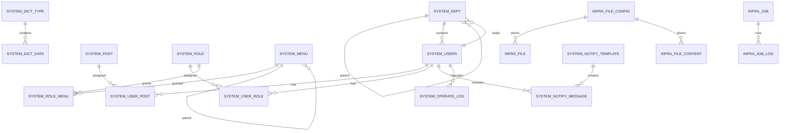
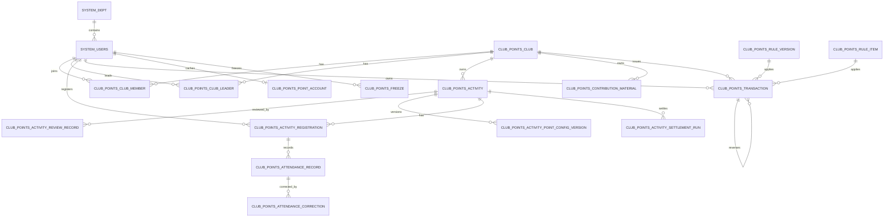
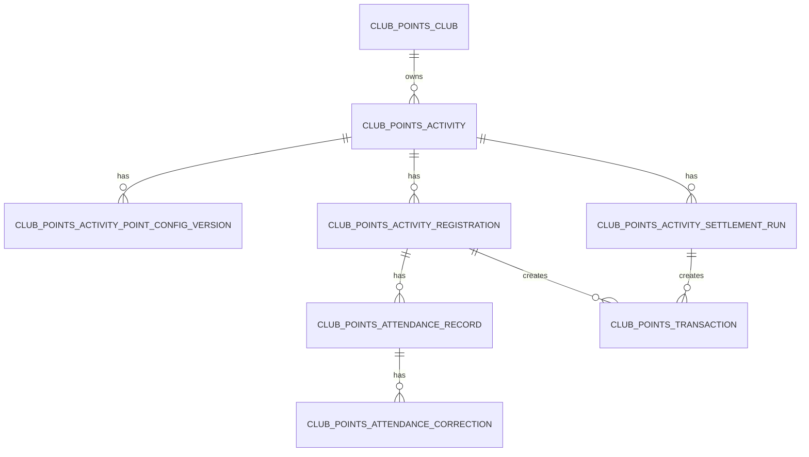
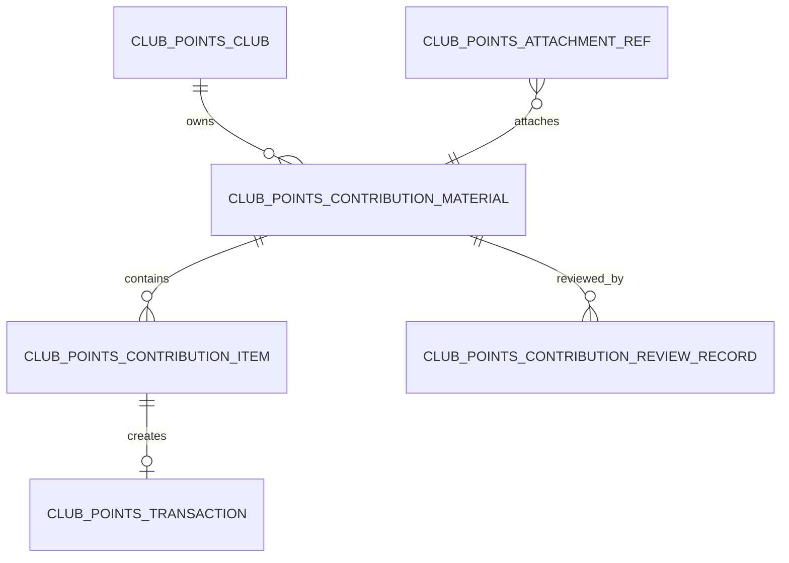
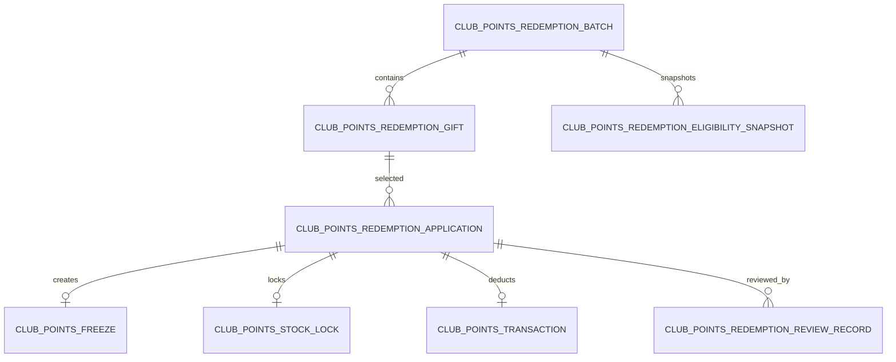
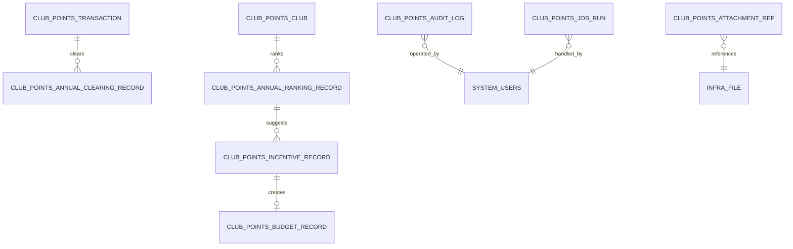

# 俱乐部员工积分系统数据库设计

## 1. 数据库标准

### 1.1 建模口径

本系统必须按“积分流水事实源 + 业务状态表 + 快照 + 幂等约束”建模。

| 标准 | 说明 |
| --- | --- |
| 积分流水是唯一积分事实源 | 所有加分、扣分、兑换扣减、年度清零、撤销、调整都进入 `club_points_transaction`。 |
| 余额表为缓存 | `club_points_point_account` 用于提高查询性能，事实以流水和冻结重算结果为准。 |
| 冻结独立建模 | 兑换申请冻结积分写 `club_points_freeze`，不改变账户净积分；审核通过才生成兑换扣减流水。 |
| 俱乐部发放积分采用统计口径 | 正向有效流水按 `issuing_club_id` 聚合，再扣除对应撤销流水。 |
| 兑换扣减按个人账户统一处理 | 兑换扣减只减少员工个人账户积分，不记录消耗来自哪个活动或俱乐部。 |
| 业务删除必须靠快照兜底 | 俱乐部、活动、材料允许物理删除，但历史流水、报名、审计、报表必须保存名称、编号、时间、规则、礼品等快照。 |
| 幂等以数据库约束兜底 | Redis/Lock4j 用于防重复点击，数据库唯一键和条件更新用于最终一致性。 |
| 报表采用查询模型 | 积分明细、兑换记录、总台账、排名从流水和业务表生成。 |

---

## 2. 芋道数据库基线和复用关系

### 2.1 基线全表

芋道 MySQL 初始化脚本当前包含 41 张 `infra_*` / `system_*` 表。本项目保留这些系统级表，由 `clubpoints` 业务模块引用或通过 seed 写入配置数据。

| 模块 | 基线表 |
| --- | --- |
| infra API 日志 | `infra_api_access_log`、`infra_api_error_log` |
| infra 代码生成 | `infra_codegen_table`、`infra_codegen_column` |
| infra 配置和数据源 | `infra_config`、`infra_data_source_config` |
| infra 文件 | `infra_file_config`、`infra_file`、`infra_file_content` |
| infra 定时任务 | `infra_job`、`infra_job_log` |
| system 组织用户 | `system_dept`、`system_post`、`system_user_post`、`system_users` |
| system 权限 | `system_role`、`system_user_role`、`system_menu`、`system_role_menu` |
| system 字典 | `system_dict_type`、`system_dict_data` |
| system 登录和操作日志 | `system_login_log`、`system_operate_log` |
| system 通知公告 | `system_notice`、`system_notify_template`、`system_notify_message` |
| system 邮件 | `system_mail_account`、`system_mail_template`、`system_mail_log` |
| system 短信 | `system_sms_channel`、`system_sms_template`、`system_sms_log`、`system_sms_code` |
| system OAuth2 | `system_oauth2_client`、`system_oauth2_access_token`、`system_oauth2_refresh_token`、`system_oauth2_code`、`system_oauth2_approve` |
| system 社交登录 | `system_social_client`、`system_social_user`、`system_social_user_bind` |

### 2.2 本项目复用表

| 能力 | 复用表 | 关键字段 | 本项目使用方式 |
| --- | --- | --- | --- |
| 员工和后台用户 | `system_users` | `id`、`username`、`nickname`、`dept_id`、`post_ids`、`mobile`、`email`、`status`、`deleted` | 员工、负责人、管理员统一引用 `system_users.id`；业务表保存必要姓名、部门快照。 |
| 部门组织 | `system_dept` | `id`、`name`、`parent_id`、`leader_user_id`、`status`、`deleted` | 员工部门从 `system_users.dept_id` 读取；历史流水保存部门名称快照。 |
| 岗位 | `system_post`、`system_user_post` | `system_post.id/code/name`、`system_user_post.user_id/post_id` | 员工岗位展示和筛选复用系统岗位关系。 |
| 角色 | `system_role`、`system_user_role` | `system_role.id/code/name/status`、`system_user_role.user_id/role_id` | 初始化员工、俱乐部负责人、系统管理员角色；授权关系写 `system_user_role`。 |
| 菜单权限 | `system_menu`、`system_role_menu` | `system_menu.permission/type/path/component`、`system_role_menu.role_id/menu_id` | 俱乐部积分菜单、按钮和 `clubpoints:*` 权限码写入 `system_menu`，角色授权写 `system_role_menu`。 |
| 字典枚举 | `system_dict_type`、`system_dict_data` | `system_dict_type.type`、`system_dict_data.dict_type/value/label/status` | 状态、类型、来源、任务状态等枚举写入系统字典；Java 枚举值与字典值一致。 |
| 文件存储 | `infra_file_config`、`infra_file`、`infra_file_content` | `infra_file.config_id/name/path/url/type/size`、`infra_file_content.config_id/path/content` | 文件本体复用 infra 文件表；业务附件关系、锁定、替换和追加写 `club_points_attachment_ref`。 |
| 定时任务 | `infra_job`、`infra_job_log` | `infra_job.handler_name/cron_expression/status`、`infra_job_log.job_id/status/result` | 任务调度配置和技术执行日志复用 infra；业务幂等、处理数量和人工处理结果写 `club_points_job_run`。 |
| 站内信 | `system_notify_template`、`system_notify_message` | `template.code/content/params/status`、`message.user_id/template_id/read_status` | 业务通知模板写 `system_notify_template`；消息落 `system_notify_message`。 |
| 操作日志 | `system_operate_log` | `user_id`、`type`、`sub_type`、`biz_id`、`action`、`extra`、`success` | 后台普通操作、查询和导出留痕复用系统操作日志。 |
| 登录和 API 日志 | `system_login_log`、`infra_api_access_log`、`infra_api_error_log` | 登录用户、请求地址、耗时、异常信息 | 运行审计和问题排查沿用框架日志表。 |

### 2.3 基线表关系

芋道 MySQL 脚本没有声明数据库级外键，关系由字段约定和代码层维护。`clubpoints` 模块引用系统表时按以下关系建模。



### 2.4 业务表引用基线表

| 基线表 | 被引用字段 | `clubpoints` 引用字段 |
| --- | --- | --- |
| `system_users` | `id` | `club_points_club_member.user_id`、`club_points_club_leader.user_id`、所有 `submitter_user_id`、`reviewer_user_id`、`operator_user_id`、`handler_user_id`、`user_id`。 |
| `system_dept` | `id` | 业务表不保存部门外键；员工部门从 `system_users.dept_id` 读取，历史记录保存 `dept_id_snapshot`、`dept_name_snapshot`。 |
| `system_role` | `id/code` | 俱乐部积分三类线上角色写入系统角色表，业务权限判断读取用户角色。 |
| `system_menu` | `permission` | `clubpoints:*` 菜单和按钮权限写入系统菜单表，接口权限校验使用系统权限码。 |
| `system_dict_type` / `system_dict_data` | `type` / `dict_type` / `value` | 状态、类型、来源、任务状态等枚举通过字典表发布给前端。 |
| `infra_file` | `id` | `club_points_attachment_ref.file_id`、`club_points_club.cover_file_id`、`club_points_redemption_gift.image_file_id`。 |
| `infra_job` | `handler_name` | 活动结算、年度清零、排名激励等任务的调度配置写入 `infra_job`。 |
| `infra_job_log` | `job_id` | 技术执行日志由 infra 自动生成；业务执行结果写 `club_points_job_run`。 |
| `system_notify_template` | `code` | 兑换审核、异议回复、积分变动等站内信模板写入系统通知模板表。 |
| `system_notify_message` | `user_id`、`template_id` | 站内信消息直接写系统通知消息表。 |
| `system_operate_log` | `type`、`sub_type`、`biz_id` | 普通后台操作、查询和导出动作写系统操作日志。 |

### 2.5 主键和通用字段

本项目数据库固定为 MySQL。所有 `club_points_*` 表的 `id` 字段统一定义为：

```sql
`id` bigint NOT NULL AUTO_INCREMENT COMMENT '主键'
```

Java DO 主键字段统一写法：

```java
@TableId
private Long id;
```

芋道当前 `application.yaml` 配置 `mybatis-plus.global-config.db-config.id-type: NONE`。`IdTypeEnvironmentPostProcessor` 会按主数据源类型改写 MyBatis Plus 全局 ID 策略；MySQL 下改写为 `IdType.AUTO`。因此 `club_points_*` 主键策略固定为 MySQL 自增主键。

所有继承 `BaseDO` 的业务表都包含以下通用字段，各表字段清单不再重复列出：

| 字段 | 类型 | 说明 |
| --- | --- | --- |
| `id` | `bigint` | 主键。 |
| `creator` | `varchar(64)` | 创建者，芋道填充，值为当前登录用户 ID 字符串或系统任务账号标识。 |
| `create_time` | `datetime` | 创建时间。 |
| `updater` | `varchar(64)` | 更新者。 |
| `update_time` | `datetime` | 更新时间。 |
| `deleted` | `bit(1)` | 逻辑删除标记。 |

注意：业务上允许物理删除俱乐部、活动、材料。由于芋道 `BaseDO` 带 `@TableLogic`，默认删除是逻辑删除；真正物理删除必须用专门 Mapper SQL，并且只能在快照校验通过后执行。`deleted` 字段仍保留，供普通低风险表和后台管理使用。

### 2.6 时间字段口径

| 字段类型 | 规则 |
| --- | --- |
| `create_time` | 记录创建时间，只用于审计和排序，不用于积分归属周期。 |
| `occurred_at` | 业务发生时间，积分统计、年度归属、俱乐部排名、来源统计一律用它。 |
| `business_year` | 冗余年度，按 `occurred_at` 的北京时间自然年计算，便于索引。 |
| `business_month` | 冗余月份，格式 `yyyyMM`，按北京时间自然月计算，用于月度履职、月度累计缺席。 |

所有业务时间、活动窗口、报名截止、年度边界按北京时间 `Asia/Shanghai` 解释。数据库仍按芋道风格使用 `datetime` / Java `LocalDateTime`。

### 2.7 JSON 字段

MySQL 表使用 `json` 类型保存快照；单测 H2 脚本使用 `longtext` 兼容。

快照字段命名统一：

| 字段 | 用途 |
| --- | --- |
| `*_snapshot_json` | 保存业务对象完整快照。 |
| `rule_snapshot_json` | 保存规则版本、规则项、分值边界、最终分值。 |
| `before_json` / `after_json` | 审计前后快照。 |

---

## 3. 状态和枚举口径

### 3.1 主要状态

| 枚举 | 值 | 说明 |
| --- | --- | --- |
| 俱乐部状态 | `1` 启用，`2` 停用，`3` 已删除快照 | 主表物理删除后，历史记录通过快照展示“已删除”。 |
| 成员状态 | `1` 有效，`2` 自主退出，`3` 管理员移除 | 退出/移除不删除历史记录。 |
| 负责人状态 | `1` 有效，`2` 解除 | 允许多负责人。 |
| 活动状态 | `1` 草稿，`2` 待审核，`3` 已驳回，`4` 已发布，`5` 已取消，`6` 已结束，`7` 已结算，`8` 已删除快照 | 物理删除前先补齐快照。 |
| 报名状态 | `1` 已报名，`2` 已取消 | 缺席不是报名状态，是结算推导。 |
| 取消原因 | `1` 员工自助，`2` 退出俱乐部自动，`3` 管理员移除，`4` 活动取消 | 这些取消默认不计无故缺席。 |
| 签到签退目标 | `1` 签到，`2` 签退 | 两个独立事实。 |
| 签到签退来源 | `1` 自助，`2` 补录，`3` 修正 | 补录/修正必须审计。 |
| 材料状态 | `1` 草稿，`2` 待审核，`3` 已撤回，`4` 已驳回，`5` 已通过，`6` 已删除快照 | 审核通过后附件锁定。 |
| 流水方向 | `1` 增加，`2` 扣减 | 所有积分变化都在流水中表达。 |
| 流水状态 | `1` 有效，`2` 已被撤销，`3` 撤销流水 | 原流水不删除，撤销用反向流水。 |
| 冻结状态 | `1` 冻结中，`2` 已转扣减，`3` 已释放 | 冻结不是流水。 |
| 兑换批次状态 | `1` 草稿，`2` 已开启，`3` 已关闭，`4` 已取消 | 只有开启期间可申请。 |
| 礼品状态 | `1` 上架，`2` 下架 | 库存不足时不能申请。 |
| 兑换申请状态 | `1` 待审核，`2` 审核前取消，`3` 已通过并直接发放，`4` 已拒绝 | 审核通过即记录直接发放时间。 |
| 异议状态 | `1` 待处理，`2` 已回复，`3` 已关闭 | 改积分必须走流水调整或撤销。 |
| 任务状态 | `1` 待运行，`2` 运行中，`3` 成功，`4` 可重试失败，`5` 最终失败，`6` 人工处理中，`7` 已关闭 | 业务任务运行事实。 |
| 审核结果 | `1` 通过，`2` 驳回/拒绝 | 用于活动、材料、兑换。 |

### 3.2 积分分类

| 分类 | 编码值 | 说明 |
| --- | --- | --- |
| 基础参与积分 | `10` | 活动签到基础积分。 |
| 全程参与额外积分 | `11` | 签到且签退额外积分。 |
| 主动贡献积分 | `20` | 月度履职、策划、执行、宣传、建议。 |
| 特殊奖励积分 | `30` | 获奖、推荐新会员、特殊贡献。 |
| 扣分 | `40` | 无故缺席、月度累计缺席、违规、严重违规、弄虚作假。 |
| 兑换扣减 | `50` | 兑换审核通过产生的扣减。 |
| 年度清零 | `60` | 年度清零负向流水。 |
| 管理员调整 | `70` | 手工调整正负都可。 |
| 撤销流水 | `80` | 指向原流水的反向流水。 |

---

## 4. ER 图

### 4.1 总体 ER



### 4.2 活动、签到、结算 ER



活动建模关键点：

| 点 | 说明 |
| --- | --- |
| 报名和签到签退分表 | 报名是资格事实，签到签退是参与事实，不混成一个状态。 |
| 签到签退是两个独立事实 | 只签到得基础积分，签到且签退得基础和全程额外积分。 |
| 活动积分配置版本独立 | 活动发布后修改分值或等级，结算要知道使用哪个配置版本。 |
| 结算运行独立 | 后台任务必须可重试、可追溯、可幂等。 |

### 4.3 非签到积分 ER



非签到积分建模关键点：

| 点 | 说明 |
| --- | --- |
| 材料不是流水 | 负责人提交材料，管理员审核通过后才生成流水。 |
| 材料明细一人一行 | 一个材料可包含多个员工，多条明细分别生成流水。 |
| 月度履职需要唯一键 | 同一员工、同一俱乐部、同一自然月只能有效发放一次。 |
| 附件审核后锁定 | 附件生命周期不能只靠一个 `file_url` 字段糊过去。 |

### 4.4 兑换 ER



兑换建模关键点：

| 点 | 说明 |
| --- | --- |
| 资格快照和实时余额都要校验 | 批次开启生成资格快照；提交申请时仍要看当前可用积分和库存。 |
| 冻结、库存锁、申请分表 | 这是并发正确性的底线，不能用一个申请状态字段代替。 |
| 审核通过才扣分 | 通过后冻结转扣减，生成兑换负向流水，库存从 locked 转 used。 |
| 审核拒绝或取消释放 | 释放冻结积分和库存，不生成兑换流水。 |

### 4.5 年度、预算、支撑 ER



---

## 5. 表清单

| 领域 | 表名 | 说明 |
| --- | --- | --- |
| 规则 | `club_points_rule_version` | 积分制度发布版本。 |
| 规则 | `club_points_rule_item` | 版本下的可执行规则项。 |
| 规则 | `club_points_rule_publish_record` | 规则发布、撤回、停用记录。 |
| 俱乐部 | `club_points_club` | 俱乐部主表。 |
| 俱乐部 | `club_points_club_member` | 俱乐部成员关系和历史。 |
| 俱乐部 | `club_points_club_leader` | 俱乐部负责人关系和历史。 |
| 活动 | `club_points_activity` | 活动主表。 |
| 活动 | `club_points_activity_review_record` | 活动审核记录。 |
| 活动 | `club_points_activity_point_config_version` | 活动积分配置版本。 |
| 活动 | `club_points_activity_registration` | 活动报名记录。 |
| 活动 | `club_points_attendance_record` | 签到签退有效事实。 |
| 活动 | `club_points_attendance_correction` | 签到签退补录/修正记录。 |
| 活动 | `club_points_activity_settlement_run` | 单活动结算运行记录。 |
| 账本 | `club_points_transaction` | 积分流水事实源。 |
| 账本 | `club_points_point_account` | 员工积分账户缓存。 |
| 账本 | `club_points_freeze` | 积分冻结记录。 |
| 账本 | `club_points_user_year_status` | 员工年度状态和评优资格。 |
| 非签到 | `club_points_contribution_material` | 非签到类积分材料。 |
| 非签到 | `club_points_contribution_item` | 材料明细。 |
| 非签到 | `club_points_contribution_review_record` | 材料审核记录。 |
| 兑换 | `club_points_redemption_batch` | 兑换批次。 |
| 兑换 | `club_points_redemption_gift` | 批次礼品/服务。 |
| 兑换 | `club_points_redemption_eligibility_snapshot` | 批次资格快照。 |
| 兑换 | `club_points_redemption_application` | 兑换申请。 |
| 兑换 | `club_points_stock_lock` | 礼品库存锁定。 |
| 兑换 | `club_points_redemption_review_record` | 兑换审核记录。 |
| 异议 | `club_points_dispute` | 员工异议。 |
| 年度 | `club_points_annual_clearing_record` | 年度清零记录。 |
| 年度 | `club_points_annual_ranking_record` | 俱乐部年度排名记录。 |
| 年度 | `club_points_incentive_record` | 激励建议、确认和荣誉记录。 |
| 预算 | `club_points_budget_record` | 预算和经费记录。 |
| 支撑 | `club_points_attachment_ref` | 业务附件和外部链接绑定。 |
| 支撑 | `club_points_audit_log` | 业务强审计日志。 |
| 支撑 | `club_points_job_run` | 业务后台任务运行记录。 |

---

## 6. 规则表

### 6.1 `club_points_rule_version`

用途：保存一次积分制度版本。新规则只影响新业务，历史流水保留原规则版本。

| 字段 | 类型 | 必填 | 说明 |
| --- | --- | --- | --- |
| `version_no` | `varchar(64)` | 是 | 版本号，例如 `V2026.01`。 |
| `name` | `varchar(128)` | 是 | 规则名称。 |
| `status` | `tinyint` | 是 | `1` 草稿，`2` 已发布，`3` 已撤回，`4` 已停用。 |
| `publicity_time` | `datetime` | 否 | 公示时间。 |
| `effective_time` | `datetime` | 是 | 生效时间。 |
| `published_time` | `datetime` | 否 | 发布时间。 |
| `disabled_time` | `datetime` | 否 | 停用时间。 |
| `summary` | `varchar(1024)` | 否 | 规则摘要。 |
| `content` | `text` | 否 | 规则正文。 |
| `attachment_snapshot_json` | `json` | 否 | 发布时附件快照。 |
| `remark` | `varchar(512)` | 否 | 备注。 |

索引和约束：

| 类型 | 字段 | 说明 |
| --- | --- | --- |
| 唯一 | `version_no` | 版本号唯一。 |
| 普通 | `status, effective_time` | 查当前生效版本。 |

### 6.2 `club_points_rule_item`

用途：保存制度版本下的可执行参数。固定分值和区间分值都用规则项表达。

| 字段 | 类型 | 必填 | 说明 |
| --- | --- | --- | --- |
| `rule_version_id` | `bigint` | 是 | 所属规则版本。 |
| `item_code` | `varchar(128)` | 是 | 稳定编码，例如 `ACTIVITY_SMALL_BASE`。 |
| `item_name` | `varchar(128)` | 是 | 中文名称。 |
| `item_type` | `tinyint` | 是 | `1` 分值，`2` 阈值，`3` 开关，`4` 金额，`5` 文本，`6` JSON。 |
| `category` | `tinyint` | 是 | 规则域：活动、扣分、兑换、年度、激励等。 |
| `min_points` | `int` | 否 | 分值下限。固定分值时等于默认值。 |
| `max_points` | `int` | 否 | 分值上限。固定分值时等于默认值。 |
| `default_points` | `int` | 否 | 默认分值。 |
| `int_value` | `int` | 否 | 整数参数，例如资格人数 180。 |
| `decimal_value` | `decimal(18,6)` | 否 | 小数参数。 |
| `text_value` | `varchar(512)` | 否 | 文本参数。 |
| `json_value` | `json` | 否 | 复杂参数。 |
| `status` | `tinyint` | 是 | `1` 启用，`2` 停用。 |
| `sort` | `int` | 是 | 排序。 |
| `remark` | `varchar(512)` | 否 | 说明。 |

索引和约束：

| 类型 | 字段 | 说明 |
| --- | --- | --- |
| 唯一 | `rule_version_id, item_code` | 同版本规则项编码唯一。 |
| 普通 | `item_code, status` | 按编码查当前规则项。 |

默认初始化的关键编码：活动基础分、全程额外分、结算缓冲、无故缺席扣分、月度累计缺席阈值和扣分、违规区间、弄虚作假清零、月度履职、策划执行、宣传建议、获奖、推荐上限、特殊贡献、兑换最低 50 分、默认前 180 人、并列同分全进、年度排名激励金额、特色创新奖金额、跨年冻结释放口径。

### 6.3 `club_points_rule_publish_record`

用途：保存规则发布、撤回、停用等变更历史。

| 字段 | 类型 | 必填 | 说明 |
| --- | --- | --- | --- |
| `rule_version_id` | `bigint` | 是 | 规则版本。 |
| `action` | `tinyint` | 是 | `1` 发布，`2` 撤回，`3` 停用，`4` 替代。 |
| `operator_user_id` | `bigint` | 是 | 操作人。 |
| `operation_time` | `datetime` | 是 | 操作时间。 |
| `reason` | `varchar(512)` | 否 | 原因。 |
| `before_json` | `json` | 否 | 变更前快照。 |
| `after_json` | `json` | 否 | 变更后快照。 |
| `audit_log_id` | `bigint` | 否 | 强审计 ID。 |

索引：

| 类型 | 字段 | 说明 |
| --- | --- | --- |
| 普通 | `rule_version_id, operation_time` | 查看规则变更历史。 |

## 7. 俱乐部与成员表

### 7.1 `club_points_club`

用途：俱乐部主表。俱乐部物理删除前必须保证下游快照足够。

| 字段 | 类型 | 必填 | 说明 |
| --- | --- | --- | --- |
| `code` | `varchar(64)` | 是 | 俱乐部编号，历史快照使用。 |
| `name` | `varchar(128)` | 是 | 俱乐部名称。 |
| `status` | `tinyint` | 是 | `1` 启用，`2` 停用。 |
| `description` | `varchar(2048)` | 否 | 介绍。 |
| `contact_text` | `varchar(256)` | 否 | 联系方式展示文本。 |
| `cover_file_id` | `bigint` | 否 | 封面文件 ID，引用 `infra_file.id`。 |
| `sort` | `int` | 是 | 排序。 |
| `disabled_time` | `datetime` | 否 | 停用时间。 |
| `disabled_reason` | `varchar(512)` | 否 | 停用原因。 |
| `remark` | `varchar(512)` | 否 | 备注。 |

索引和约束：

| 类型 | 字段 | 说明 |
| --- | --- | --- |
| 唯一 | `code` | 俱乐部编号唯一。 |
| 唯一 | `name` | 名称唯一，避免成员选择混乱。 |
| 普通 | `status, sort` | 俱乐部列表。 |

### 7.2 `club_points_club_member`

用途：员工加入、退出、管理员移除俱乐部的关系和历史。员工可多次加入同一俱乐部，历史不删除。

| 字段 | 类型 | 必填 | 说明 |
| --- | --- | --- | --- |
| `club_id` | `bigint` | 是 | 俱乐部 ID。 |
| `user_id` | `bigint` | 是 | 员工 ID，引用 `system_users.id`。 |
| `dept_id_snapshot` | `bigint` | 否 | 加入时部门 ID 快照。 |
| `user_name_snapshot` | `varchar(128)` | 是 | 员工姓名快照。 |
| `dept_name_snapshot` | `varchar(128)` | 否 | 部门名称快照。 |
| `mobile_snapshot` | `varchar(64)` | 否 | 联系方式快照。 |
| `club_code_snapshot` | `varchar(64)` | 是 | 俱乐部编号快照。 |
| `club_name_snapshot` | `varchar(128)` | 是 | 俱乐部名称快照。 |
| `status` | `tinyint` | 是 | `1` 有效，`2` 自主退出，`3` 管理员移除。 |
| `join_time` | `datetime` | 是 | 加入时间。 |
| `leave_time` | `datetime` | 否 | 退出或移除时间。 |
| `leave_reason_type` | `tinyint` | 否 | `1` 自主退出，`2` 管理员移除。 |
| `leave_reason` | `varchar(512)` | 否 | 退出或移除原因。 |
| `operator_user_id` | `bigint` | 否 | 移除操作人，员工自退为空或本人。 |
| `active_unique_key` | `varchar(160)` | 否 | 有效关系唯一键，格式 `clubId:userId`；非有效记录置空。 |

索引和约束：

| 类型 | 字段 | 说明 |
| --- | --- | --- |
| 唯一 | `active_unique_key` | 保证同员工同俱乐部最多一条有效成员关系；MySQL 允许多个 NULL。 |
| 普通 | `club_id, status` | 成员名单。 |
| 普通 | `user_id, status` | 我的俱乐部。 |

### 7.3 `club_points_club_leader`

用途：俱乐部负责人关系和历史。负责人是“员工 + 负责关系”，不是独立用户体系。

| 字段 | 类型 | 必填 | 说明 |
| --- | --- | --- | --- |
| `club_id` | `bigint` | 是 | 俱乐部 ID。 |
| `user_id` | `bigint` | 是 | 负责人用户 ID。 |
| `status` | `tinyint` | 是 | `1` 有效，`2` 解除。 |
| `assigned_time` | `datetime` | 是 | 任命时间。 |
| `removed_time` | `datetime` | 否 | 解除时间。 |
| `assigned_by` | `bigint` | 是 | 任命操作人。 |
| `removed_by` | `bigint` | 否 | 解除操作人。 |
| `reason` | `varchar(512)` | 是 | 任免原因。 |
| `club_name_snapshot` | `varchar(128)` | 是 | 俱乐部名称快照。 |
| `user_name_snapshot` | `varchar(128)` | 是 | 负责人姓名快照。 |
| `active_unique_key` | `varchar(160)` | 否 | 有效关系唯一键，格式 `clubId:userId`。 |

索引和约束：

| 类型 | 字段 | 说明 |
| --- | --- | --- |
| 唯一 | `active_unique_key` | 同员工同俱乐部最多一条有效负责人关系。 |
| 普通 | `club_id, status` | 查俱乐部负责人。 |
| 普通 | `user_id, status` | 查某负责人管理范围。 |

---

## 8. 活动、报名、签到与结算表

### 8.1 `club_points_activity`

用途：活动主表。

| 字段 | 类型 | 必填 | 说明 |
| --- | --- | --- | --- |
| `club_id` | `bigint` | 是 | 所属俱乐部。 |
| `club_code_snapshot` | `varchar(64)` | 是 | 俱乐部编号快照。 |
| `club_name_snapshot` | `varchar(128)` | 是 | 俱乐部名称快照。 |
| `title` | `varchar(256)` | 是 | 活动标题。 |
| `location` | `varchar(256)` | 否 | 活动地点。 |
| `description` | `text` | 否 | 活动说明。 |
| `cover_file_id` | `bigint` | 否 | 封面文件。 |
| `level` | `tinyint` | 是 | `1` 小型，`2` 中型，`3` 大型。 |
| `status` | `tinyint` | 是 | 活动状态。 |
| `start_time` | `datetime` | 是 | 开始时间。 |
| `end_time` | `datetime` | 是 | 结束时间。 |
| `registration_deadline` | `datetime` | 是 | 报名截止时间。 |
| `cancel_deadline_time` | `datetime` | 否 | 自助取消截止时间，默认开始前 24 小时。 |
| `checkin_start_time` | `datetime` | 是 | 签到窗口开始。 |
| `checkin_end_time` | `datetime` | 是 | 签到窗口结束。 |
| `checkout_mode` | `tinyint` | 是 | `1` 按结束时间，`2` 按开始后时长。 |
| `checkout_start_time` | `datetime` | 是 | 签退窗口开始。 |
| `checkout_end_time` | `datetime` | 是 | 签退窗口结束。 |
| `current_config_version_id` | `bigint` | 否 | 当前活动积分配置版本。 |
| `creator_user_id` | `bigint` | 是 | 创建人。 |
| `submit_time` | `datetime` | 否 | 提交审核时间。 |
| `publish_time` | `datetime` | 否 | 发布时间。 |
| `cancel_time` | `datetime` | 否 | 取消时间。 |
| `cancel_reason` | `varchar(512)` | 否 | 取消原因。 |
| `snapshot_json` | `json` | 否 | 删除前活动快照。 |
| `remark` | `varchar(512)` | 否 | 备注。 |

索引：

| 类型 | 字段 | 说明 |
| --- | --- | --- |
| 普通 | `club_id, status, start_time` | 俱乐部活动列表。 |
| 普通 | `status, start_time` | 管理员全局活动列表。 |
| 普通 | `end_time, status` | 结算扫描。 |

### 8.2 `club_points_activity_review_record`

用途：活动发布审核记录。管理员直接发布时写一条通过记录，页面审核历史和审计口径保持一致。

| 字段 | 类型 | 必填 | 说明 |
| --- | --- | --- | --- |
| `activity_id` | `bigint` | 是 | 活动 ID。 |
| `reviewer_user_id` | `bigint` | 是 | 审核人。 |
| `result` | `tinyint` | 是 | `1` 通过，`2` 驳回。 |
| `reason` | `varchar(512)` | 否 | 审核意见。 |
| `review_time` | `datetime` | 是 | 审核时间。 |
| `activity_snapshot_json` | `json` | 是 | 审核时活动快照。 |
| `audit_log_id` | `bigint` | 否 | 强审计 ID。 |

索引：

| 类型 | 字段 | 说明 |
| --- | --- | --- |
| 普通 | `activity_id, review_time` | 活动审核历史。 |

### 8.3 `club_points_activity_point_config_version`

用途：活动积分配置版本。活动发布后修改等级、基础积分、全程额外积分时新增版本，已生成流水不重算。

| 字段 | 类型 | 必填 | 说明 |
| --- | --- | --- | --- |
| `activity_id` | `bigint` | 是 | 活动 ID。 |
| `version_no` | `int` | 是 | 版本号，从 1 开始。 |
| `level` | `tinyint` | 是 | 活动等级快照。 |
| `base_points` | `int` | 是 | 基础参与积分。 |
| `full_extra_points` | `int` | 是 | 全程额外积分，不配置时为 0。 |
| `rule_version_id` | `bigint` | 是 | 规则版本。 |
| `base_rule_item_id` | `bigint` | 否 | 基础积分规则项。 |
| `full_rule_item_id` | `bigint` | 否 | 全程额外规则项。 |
| `effective_time` | `datetime` | 是 | 配置生效时间。 |
| `created_reason` | `varchar(512)` | 否 | 创建原因。 |
| `active` | `bit(1)` | 是 | 是否当前有效。 |
| `rule_snapshot_json` | `json` | 是 | 规则快照。 |

索引和约束：

| 类型 | 字段 | 说明 |
| --- | --- | --- |
| 唯一 | `activity_id, version_no` | 活动内版本唯一。 |
| 普通 | `activity_id, active` | 查当前配置。 |

### 8.4 `club_points_activity_registration`

用途：活动报名记录。退出俱乐部、管理员移除成员、活动取消都会自动取消未结束报名，并且不扣缺席分。

| 字段 | 类型 | 必填 | 说明 |
| --- | --- | --- | --- |
| `activity_id` | `bigint` | 是 | 活动 ID。 |
| `club_id` | `bigint` | 是 | 冗余俱乐部 ID。 |
| `user_id` | `bigint` | 是 | 员工 ID。 |
| `status` | `tinyint` | 是 | `1` 已报名，`2` 已取消。 |
| `register_time` | `datetime` | 是 | 报名时间。 |
| `cancel_time` | `datetime` | 否 | 取消时间。 |
| `cancel_reason_type` | `tinyint` | 否 | 取消原因类型。 |
| `cancel_reason` | `varchar(512)` | 否 | 取消说明。 |
| `cancel_operator_user_id` | `bigint` | 否 | 取消操作人。 |
| `no_absence_deduct` | `bit(1)` | 是 | 是否不计缺席扣分。 |
| `special_absence_flag` | `bit(1)` | 是 | 是否特殊请假缺席。 |
| `special_absence_reason` | `varchar(512)` | 否 | 特殊缺席原因。 |
| `special_absence_time` | `datetime` | 否 | 标记时间。 |
| `special_absence_operator_id` | `bigint` | 否 | 标记人。 |
| `user_name_snapshot` | `varchar(128)` | 是 | 员工姓名快照。 |
| `dept_id_snapshot` | `bigint` | 否 | 部门 ID 快照。 |
| `dept_name_snapshot` | `varchar(128)` | 否 | 部门名称快照。 |
| `mobile_snapshot` | `varchar(64)` | 否 | 联系方式快照。 |
| `club_name_snapshot` | `varchar(128)` | 是 | 俱乐部名称快照。 |
| `activity_title_snapshot` | `varchar(256)` | 是 | 活动标题快照。 |
| `activity_start_time_snapshot` | `datetime` | 是 | 活动开始时间快照。 |
| `activity_end_time_snapshot` | `datetime` | 是 | 活动结束时间快照。 |
| `active_unique_key` | `varchar(160)` | 否 | 有效报名唯一键，格式 `activityId:userId`；取消后置空。 |

索引和约束：

| 类型 | 字段 | 说明 |
| --- | --- | --- |
| 唯一 | `active_unique_key` | 同员工同活动最多一条有效报名。 |
| 普通 | `activity_id, status` | 活动报名列表和结算。 |
| 普通 | `user_id, status, register_time` | 我的报名。 |
| 普通 | `club_id, user_id, status` | 退出俱乐部自动取消。 |

### 8.5 `club_points_attendance_record`

用途：签到或签退的当前有效事实。一条报名最多一条签到、一条签退。

| 字段 | 类型 | 必填 | 说明 |
| --- | --- | --- | --- |
| `registration_id` | `bigint` | 是 | 报名 ID。 |
| `activity_id` | `bigint` | 是 | 活动 ID。 |
| `user_id` | `bigint` | 是 | 员工 ID。 |
| `target_type` | `tinyint` | 是 | `1` 签到，`2` 签退。 |
| `record_time` | `datetime` | 是 | 签到或签退时间。 |
| `source_type` | `tinyint` | 是 | `1` 自助，`2` 补录，`3` 修正。 |
| `operator_user_id` | `bigint` | 是 | 操作人。 |
| `reason` | `varchar(512)` | 否 | 补录或修正原因。 |
| `client_ip` | `varchar(64)` | 否 | 操作 IP。 |
| `remark` | `varchar(512)` | 否 | 备注。 |

索引和约束：

| 类型 | 字段 | 说明 |
| --- | --- | --- |
| 唯一 | `registration_id, target_type` | 一条报名最多一个有效签到事实、一个有效签退事实。 |
| 普通 | `activity_id, target_type` | 活动签到统计。 |
| 普通 | `user_id, record_time` | 员工参与历史。 |

### 8.6 `club_points_attendance_correction`

用途：签到签退补录和修正历史。强审计动作，审计失败业务回滚。

| 字段 | 类型 | 必填 | 说明 |
| --- | --- | --- | --- |
| `attendance_record_id` | `bigint` | 否 | 被修正记录；补录时可为空。 |
| `registration_id` | `bigint` | 是 | 报名 ID。 |
| `activity_id` | `bigint` | 是 | 活动 ID。 |
| `user_id` | `bigint` | 是 | 员工 ID。 |
| `target_type` | `tinyint` | 是 | 签到或签退。 |
| `correction_type` | `tinyint` | 是 | `1` 补录，`2` 修正。 |
| `before_record_time` | `datetime` | 否 | 修正前时间。 |
| `after_record_time` | `datetime` | 是 | 修正后时间。 |
| `reason` | `varchar(512)` | 是 | 原因。 |
| `operator_user_id` | `bigint` | 是 | 操作人。 |
| `audit_log_id` | `bigint` | 是 | 强审计 ID。 |

索引：

| 类型 | 字段 | 说明 |
| --- | --- | --- |
| 普通 | `registration_id, create_time` | 报名签到修正历史。 |
| 普通 | `activity_id, create_time` | 活动修正记录。 |

### 8.7 `club_points_activity_settlement_run`

用途：单活动结算运行记录。它记录活动层面的结算批次，通用任务运行事实仍写 `club_points_job_run`。

| 字段 | 类型 | 必填 | 说明 |
| --- | --- | --- | --- |
| `activity_id` | `bigint` | 是 | 活动 ID。 |
| `job_run_id` | `bigint` | 否 | 通用任务运行记录 ID。 |
| `run_key` | `varchar(160)` | 是 | 结算批次键，例如 `ACTIVITY_SETTLEMENT:{activityId}:{runAt}`。 |
| `status` | `tinyint` | 是 | 任务状态。 |
| `settlement_time` | `datetime` | 是 | 结算执行时间。 |
| `config_version_id` | `bigint` | 是 | 使用的活动积分配置版本。 |
| `registration_count` | `int` | 是 | 报名数。 |
| `success_count` | `int` | 是 | 成功处理数。 |
| `skip_count` | `int` | 是 | 跳过数。 |
| `failed_count` | `int` | 是 | 失败数。 |
| `error_message` | `varchar(2048)` | 否 | 错误摘要。 |
| `trigger_source` | `tinyint` | 是 | `1` 定时，`2` 管理员手动。 |
| `operator_user_id` | `bigint` | 否 | 手动触发人。 |

索引和约束：

| 类型 | 字段 | 说明 |
| --- | --- | --- |
| 唯一 | `run_key` | 结算批次幂等。 |
| 普通 | `activity_id, status` | 查活动结算记录。 |

---

## 9. 积分账本表

### 9.1 `club_points_transaction`

用途：积分流水唯一事实源。任何积分变化都必须写入本表，禁止直接改余额。

| 字段 | 类型 | 必填 | 说明 |
| --- | --- | --- | --- |
| `transaction_no` | `varchar(64)` | 是 | 流水号。 |
| `user_id` | `bigint` | 是 | 员工 ID。 |
| `user_name_snapshot` | `varchar(128)` | 是 | 员工姓名快照。 |
| `dept_id_snapshot` | `bigint` | 否 | 部门 ID 快照。 |
| `dept_name_snapshot` | `varchar(128)` | 否 | 部门名称快照。 |
| `direction` | `tinyint` | 是 | `1` 增加，`2` 扣减。 |
| `points` | `int` | 是 | 积分绝对值，必须大于 0。 |
| `point_category` | `tinyint` | 是 | 积分分类。 |
| `point_type_code` | `varchar(128)` | 否 | 细分类型编码；有规则项时取规则项编码，无规则项时取业务类型编码。 |
| `status` | `tinyint` | 是 | `1` 有效，`2` 已被撤销，`3` 撤销流水。 |
| `source_type` | `tinyint` | 是 | `1` 活动结算，`2` 非签到材料，`3` 管理员代录，`4` 兑换，`5` 年度清零，`6` 调整，`7` 撤销，`8` 异议处理。 |
| `source_id` | `bigint` | 否 | 来源主对象 ID。 |
| `source_item_id` | `bigint` | 否 | 来源明细 ID，例如材料明细、报名 ID。 |
| `source_title_snapshot` | `varchar(256)` | 否 | 来源名称快照。 |
| `issuing_club_id` | `bigint` | 否 | 发放俱乐部 ID。只有正向发放和正向发放撤销需要。 |
| `issuing_club_code_snapshot` | `varchar(64)` | 否 | 发放俱乐部编号快照。 |
| `issuing_club_name_snapshot` | `varchar(128)` | 否 | 发放俱乐部名称快照。 |
| `activity_id` | `bigint` | 否 | 关联活动 ID。 |
| `activity_title_snapshot` | `varchar(256)` | 否 | 活动标题快照。 |
| `activity_date_snapshot` | `date` | 否 | 活动日期快照。 |
| `rule_version_id` | `bigint` | 是 | 规则版本。 |
| `rule_item_id` | `bigint` | 否 | 规则项。 |
| `rule_item_code_snapshot` | `varchar(128)` | 否 | 规则项编码快照。 |
| `rule_snapshot_json` | `json` | 否 | 规则快照。 |
| `evidence_type` | `tinyint` | 否 | 证明材料类型：签到、照片、文档、管理员确认等。 |
| `material_summary` | `varchar(1024)` | 否 | 材料摘要。 |
| `reason` | `varchar(1024)` | 否 | 原因。 |
| `occurred_at` | `datetime` | 是 | 业务发生时间，统计唯一口径。 |
| `business_year` | `int` | 是 | 业务年度。 |
| `business_month` | `int` | 是 | 业务月份，格式 `yyyyMM`。 |
| `idempotency_key` | `varchar(192)` | 是 | 幂等键。 |
| `reverse_of_transaction_id` | `bigint` | 否 | 撤销流水指向原流水。 |
| `operator_user_id` | `bigint` | 否 | 操作人或系统任务操作者。 |
| `audit_log_id` | `bigint` | 否 | 强审计 ID。 |
| `snapshot_json` | `json` | 否 | 其他完整来源快照。 |

索引和约束：

| 类型 | 字段 | 说明 |
| --- | --- | --- |
| 唯一 | `transaction_no` | 流水号唯一。 |
| 唯一 | `idempotency_key` | 防重复发分、扣分、清零、兑换扣减。 |
| 唯一 | `reverse_of_transaction_id` | 同一原流水最多一条撤销流水；普通流水为 NULL。 |
| 普通 | `user_id, occurred_at` | 员工流水分页。 |
| 普通 | `user_id, business_year, point_category` | 年度台账。 |
| 普通 | `issuing_club_id, business_year, direction, point_category` | 俱乐部年度发放积分排名。 |
| 普通 | `source_type, source_id, source_item_id` | 业务追溯。 |
| 普通 | `business_year, business_month` | 周期统计。 |

幂等键规范：

| 场景 | 幂等键 |
| --- | --- |
| 活动基础积分 | `ACTIVITY_SETTLEMENT:{activityId}:{userId}:BASE` |
| 活动全程额外 | `ACTIVITY_SETTLEMENT:{activityId}:{userId}:FULL_EXTRA` |
| 单次无故缺席 | `ACTIVITY_SETTLEMENT:{activityId}:{userId}:ABSENCE_SINGLE` |
| 月度累计缺席 | `ABSENCE_MONTHLY:{businessMonth}:{userId}` |
| 非签到材料 | `CONTRIBUTION:{materialId}:{itemId}:{userId}` |
| 管理员代录 | `DIRECT_CONTRIBUTION:{requestNo}` |
| 兑换扣减 | `REDEMPTION_APPROVE:{applicationId}` |
| 年度清零 | `ANNUAL_CLEARING:{year}:{userId}` |
| 积分调整 | `LEDGER_ADJUST:{requestNo}` |
| 撤销流水 | `LEDGER_REVERSE:{sourceTransactionId}` |

### 9.2 `club_points_point_account`

用途：员工积分账户缓存。它不是事实源，只是读性能优化。

| 字段 | 类型 | 必填 | 说明 |
| --- | --- | --- | --- |
| `user_id` | `bigint` | 是 | 员工 ID。 |
| `total_positive_points` | `int` | 是 | 全历史有效正向积分总和。 |
| `total_negative_points` | `int` | 是 | 全历史有效负向积分绝对值总和。 |
| `net_points` | `int` | 是 | 账户净积分。 |
| `frozen_points` | `int` | 是 | 当前有效冻结积分。 |
| `available_points` | `int` | 是 | 当前可用积分。 |
| `annual_earned_points` | `int` | 是 | 当前年度累计获取积分缓存。 |
| `last_transaction_id` | `bigint` | 否 | 最近流水。 |
| `last_transaction_time` | `datetime` | 否 | 最近流水时间。 |
| `last_rebuild_time` | `datetime` | 否 | 最近重算时间。 |
| `version` | `int` | 是 | 乐观锁版本。 |

索引和约束：

| 类型 | 字段 | 说明 |
| --- | --- | --- |
| 唯一 | `user_id` | 每个员工一条账户缓存。 |
| 普通 | `available_points` | 兑换资格快照排序。 |

缓存重算公式：

```text
账户净积分 = 有效增加流水 points 之和 - 有效扣减流水 points 之和
冻结积分 = status=冻结中的 freeze points 之和
当前可用积分 = max(账户净积分 - 冻结积分, 0)
```

### 9.3 `club_points_freeze`

用途：冻结积分。冻结不进入流水，释放也不进入流水。

| 字段 | 类型 | 必填 | 说明 |
| --- | --- | --- | --- |
| `freeze_no` | `varchar(64)` | 是 | 冻结号。 |
| `user_id` | `bigint` | 是 | 员工 ID。 |
| `points` | `int` | 是 | 冻结积分。 |
| `status` | `tinyint` | 是 | `1` 冻结中，`2` 已转扣减，`3` 已释放。 |
| `source_type` | `tinyint` | 是 | 来源类型，兑换冻结取 `1`。 |
| `source_id` | `bigint` | 是 | 兑换申请 ID。 |
| `frozen_at` | `datetime` | 是 | 冻结时间。 |
| `converted_at` | `datetime` | 否 | 转扣减时间。 |
| `released_at` | `datetime` | 否 | 释放时间。 |
| `release_reason` | `varchar(512)` | 否 | 释放原因。 |
| `converted_transaction_id` | `bigint` | 否 | 审核通过生成的兑换扣减流水。 |
| `idempotency_key` | `varchar(192)` | 是 | 幂等键。 |

索引和约束：

| 类型 | 字段 | 说明 |
| --- | --- | --- |
| 唯一 | `freeze_no` | 冻结号唯一。 |
| 唯一 | `idempotency_key` | 防重复冻结。 |
| 唯一 | `source_type, source_id` | 一个兑换申请只产生一条冻结。 |
| 普通 | `user_id, status` | 计算当前冻结积分。 |

### 9.4 `club_points_user_year_status`

用途：员工年度状态和评优资格。弄虚作假取消年度评优资格不能只写在备注里。

| 字段 | 类型 | 必填 | 说明 |
| --- | --- | --- | --- |
| `user_id` | `bigint` | 是 | 员工 ID。 |
| `year` | `int` | 是 | 年度。 |
| `honor_eligible` | `bit(1)` | 是 | 是否具备年度评优资格。 |
| `honor_cancel_reason` | `varchar(512)` | 否 | 取消原因。 |
| `honor_cancel_transaction_id` | `bigint` | 否 | 关联扣分或调整流水。 |
| `honor_cancel_time` | `datetime` | 否 | 取消时间。 |
| `annual_positive_points` | `int` | 是 | 年度正向获取积分缓存。 |
| `annual_negative_points` | `int` | 是 | 年度扣减积分缓存。 |
| `remark` | `varchar(512)` | 否 | 备注。 |

索引和约束：

| 类型 | 字段 | 说明 |
| --- | --- | --- |
| 唯一 | `user_id, year` | 员工年度状态唯一。 |
| 普通 | `year, honor_eligible` | 年度荣誉候选过滤。 |

---

## 10. 非签到类积分表

### 10.1 `club_points_contribution_material`

用途：负责人提交的非签到类积分材料，或管理员代录时自动生成的材料。

| 字段 | 类型 | 必填 | 说明 |
| --- | --- | --- | --- |
| `club_id` | `bigint` | 否 | 发放俱乐部；全局奖励可为空。 |
| `club_name_snapshot` | `varchar(128)` | 否 | 俱乐部名称快照。 |
| `type` | `tinyint` | 是 | 材料类型：月度履职、策划执行、宣传、建议、获奖、推荐、特殊贡献、违规扣分等。 |
| `title` | `varchar(256)` | 是 | 材料标题。 |
| `description` | `text` | 否 | 材料说明。 |
| `status` | `tinyint` | 是 | 材料状态。 |
| `rule_version_id` | `bigint` | 是 | 规则版本。 |
| `submitter_user_id` | `bigint` | 是 | 提交人。管理员代录时为管理员。 |
| `submit_time` | `datetime` | 否 | 提交时间。 |
| `reviewer_user_id` | `bigint` | 否 | 审核人。 |
| `review_time` | `datetime` | 否 | 审核时间。 |
| `review_reason` | `varchar(512)` | 否 | 审核意见。 |
| `locked` | `bit(1)` | 是 | 审核通过后锁定。 |
| `direct_created` | `bit(1)` | 是 | 是否管理员代录。 |
| `request_no` | `varchar(64)` | 否 | 管理员代录请求号。 |
| `snapshot_json` | `json` | 否 | 删除或审核通过时材料快照。 |

索引和约束：

| 类型 | 字段 | 说明 |
| --- | --- | --- |
| 唯一 | `request_no` | 管理员代录防重复；负责人普通提交可为空。 |
| 普通 | `club_id, status` | 负责人材料列表。 |
| 普通 | `status, submit_time` | 管理员待审核材料。 |

### 10.2 `club_points_contribution_item`

用途：材料明细。一份材料可以给多个员工发分或扣分。

| 字段 | 类型 | 必填 | 说明 |
| --- | --- | --- | --- |
| `material_id` | `bigint` | 是 | 材料 ID。 |
| `club_id` | `bigint` | 否 | 发放俱乐部冗余。 |
| `user_id` | `bigint` | 是 | 员工 ID。 |
| `user_name_snapshot` | `varchar(128)` | 是 | 员工姓名快照。 |
| `dept_name_snapshot` | `varchar(128)` | 否 | 部门快照。 |
| `point_category` | `tinyint` | 是 | 主动贡献、特殊奖励、扣分等。 |
| `rule_item_id` | `bigint` | 否 | 规则项。 |
| `rule_item_code` | `varchar(128)` | 否 | 规则项编码快照。 |
| `direction` | `tinyint` | 是 | 增加或扣减。 |
| `points` | `int` | 是 | 实际分值。 |
| `reason` | `varchar(1024)` | 是 | 原因。 |
| `material_summary` | `varchar(1024)` | 否 | 材料摘要。 |
| `duty_month` | `int` | 否 | 月度履职月份，格式 `yyyyMM`。 |
| `recommended_user_id` | `bigint` | 否 | 推荐新会员时填写。 |
| `award_level` | `tinyint` | 否 | 获奖等级。 |
| `approval_result_snapshot` | `varchar(1024)` | 否 | 特殊贡献线下审批结果。 |
| `transaction_id` | `bigint` | 否 | 审核通过后生成的积分流水。 |
| `idempotency_key` | `varchar(192)` | 是 | 明细发分幂等键。 |
| `effective_unique_key` | `varchar(192)` | 否 | 业务唯一键，如月度履职；审核通过时写入。 |

索引和约束：

| 类型 | 字段 | 说明 |
| --- | --- | --- |
| 唯一 | `idempotency_key` | 同材料明细不能重复生成流水。 |
| 唯一 | `effective_unique_key` | 月度履职等业务唯一约束；非唯一场景为空。 |
| 普通 | `material_id` | 材料详情。 |
| 普通 | `user_id, point_category` | 员工非签到积分查询。 |

`effective_unique_key` 示例：

| 场景 | 值 |
| --- | --- |
| 月度履职 | `MONTHLY_DUTY:{clubId}:{userId}:{yyyyMM}` |
| 推荐新会员单次 | `RECOMMEND_MEMBER:{clubId}:{userId}:{recommendedUserId}:{year}` |

### 10.3 `club_points_contribution_review_record`

用途：非签到材料审核历史。

| 字段 | 类型 | 必填 | 说明 |
| --- | --- | --- | --- |
| `material_id` | `bigint` | 是 | 材料 ID。 |
| `reviewer_user_id` | `bigint` | 是 | 审核人。 |
| `result` | `tinyint` | 是 | 通过或驳回。 |
| `reason` | `varchar(512)` | 否 | 审核意见。 |
| `review_time` | `datetime` | 是 | 审核时间。 |
| `material_snapshot_json` | `json` | 是 | 审核时材料快照。 |
| `created_transaction_count` | `int` | 是 | 生成流水条数。 |
| `audit_log_id` | `bigint` | 是 | 强审计 ID。 |

索引：

| 类型 | 字段 | 说明 |
| --- | --- | --- |
| 普通 | `material_id, review_time` | 材料审核历史。 |

---

## 11. 兑换表

### 11.1 `club_points_redemption_batch`

用途：兑换批次。批次开启时生成资格快照。

| 字段 | 类型 | 必填 | 说明 |
| --- | --- | --- | --- |
| `year` | `int` | 是 | 批次年度。 |
| `name` | `varchar(128)` | 是 | 批次名称。 |
| `status` | `tinyint` | 是 | 批次状态。 |
| `open_time` | `datetime` | 是 | 开放时间。 |
| `close_time` | `datetime` | 是 | 关闭时间。 |
| `description` | `varchar(2048)` | 否 | 说明。 |
| `min_available_points` | `int` | 是 | 最低可用积分，默认来自规则 50。 |
| `qualified_count` | `int` | 是 | 默认资格人数，默认 180，可按预算调整。 |
| `include_tie_at_cutoff` | `bit(1)` | 是 | 第 N 名同分是否全进。 |
| `qualification_rule_json` | `json` | 是 | 资格规则快照。 |
| `snapshot_generated` | `bit(1)` | 是 | 是否已生成资格快照。 |
| `snapshot_generated_time` | `datetime` | 否 | 快照生成时间。 |
| `rule_version_id` | `bigint` | 是 | 规则版本。 |
| `rule_snapshot_json` | `json` | 是 | 规则快照。 |

索引：

| 类型 | 字段 | 说明 |
| --- | --- | --- |
| 普通 | `year, status` | 批次列表。 |
| 普通 | `open_time, close_time, status` | 员工端开放批次。 |

### 11.2 `club_points_redemption_gift`

用途：批次内礼品或服务。兑换审核通过后按申请表记录直接发放时间。

| 字段 | 类型 | 必填 | 说明 |
| --- | --- | --- | --- |
| `batch_id` | `bigint` | 是 | 批次 ID。 |
| `name` | `varchar(128)` | 是 | 礼品名称。 |
| `description` | `varchar(2048)` | 否 | 说明。 |
| `points_cost` | `int` | 是 | 消耗积分。 |
| `tier_min_points` | `int` | 否 | 制度档位下限，如 50。 |
| `tier_max_points` | `int` | 否 | 制度档位上限，如 100。 |
| `reference_amount_cent` | `bigint` | 否 | 参考价值，单位分。 |
| `stock_total` | `int` | 是 | 总库存。 |
| `stock_locked` | `int` | 是 | 已锁定库存。 |
| `stock_used` | `int` | 是 | 已审核通过使用库存。 |
| `status` | `tinyint` | 是 | 上架或下架。 |
| `image_file_id` | `bigint` | 否 | 图片文件。 |
| `sort` | `int` | 是 | 排序。 |
| `gift_snapshot_json` | `json` | 否 | 重要变更快照。 |

索引：

| 类型 | 字段 | 说明 |
| --- | --- | --- |
| 普通 | `batch_id, status, sort` | 批次礼品列表。 |

库存可用公式：

```text
available_stock = stock_total - stock_locked - stock_used
```

提交申请时必须使用数据库条件更新兜底：

```sql
update club_points_redemption_gift
set stock_locked = stock_locked + 1
where id = ?
  and status = 1
  and stock_total - stock_locked - stock_used > 0
```

### 11.3 `club_points_redemption_eligibility_snapshot`

用途：批次资格名单快照。批次开启时按当前可用积分、最低积分、排名规则生成。

| 字段 | 类型 | 必填 | 说明 |
| --- | --- | --- | --- |
| `batch_id` | `bigint` | 是 | 批次 ID。 |
| `user_id` | `bigint` | 是 | 员工 ID。 |
| `user_name_snapshot` | `varchar(128)` | 是 | 员工姓名快照。 |
| `dept_name_snapshot` | `varchar(128)` | 否 | 部门快照。 |
| `net_points_snapshot` | `int` | 是 | 账户净积分快照。 |
| `frozen_points_snapshot` | `int` | 是 | 冻结积分快照。 |
| `available_points_snapshot` | `int` | 是 | 可用积分快照。 |
| `annual_earned_points_snapshot` | `int` | 是 | 年度累计获取积分快照。 |
| `rank_no` | `int` | 否 | 排名。 |
| `qualified` | `bit(1)` | 是 | 是否具备资格。 |
| `qualification_reason` | `varchar(512)` | 否 | 资格说明。 |
| `tie_at_cutoff` | `bit(1)` | 是 | 是否因 cutoff 同分进入。 |
| `generated_time` | `datetime` | 是 | 生成时间。 |

索引和约束：

| 类型 | 字段 | 说明 |
| --- | --- | --- |
| 唯一 | `batch_id, user_id` | 同批次员工快照唯一。 |
| 普通 | `batch_id, qualified, rank_no` | 批次资格名单。 |
| 普通 | `user_id, batch_id` | 员工可申请批次。 |

### 11.4 `club_points_redemption_application`

用途：兑换申请。单次申请只能选择一种礼品或服务。

| 字段 | 类型 | 必填 | 说明 |
| --- | --- | --- | --- |
| `application_no` | `varchar(64)` | 是 | 申请号。 |
| `request_no` | `varchar(64)` | 是 | 前端请求号，防重复点击。 |
| `batch_id` | `bigint` | 是 | 批次 ID。 |
| `gift_id` | `bigint` | 是 | 礼品 ID。 |
| `eligibility_snapshot_id` | `bigint` | 是 | 资格快照 ID。 |
| `user_id` | `bigint` | 是 | 员工 ID。 |
| `status` | `tinyint` | 是 | 申请状态。 |
| `points_cost` | `int` | 是 | 消耗积分。 |
| `quantity` | `int` | 是 | 数量，当前业务规则固定为 1。 |
| `freeze_id` | `bigint` | 否 | 冻结记录。 |
| `stock_lock_id` | `bigint` | 否 | 库存锁。 |
| `deduct_transaction_id` | `bigint` | 否 | 兑换扣减流水。 |
| `qualification_rank_snapshot` | `int` | 否 | 资格排名快照。 |
| `before_net_points` | `int` | 是 | 申请前账户净积分快照。 |
| `before_frozen_points` | `int` | 是 | 申请前冻结积分快照。 |
| `before_available_points` | `int` | 是 | 申请前可用积分快照。 |
| `after_net_points` | `int` | 否 | 审核通过后账户净积分快照。 |
| `after_frozen_points` | `int` | 否 | 审核通过后冻结积分快照。 |
| `after_available_points` | `int` | 否 | 审核通过后可用积分快照。 |
| `batch_snapshot_json` | `json` | 是 | 批次快照。 |
| `gift_snapshot_json` | `json` | 是 | 礼品快照。 |
| `apply_time` | `datetime` | 是 | 申请时间。 |
| `cancel_time` | `datetime` | 否 | 审核前取消时间。 |
| `cancel_reason` | `varchar(512)` | 否 | 取消原因。 |
| `reviewer_user_id` | `bigint` | 否 | 审核人。 |
| `review_time` | `datetime` | 否 | 审核时间。 |
| `review_reason` | `varchar(512)` | 否 | 审核意见。 |
| `direct_issue_time` | `datetime` | 否 | 直接发放时间。 |
| `idempotency_key` | `varchar(192)` | 是 | 申请幂等键。 |

索引和约束：

| 类型 | 字段 | 说明 |
| --- | --- | --- |
| 唯一 | `application_no` | 申请号唯一。 |
| 唯一 | `idempotency_key` | 防重复申请。 |
| 普通 | `user_id, status, apply_time` | 我的兑换。 |
| 普通 | `batch_id, status` | 管理员批次审核列表。 |
| 普通 | `gift_id, status` | 礼品申请统计。 |

申请幂等键：

```text
REDEMPTION_APPLY:{batchId}:{giftId}:{userId}:{requestNo}
```

### 11.5 `club_points_stock_lock`

用途：库存锁定记录。与冻结同事务创建。

| 字段 | 类型 | 必填 | 说明 |
| --- | --- | --- | --- |
| `gift_id` | `bigint` | 是 | 礼品 ID。 |
| `application_id` | `bigint` | 是 | 兑换申请 ID。 |
| `user_id` | `bigint` | 是 | 员工 ID。 |
| `quantity` | `int` | 是 | 锁定数量，当前业务规则固定为 1。 |
| `status` | `tinyint` | 是 | `1` 锁定中，`2` 已使用，`3` 已释放。 |
| `locked_time` | `datetime` | 是 | 锁定时间。 |
| `used_time` | `datetime` | 否 | 使用时间。 |
| `released_time` | `datetime` | 否 | 释放时间。 |
| `release_reason` | `varchar(512)` | 否 | 释放原因。 |
| `idempotency_key` | `varchar(192)` | 是 | 幂等键。 |

索引和约束：

| 类型 | 字段 | 说明 |
| --- | --- | --- |
| 唯一 | `application_id` | 一个申请一条库存锁。 |
| 唯一 | `idempotency_key` | 防重复锁库存。 |
| 普通 | `gift_id, status` | 统计锁定库存。 |

### 11.6 `club_points_redemption_review_record`

用途：兑换审核记录。管理员只能通过或拒绝，不能修改礼品和消耗积分。

| 字段 | 类型 | 必填 | 说明 |
| --- | --- | --- | --- |
| `application_id` | `bigint` | 是 | 兑换申请 ID。 |
| `reviewer_user_id` | `bigint` | 是 | 审核人。 |
| `result` | `tinyint` | 是 | `1` 通过，`2` 拒绝。 |
| `reason` | `varchar(512)` | 否 | 审核意见。 |
| `review_time` | `datetime` | 是 | 审核时间。 |
| `application_snapshot_json` | `json` | 是 | 审核时申请快照。 |
| `freeze_snapshot_json` | `json` | 是 | 冻结处理快照。 |
| `stock_snapshot_json` | `json` | 是 | 库存处理快照。 |
| `audit_log_id` | `bigint` | 是 | 强审计 ID。 |

索引：

| 类型 | 字段 | 说明 |
| --- | --- | --- |
| 普通 | `application_id, review_time` | 兑换审核历史。 |

---

## 12. 异议、年度、激励和预算表

### 12.1 `club_points_dispute`

用途：员工对积分登记、扣除、兑换等提交异议。异议不直接改积分，需要调整时走账本调整或撤销。

| 字段 | 类型 | 必填 | 说明 |
| --- | --- | --- | --- |
| `user_id` | `bigint` | 是 | 提交员工。 |
| `title` | `varchar(256)` | 是 | 标题。 |
| `content` | `text` | 是 | 异议内容。 |
| `target_type` | `tinyint` | 是 | `1` 积分流水，`2` 兑换申请，`3` 活动报名，`4` 其他。 |
| `target_id` | `bigint` | 否 | 目标业务 ID。 |
| `status` | `tinyint` | 是 | 异议状态。 |
| `submit_time` | `datetime` | 是 | 提交时间。 |
| `handler_user_id` | `bigint` | 否 | 处理人。 |
| `handle_time` | `datetime` | 否 | 处理时间。 |
| `reply_content` | `text` | 否 | 回复内容。 |
| `related_action_type` | `tinyint` | 否 | `1` 无动作，`2` 调整，`3` 撤销。 |
| `related_transaction_id` | `bigint` | 否 | 关联调整或撤销流水。 |
| `close_time` | `datetime` | 否 | 关闭时间。 |
| `audit_log_id` | `bigint` | 否 | 强审计 ID。 |

索引：

| 类型 | 字段 | 说明 |
| --- | --- | --- |
| 普通 | `user_id, status, submit_time` | 我的异议。 |
| 普通 | `status, submit_time` | 管理员待处理。 |
| 普通 | `target_type, target_id` | 目标业务异议。 |

### 12.2 `club_points_annual_clearing_record`

用途：年度清零记录。年度清零只清未冻结可用积分。

| 字段 | 类型 | 必填 | 说明 |
| --- | --- | --- | --- |
| `year` | `int` | 是 | 清零年度。 |
| `user_id` | `bigint` | 是 | 员工 ID。 |
| `net_points_before` | `int` | 是 | 清零前净积分。 |
| `frozen_points_before` | `int` | 是 | 清零前冻结积分。 |
| `available_points_before` | `int` | 是 | 清零前可用积分。 |
| `clearable_points` | `int` | 是 | 实际清零积分。 |
| `clear_transaction_id` | `bigint` | 否 | 清零负向流水。 |
| `status` | `tinyint` | 是 | 成功、失败、跳过等。 |
| `run_id` | `bigint` | 否 | 任务运行 ID。 |
| `idempotency_key` | `varchar(192)` | 是 | 幂等键。 |
| `clear_time` | `datetime` | 是 | 清零时间。 |
| `error_message` | `varchar(2048)` | 否 | 错误说明。 |

索引和约束：

| 类型 | 字段 | 说明 |
| --- | --- | --- |
| 唯一 | `year, user_id` | 同员工同年度只能清零一次。 |
| 唯一 | `idempotency_key` | 清零幂等。 |
| 普通 | `year, status` | 清零批次查询。 |

### 12.3 `club_points_annual_ranking_record`

用途：俱乐部年度发放积分排名记录。它是由流水聚合生成的年度快照，不是实时事实源。

| 字段 | 类型 | 必填 | 说明 |
| --- | --- | --- | --- |
| `year` | `int` | 是 | 年度。 |
| `club_id` | `bigint` | 否 | 俱乐部 ID，俱乐部已物理删除时可为空。 |
| `club_code_snapshot` | `varchar(64)` | 是 | 俱乐部编号快照。 |
| `club_name_snapshot` | `varchar(128)` | 是 | 俱乐部名称快照。 |
| `activity_points` | `int` | 是 | 活动发放积分。 |
| `contribution_points` | `int` | 是 | 主动贡献发放积分。 |
| `reward_points` | `int` | 是 | 特殊奖励发放积分。 |
| `reversed_points` | `int` | 是 | 已撤销积分。 |
| `total_issued_points` | `int` | 是 | 年度发放积分净额。 |
| `rank_no` | `int` | 是 | 排名。 |
| `incentive_amount_cent` | `bigint` | 是 | 激励建议金额。 |
| `confirm_status` | `tinyint` | 是 | `1` 待确认，`2` 已确认，`3` 已驳回。 |
| `confirmed_by` | `bigint` | 否 | 确认人。 |
| `confirmed_time` | `datetime` | 否 | 确认时间。 |
| `budget_record_id` | `bigint` | 否 | 关联经费记录。 |
| `generated_time` | `datetime` | 是 | 生成时间。 |
| `snapshot_json` | `json` | 是 | 排名计算快照。 |

索引和约束：

| 类型 | 字段 | 说明 |
| --- | --- | --- |
| 唯一 | `year, club_code_snapshot` | 同年度俱乐部排名唯一。 |
| 普通 | `year, rank_no` | 年度排名列表。 |

### 12.4 `club_points_incentive_record`

用途：记录俱乐部排名激励、特色活动创新奖、个人荣誉等运营激励。

| 字段 | 类型 | 必填 | 说明 |
| --- | --- | --- | --- |
| `year` | `int` | 是 | 年度。 |
| `type` | `tinyint` | 是 | `1` 俱乐部排名，`2` 特色活动创新奖，`3` 个人荣誉。 |
| `club_id` | `bigint` | 否 | 俱乐部 ID。 |
| `club_name_snapshot` | `varchar(128)` | 否 | 俱乐部名称快照。 |
| `user_id` | `bigint` | 否 | 个人荣誉员工 ID。 |
| `user_name_snapshot` | `varchar(128)` | 否 | 员工姓名快照。 |
| `title` | `varchar(256)` | 是 | 激励名称。 |
| `amount_cent` | `bigint` | 是 | 金额，个人荣誉可为 0。 |
| `status` | `tinyint` | 是 | `1` 建议，`2` 已确认，`3` 已取消。 |
| `source_type` | `tinyint` | 否 | 来源类型。 |
| `source_id` | `bigint` | 否 | 来源 ID，例如年度排名记录。 |
| `budget_record_id` | `bigint` | 否 | 预算经费记录。 |
| `confirmed_by` | `bigint` | 否 | 确认人。 |
| `confirmed_time` | `datetime` | 否 | 确认时间。 |
| `remark` | `varchar(1024)` | 否 | 备注。 |

索引：

| 类型 | 字段 | 说明 |
| --- | --- | --- |
| 普通 | `year, type, status` | 年度激励列表。 |
| 普通 | `club_id, year` | 俱乐部激励历史。 |
| 普通 | `user_id, year` | 个人荣誉历史。 |

### 12.5 `club_points_budget_record`

用途：预算和经费使用记录。

| 字段 | 类型 | 必填 | 说明 |
| --- | --- | --- | --- |
| `category` | `tinyint` | 是 | `1` 活动经费，`2` 专项激励，`3` 积分兑换奖品，`4` 其他。 |
| `budget_amount_cent` | `bigint` | 是 | 预算金额，单位分。 |
| `actual_amount_cent` | `bigint` | 否 | 实际支出，单位分。 |
| `occur_date` | `date` | 否 | 发生日期。 |
| `handler_user_id` | `bigint` | 否 | 经办人。 |
| `source_type` | `tinyint` | 否 | 来源类型：手工、排名激励、创新奖等。 |
| `source_id` | `bigint` | 否 | 来源 ID。 |
| `description` | `varchar(2048)` | 否 | 说明。 |
| `remark` | `varchar(1024)` | 否 | 备注。 |

索引：

| 类型 | 字段 | 说明 |
| --- | --- | --- |
| 普通 | `category, occur_date` | 预算统计。 |
| 普通 | `source_type, source_id` | 由激励建议追溯预算。 |

---

## 13. 支撑表

### 13.1 `club_points_attachment_ref`

用途：业务附件和外部链接绑定。审核前可替换，审核通过后锁定；管理员可以追加补充附件。

| 字段 | 类型 | 必填 | 说明 |
| --- | --- | --- | --- |
| `biz_type` | `varchar(64)` | 是 | 业务类型，例如 `CONTRIBUTION_MATERIAL`、`DISPUTE`、`BUDGET`。 |
| `biz_id` | `bigint` | 是 | 业务 ID。 |
| `biz_item_id` | `bigint` | 否 | 明细 ID。 |
| `attachment_type` | `tinyint` | 是 | `1` 文件，`2` 外部链接。 |
| `file_id` | `bigint` | 否 | 文件 ID，引用 `infra_file.id`。 |
| `url` | `varchar(1024)` | 否 | 外部链接。 |
| `name` | `varchar(256)` | 是 | 展示名称。 |
| `remark` | `varchar(512)` | 否 | 备注。 |
| `status` | `tinyint` | 是 | `1` 有效，`2` 已替换，`3` 已删除。 |
| `locked` | `bit(1)` | 是 | 是否锁定。 |
| `lock_time` | `datetime` | 否 | 锁定时间。 |
| `uploaded_by` | `bigint` | 是 | 上传人。 |
| `uploaded_time` | `datetime` | 是 | 上传时间。 |
| `admin_append` | `bit(1)` | 是 | 是否管理员审核后追加。 |

索引：

| 类型 | 字段 | 说明 |
| --- | --- | --- |
| 普通 | `biz_type, biz_id, status` | 查业务附件。 |
| 普通 | `file_id` | 文件追溯。 |

### 13.2 `club_points_audit_log`

用途：业务强审计。关键业务写必须和审计写在同一事务里，审计失败业务回滚。

| 字段 | 类型 | 必填 | 说明 |
| --- | --- | --- | --- |
| `action_type` | `varchar(128)` | 是 | 动作类型，例如 `ACTIVITY_CANCEL`、`LEDGER_REVERSE`。 |
| `biz_type` | `varchar(64)` | 是 | 业务类型。 |
| `biz_id` | `bigint` | 否 | 业务 ID。 |
| `operator_user_id` | `bigint` | 是 | 操作人。 |
| `operator_name_snapshot` | `varchar(128)` | 是 | 操作人姓名快照。 |
| `operator_role_snapshot` | `varchar(256)` | 否 | 操作人角色快照。 |
| `operation_time` | `datetime` | 是 | 操作时间。 |
| `client_ip` | `varchar(64)` | 否 | IP。 |
| `user_agent` | `varchar(512)` | 否 | User-Agent。 |
| `reason` | `varchar(1024)` | 否 | 原因。 |
| `before_json` | `json` | 否 | 变更前快照。 |
| `after_json` | `json` | 否 | 变更后快照。 |
| `target_snapshot_json` | `json` | 否 | 目标对象快照。 |
| `success` | `bit(1)` | 是 | 是否成功。强审计落成功业务变更记录；业务失败由事务回滚。 |
| `error_message` | `varchar(2048)` | 否 | 错误说明。 |

索引：

| 类型 | 字段 | 说明 |
| --- | --- | --- |
| 普通 | `biz_type, biz_id, operation_time` | 查业务审计。 |
| 普通 | `operator_user_id, operation_time` | 查操作人审计。 |
| 普通 | `action_type, operation_time` | 查动作审计。 |

### 13.3 `club_points_job_run`

用途：业务后台任务运行事实。调度配置和技术日志使用 `infra_job` / `infra_job_log`；本表记录业务幂等键、处理汇总和人工处理结果。

| 字段 | 类型 | 必填 | 说明 |
| --- | --- | --- | --- |
| `task_type` | `varchar(128)` | 是 | 任务类型，例如 `ACTIVITY_SETTLEMENT`、`ANNUAL_CLEARING`。 |
| `biz_type` | `varchar(64)` | 否 | 业务类型。 |
| `biz_id` | `bigint` | 否 | 业务对象 ID。 |
| `run_key` | `varchar(192)` | 是 | 运行键。 |
| `idempotency_key` | `varchar(192)` | 是 | 幂等键。 |
| `status` | `tinyint` | 是 | 任务状态。 |
| `planned_time` | `datetime` | 否 | 计划运行时间。 |
| `start_time` | `datetime` | 否 | 开始时间。 |
| `end_time` | `datetime` | 否 | 结束时间。 |
| `trigger_source` | `tinyint` | 是 | `1` 定时，`2` 手动，`3` 重试。 |
| `handler_user_id` | `bigint` | 否 | 手动处理人。 |
| `total_count` | `int` | 是 | 总数。 |
| `success_count` | `int` | 是 | 成功数。 |
| `skip_count` | `int` | 是 | 跳过数。 |
| `failed_count` | `int` | 是 | 失败数。 |
| `retry_count` | `int` | 是 | 已重试次数。 |
| `next_retry_time` | `datetime` | 否 | 下次重试时间。 |
| `error_type` | `varchar(128)` | 否 | 错误类型。 |
| `error_message` | `varchar(2048)` | 否 | 错误摘要。 |
| `result_json` | `json` | 否 | 结果详情。 |
| `manual_handle_reason` | `varchar(1024)` | 否 | 人工处理说明。 |

索引和约束：

| 类型 | 字段 | 说明 |
| --- | --- | --- |
| 唯一 | `idempotency_key` | 防重复运行产生重复结果。 |
| 普通 | `task_type, status, planned_time` | 任务监控。 |
| 普通 | `biz_type, biz_id` | 查业务任务。 |

---

## 14. 报表视图设计

这些是查询视图或服务层查询模型，不是业务主表。

### 14.1 积分明细视图

来源：`club_points_transaction` 为主，关联 `system_users`、`system_dept`、附件、材料、活动快照。

核心字段：

| 报表字段 | 来源 |
| --- | --- |
| 员工姓名 | `transaction.user_name_snapshot` |
| 部门 | `transaction.dept_name_snapshot` |
| 发放俱乐部 | `transaction.issuing_club_name_snapshot` |
| 活动日期 | `transaction.activity_date_snapshot` 或 `occurred_at` |
| 积分类型 | `point_category + point_type_code` |
| 具体活动或事项 | `source_title_snapshot` |
| 获得/扣除积分 | `direction + points` |
| 归属周期 | `business_year/business_month/occurred_at` |
| 证明材料类型 | `evidence_type` |
| 登记日期 | `create_time` |
| 登记人 | `operator_user_id` |
| 规则版本 | `rule_version_id/rule_item_code_snapshot` |
| 审核状态 | 来自来源业务表状态或流水状态 |

### 14.2 积分兑换记录视图

来源：`club_points_redemption_application`、`club_points_redemption_batch`、`club_points_redemption_gift`、`club_points_freeze`、`club_points_transaction`。

兑换前后积分展示使用申请快照字段。

### 14.3 积分总台账视图

来源：`club_points_transaction` 聚合 + `club_points_point_account` 当前缓存 + `club_points_redemption_application` 最近兑换。

字段计算：

```text
基础参与积分 = 当年度有效正向基础参与和全程额外流水总和
主动贡献积分 = 当年度有效正向主动贡献流水总和
特殊奖励积分 = 当年度有效正向特殊奖励流水总和
积分扣除 = 当年度有效扣分类流水绝对值总和
年度累计获取积分 = 基础参与积分 + 主动贡献积分 + 特殊奖励积分
账户净积分 = 全历史有效流水净和
当前可用积分 = 账户净积分 - 当前有效冻结积分
兑换积分 = 当年度审核通过兑换扣减流水总和
```

### 14.4 俱乐部发放积分排名视图

来源：`club_points_transaction`。

计算口径：

```text
俱乐部年度发放积分 =
  该俱乐部作为 issuing_club_id 的年度有效正向流水 points 之和
  - 指向这些正向流水的有效撤销流水 points 之和
```

指标排除项：

| 项 | 原因 |
| --- | --- |
| 员工兑换 | 兑换消耗个人积分，不减少俱乐部历史发放量。 |
| 年度清零 | 清零是个人账户有效期口径，不减少俱乐部历史发放量。 |
| 普通扣分 | 扣分是约束机制，不代表俱乐部发放积分被撤销。 |

---

## 15. 关键一致性约束

### 15.1 同事务要求

| 场景 | 同事务写入 |
| --- | --- |
| 非签到材料审核通过 | 材料状态 + 明细状态 + 积分流水 + 附件锁定 + 审计。 |
| 管理员代录积分 | 材料 + 明细 + 积分流水 + 附件 + 审计。 |
| 兑换申请提交 | 校验资格 + 创建申请 + 创建冻结 + 锁库存 + 更新礼品 `stock_locked`。 |
| 兑换审核通过 | 申请状态 + 冻结转扣减 + 兑换扣减流水 + 库存 locked 转 used + 审计。 |
| 兑换审核拒绝 | 申请状态 + 冻结释放 + 库存释放 + 审计。 |
| 年度清零 | 清零记录 + 清零负向流水 + 账户缓存更新。 |
| 强审计动作 | 业务变更 + 审计日志。审计失败业务失败。 |

### 15.2 数据库唯一约束兜底

| 场景 | 兜底约束 |
| --- | --- |
| 活动结算重复发分 | `club_points_transaction.idempotency_key` 唯一。 |
| 月度累计缺席重复扣分 | `ABSENCE_MONTHLY:{yyyyMM}:{userId}` 幂等键唯一。 |
| 月度履职重复发分 | `contribution_item.effective_unique_key` 唯一。 |
| 非签到材料重复审核 | `contribution_item.idempotency_key` 唯一。 |
| 兑换重复申请 | `redemption_application.idempotency_key` 唯一。 |
| 兑换重复扣分 | `transaction.idempotency_key = REDEMPTION_APPROVE:{applicationId}` 唯一。 |
| 年度重复清零 | `annual_clearing_record.year,user_id` 和 `transaction.idempotency_key` 唯一。 |
| 重复撤销原流水 | `transaction.reverse_of_transaction_id` 唯一。 |
| 同一员工同俱乐部有效成员重复 | `club_member.active_unique_key` 唯一。 |
| 同一员工同活动有效报名重复 | `activity_registration.active_unique_key` 唯一。 |

### 15.3 生效后不可变字段

以下表的数据属于生效事实，核心字段通过撤销、调整或新增版本处理：

| 表 | 核心字段 |
| --- | --- |
| `club_points_transaction` | `user_id`、`direction`、`points`、`source_type`、`source_id`、`issuing_club_id`、`rule_version_id`、`occurred_at`、`idempotency_key`。 |
| `club_points_redemption_application` | 审核后不可改 `gift_id`、`points_cost`、`user_id`、`batch_id`。 |
| `club_points_contribution_item` | 审核通过并生成流水后不可改 `user_id`、`points`、`rule_item_id`。 |
| `club_points_activity_point_config_version` | 已被结算使用后不可改，只能新增版本。 |
| `club_points_attachment_ref` | 锁定后上传人不可替换或删除，只能管理员追加。 |

---

## 16. 删除和快照策略

### 16.1 俱乐部物理删除

删除前必须确认以下快照已经存在：

| 依赖对象 | 必须快照字段 |
| --- | --- |
| 成员关系 | `club_code_snapshot`、`club_name_snapshot`。 |
| 负责人关系 | `club_name_snapshot`。 |
| 活动 | `club_code_snapshot`、`club_name_snapshot`。 |
| 报名 | `club_name_snapshot`、`activity_title_snapshot`。 |
| 积分流水 | `issuing_club_code_snapshot`、`issuing_club_name_snapshot`。 |
| 年度排名 | `club_code_snapshot`、`club_name_snapshot`。 |
| 审计 | `target_snapshot_json`。 |

### 16.2 活动物理删除

当前 MVP 不开放活动物理删除。以下约束只作为后续阶段恢复该能力时的数据库和快照门禁。

删除前必须确认：

| 依赖对象 | 必须快照字段 |
| --- | --- |
| 报名 | 活动标题、开始结束时间、俱乐部名称。 |
| 签到签退 | 通过报名快照可解释。 |
| 积分流水 | 活动标题、活动日期、发放俱乐部、规则快照。 |
| 结算记录 | 活动快照或 run 结果快照。 |
| 审计 | 删除前活动完整快照。 |

### 16.3 材料物理删除

当前 MVP 不开放非签到材料物理删除。以下约束只作为后续阶段恢复该能力时的数据库和快照门禁。

删除前必须确认：

| 依赖对象 | 必须快照字段 |
| --- | --- |
| 材料明细 | 员工、分值、原因、规则项。 |
| 积分流水 | 来源标题、材料摘要、附件摘要、规则快照。 |
| 附件 | 已锁定附件继续保留绑定或快照。 |
| 审计 | 删除前材料完整快照。 |

---

## 17. 推荐落库顺序

数据库脚本拆分为：

| 文件 | 内容 |
| --- | --- |
| `sql/mysql/club-points-schema.sql` | 全部 `club_points_*` 建表、索引、唯一键。 |
| `sql/mysql/club-points-seed.sql` | 菜单权限、字典、默认规则版本和规则项、通知模板、定时任务配置。 |
| `yudao-module-clubpoints/src/test/resources/sql/create_tables.sql` | 单测建表，核心表即可，JSON 可降级为 `longtext`。 |
| `yudao-module-clubpoints/src/test/resources/sql/clean.sql` | 单测清表。 |

建表依赖顺序：

1. `club_points_rule_version`
2. `club_points_rule_item`
3. `club_points_rule_publish_record`
4. `club_points_audit_log`
5. `club_points_attachment_ref`
6. `club_points_club`
7. `club_points_club_member`
8. `club_points_club_leader`
9. `club_points_activity`
10. `club_points_activity_review_record`
11. `club_points_activity_point_config_version`
12. `club_points_activity_registration`
13. `club_points_attendance_record`
14. `club_points_attendance_correction`
15. `club_points_activity_settlement_run`
16. `club_points_transaction`
17. `club_points_point_account`
18. `club_points_freeze`
19. `club_points_user_year_status`
20. `club_points_contribution_material`
21. `club_points_contribution_item`
22. `club_points_contribution_review_record`
23. `club_points_redemption_batch`
24. `club_points_redemption_gift`
25. `club_points_redemption_eligibility_snapshot`
26. `club_points_redemption_application`
27. `club_points_stock_lock`
28. `club_points_redemption_review_record`
29. `club_points_dispute`
30. `club_points_annual_clearing_record`
31. `club_points_annual_ranking_record`
32. `club_points_incentive_record`
33. `club_points_budget_record`
34. `club_points_job_run`
