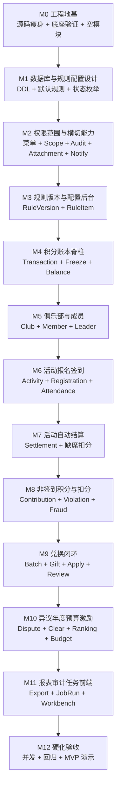

# 俱乐部员工积分系统开发计划（源码落地详版）

**框架基线：官方仓库 [github.com/YunaiV/ruoyi-vue-pro](https://github.com/YunaiV/ruoyi-vue-pro)。一切结构、依赖、约定以官方 master 为准，不以任何本地副本为准。**

---

## 0. 结论先行

这个系统不能按页面一页页堆。正确顺序是：**源码地基 -> 数据库设计 -> 规则配置 -> 权限范围 -> 账本 -> 俱乐部成员 -> 活动签到 -> 自动结算 -> 非签到积分和扣分 -> 兑换 -> 年度运营 -> 报表审计前端收口**。

最大的设计变化：**制度分值、阈值、区间、上限、结算缓冲、资格人数、激励金额全部系统配置化**。代码只做三件事：

1. 读取当前已发布规则版本和规则项。
2. 校验管理员输入是否落在配置边界内。
3. 把当时使用的规则版本、规则项、最终分值、快照写进业务记录和积分流水。

所以类似“违规扣分 10-20 分”“活动策划 15-30 分”不能写死在 Java 里。正确做法是配置 `min_points=10, max_points=20`，管理员处理时填写本次实际扣分，后端校验区间，流水保存最终 `points` 和 `rule_item_id`。固定值也用配置表达，例如月度履职 20 分就是 `min_points=20, max_points=20, default_points=20`。

---

## 1. 芋道源码落地事实

| 项 | 官方源码事实 | 本项目落地要求 |
| --- | --- | --- |
| 源码版本 | 根 `pom.xml`：`revision=2026.05-jdk8-SNAPSHOT`，`java.version=1.8`，`mapstruct.version=1.6.3`，`lombok.version=1.18.42` | 不升级 JDK，不引入新大框架，不把计划写成 Spring Boot 3 |
| 启用模块 | 根 `pom.xml` 默认只启用 `yudao-module-system`、`yudao-module-infra`；`yudao-server/pom.xml` 默认只依赖这两个模块 | 新增 `yudao-module-clubpoints`，根 pom 加 module，server pom 加依赖 |
| 当前保留模块 | 已裁剪后只保留 `yudao-dependencies`、`yudao-framework`、`yudao-server`、`yudao-module-system`、`yudao-module-infra` | 这是 clubpoints 的最小后端底座，不能再按业务模块粗删 |
| 当前已删模块 | `ai/bpm/crm/erp/im/iot/mall/member/mes/mp/pay/report/wms` 等独立业务模块已从源码目录删除 | 后续不得在 POM、配置、SQL、菜单、Job 中再引用这些模块 |
| 模块形态 | `yudao-module-system`、`yudao-module-infra` 是单 Maven 工程：`pom.xml + src`，不是 api/biz 双子模块 | `clubpoints` 同形态，不拆 `api/biz` 子模块 |
| 包结构 | 官方模块使用 `api/ controller/ convert/ dal/{dataobject,mysql,redis}/ enums/ framework/ job/ mq/ service/` | `clubpoints` 照这个结构建包 |
| DO 基类 | 官方普通业务 DO 继承 `cn.iocoder.yudao.framework.mybatis.core.dataobject.BaseDO`；租户扩展是 `TenantBaseDO` | 本项目关租户，业务 DO 一律继承 `BaseDO`，不继承 `TenantBaseDO` |
| Mapper | 官方 Mapper 继承 `BaseMapperX<T>`，查询常用 `LambdaQueryWrapperX<T>` | `clubpoints` Mapper 统一这样写，复杂报表再用 XML 或自定义 SQL |
| 分页 | 官方返回 `PageResult<T>`，分页入参复用 `PageParam` 语义 | API 设计里的分页保持芋道风格 |
| 权限 | 控制器用 `@PreAuthorize("@ss.hasPermission('system:user:delete')")` | 权限码统一 `clubpoints:<resource>:<action>`，前端隐藏按钮不算权限 |
| 登录用户 | 官方通过安全框架拿当前登录人 | 服务层使用 `SecurityFrameworkUtils.getLoginUserId()`，不要让前端传当前用户 ID |
| 错误码 | system/infra 有自己的 `enums/ErrorCodeConstants.java`，错误码格式是 `1_TTT_MMM_SSS` | `clubpoints` 独占 `1_300_xxx_xxx` 段，统一放模块内 `enums/ErrorCodeConstants.java` |
| 文件 | infra 暴露 `cn.iocoder.yudao.module.infra.api.file.FileApi` | 附件上传仍走 infra 文件能力，业务只存附件绑定和锁定状态 |
| 通知 | system 有 `NotifySendService`、`NotifyMessageService` 和通知消息表 | 第一版系统内通知复用 system 通知，不自建消息队列 |
| 任务 | job starter 提供 `JobHandler`，infra 负责定时任务管理和日志 | 业务任务 Handler 只触发 service；另建 `club_points_job_run` 存业务幂等和处理结果 |
| Excel | framework 有 `ExcelUtils`，导出 VO 使用 Excel 注解 | 报表导出复用 `yudao-spring-boot-starter-excel` |
| Lock4j | Lock4j 自动配置在 `yudao-spring-boot-starter-protection` | 兑换提交用 Lock4j 做短锁，数据库条件更新做最终兜底 |
| 租户 | 官方源码含租户 starter、租户表、租户菜单、请求头和数据隔离链路 | 本项目不做 SaaS，多租户能力在 M0 物理删除，不是只改 `enable=false` |

### 1.1 新模块 Maven 依赖

`yudao-module-clubpoints/pom.xml` 必须至少依赖：

| 依赖 | 用途 |
| --- | --- |
| `yudao-module-system` | 用户、部门、权限、站内信、操作日志相关能力 |
| `yudao-module-infra` | 文件能力、任务管理、Excel/代码生成参考 |
| `yudao-spring-boot-starter-security` | 登录、权限注解、当前用户 |
| `yudao-spring-boot-starter-mybatis` | DO/Mapper/分页 |
| `yudao-spring-boot-starter-redis` | 可选缓存和幂等短期防抖，不能当事实源 |
| `yudao-spring-boot-starter-protection` | Lock4j、防重复提交、限流等保护能力 |
| `yudao-spring-boot-starter-job` | 活动结算、年度清零、任务重试 |
| `yudao-spring-boot-starter-excel` | 报表导出 |
| `yudao-spring-boot-starter-test` | `BaseDbUnitTest`、`BaseMockitoUnitTest` |

禁止反向依赖：`system`、`infra` 不得依赖 `clubpoints`。需要通知、文件、用户时从 `clubpoints` 调它们的 API 或 service。

### 1.2 新模块包布局

```text
yudao-module-clubpoints/
  pom.xml
  src/main/java/cn/iocoder/yudao/module/clubpoints/
    ClubPointsModule.java
    api/
    controller/
      app/
        dashboard/
        ledger/
        club/
        activity/
        registration/
        attendance/
        redemption/
        dispute/
        notify/
      admin/
        club/
        activity/
        attendance/
        settlement/
        ledger/
        contribution/
        redemption/
        rule/
        dispute/
        annual/
        budget/
        report/
        audit/
        jobrun/
        dashboard/
    convert/
    dal/
      dataobject/
        rule/
        ledger/
        club/
        activity/
        contribution/
        redemption/
        dispute/
        annual/
        budget/
        audit/
        attachment/
        jobrun/
      mysql/
      redis/
    enums/
      ErrorCodeConstants.java
      DictTypeConstants.java
      rule/
      ledger/
      club/
      activity/
      contribution/
      redemption/
      annual/
    framework/
      audit/
      permission/
      web/
    job/
    service/
      rule/
      scope/
      audit/
      attachment/
      notify/
      ledger/
      club/
      activity/
      settlement/
      contribution/
      redemption/
      dispute/
      annual/
      budget/
      report/
      jobrun/
  src/test/java/cn/iocoder/yudao/module/clubpoints/
  src/test/resources/sql/create_tables.sql
  src/test/resources/sql/clean.sql
```

### 1.3 SQL 落地位置

第一版不引入 Flyway/Liquibase。按芋道习惯准备 SQL：

| 文件 | 内容 |
| --- | --- |
| `sql/mysql/club-points-schema.sql` | `club_points_*` 表结构、索引、唯一键 |
| `sql/mysql/club-points-seed.sql` | 菜单、权限、字典、默认规则配置、通知模板、定时任务 |
| `yudao-module-clubpoints/src/test/resources/sql/create_tables.sql` | 单测 H2/MySQL 兼容建表，覆盖核心表 |
| `yudao-module-clubpoints/src/test/resources/sql/clean.sql` | 单测清表 |

所有业务表统一前缀 `club_points_`。所有业务表继承 `BaseDO` 后包含 `creator/create_time/updater/update_time/deleted` 等字段，但核心事实表仍要有业务自己的状态字段，不能只靠逻辑删除表达状态。

### 1.4 当前源码瘦身基线

第一步不是直接写 clubpoints，而是先把芋道源码清到一个不会污染后台和初始化库的最小底座。当前基线如下。

必须保留：

1. `yudao-framework`：安全、Web、MyBatis、Redis、Quartz、Excel、Lock4j、文件存储客户端都在这里。
2. `yudao-module-system`：用户、部门、角色、菜单、登录、权限、站内信、操作日志是三类角色共用的身份底座。
3. `yudao-module-infra`：文件、定时任务、Job 日志、配置、代码生成、API 文档、数据库连接配置是 clubpoints 的工程底座。
4. `yudao-server`：应用启动入口，只加载 system、infra 和后续 clubpoints。
5. `sql/mysql`：第一版只保留 MySQL 初始化脚本，不保留其他数据库方言。
6. `yudao-ui/yudao-ui-admin-vue3`：管理端前端工程，已经从独立 Vue3 仓库恢复到当前源码目录。

已经删除：

1. 上游仓库宣传和 CI 目录：`.gitee`、`.github`、`.image`。
2. 旧前端集合里的非 Vue3 管理端占位目录；Vue3 管理端已恢复到 `yudao-ui/yudao-ui-admin-vue3`。
3. 当前项目不需要的业务模块：`yudao-module-ai`、`yudao-module-bpm`、`yudao-module-crm`、`yudao-module-erp`、`yudao-module-im`、`yudao-module-iot`、`yudao-module-mall`、`yudao-module-member`、`yudao-module-mes`、`yudao-module-mp`、`yudao-module-pay`、`yudao-module-report`、`yudao-module-wms`。
4. 非 MySQL SQL 方言目录：`db2/dm/highgo/kingbase/opengauss/oracle/postgresql/sqlserver/tools`。
5. `yudao-server` 的上游 `DefaultController`：它只为禁用模块返回提示，还带 `/test` 请求体测试接口。
6. `application*.yaml` 里的 Flowable、AI、Pay、Trade、IoT、已删模块日志和开放白名单。
7. `infra` main 源码里的 `demo01/demo02/demo03` 代码生成演示 CRUD。
8. `system` 的 `DemoJob` 示例定时任务。
9. MySQL seed 里的已删业务模块菜单树、角色菜单引用、支付/商城/IoT/demo Job、`yudao_demo*` 示例表、作者/文档外链菜单、示例云存储文件配置。
10. 后端租户能力：租户 starter、租户 controller/service/mapper/DO/API、`TenantBaseDO` 继承、`@TenantIgnore`、`TenantContextHolder`、`TenantUtils`、租户请求头、Swagger 租户 header、WebSocket 租户上下文、租户菜单过滤、租户账号额度限制。
11. 前端租户能力：租户管理、租户套餐、登录租户输入、租户 header 注入、租户缓存、顶部租户切换。
12. MySQL seed 租户能力：`system_tenant`、`system_tenant_package`、所有 `tenant_id` 字段、租户菜单、租户管理员角色、租户角色菜单引用、非基线租户数据。

本轮明确保留：

1. `system` 的短信、邮件、站内信、OAuth2、社交登录。短信和邮件是项目需要的通知通道，不能因为删除租户误砍。
2. `infra` 的文件、定时任务、API 文档、代码生成器。它们是后续 clubpoints 开发和附件能力的工程底座。
3. `@EnableLogRecord(tenant = "")`：这是第三方 `bizlog-sdk` 注解属性名，不是本系统租户能力，删掉会导致编译风险。
4. `infra` 代码生成器单测资源中的 demo 字符串。这些是断言样例，不注册运行态 Bean、菜单或表，先保留以免破坏 codegen 单测。

当前验证记录：

1. 后端 main 扫描：`TenantIgnore`、`TenantBaseDO`、`TenantContextHolder`、`TenantUtils`、租户 header、租户 API、租户 service 等硬引用无结果。
2. 后端全仓租户关键词扫描：只剩 `@EnableLogRecord(tenant = "")` 这一处第三方注解属性名。
3. MySQL 主 seed：`tenant_id`、`system_tenant`、租户菜单、租户角色关键词无结果。
4. 后端验证：`mvn -pl yudao-server -am -DskipTests -Dflatten.skip=true compile` 通过；`mvn -pl yudao-module-system,yudao-module-infra -am -DskipTests -Dflatten.skip=true test-compile` 通过。
5. 前端恢复：`pnpm install` 通过，Vite dev server 已能响应 `http://localhost:8889/` 和 `http://localhost:8889/src/main.ts`。
6. 前端 `pnpm ts:check` 当前仍有上游 TypeScript 严格类型债，主要是 Element Plus/TS6 类型收窄、未使用变量和局部 VO 类型定义问题；不是租户或已删业务模块引用。

---

## 2. 第一版配置化规则模型

### 2.1 规则总原则

1. **默认制度分值只作为 seed 数据**：例如小型活动基础 5 分、无故缺席扣 5 分、推荐新会员 3 分，都放到默认规则配置，不写死在 service。
2. **区间分值由规则定义边界，管理员决定实际值**：例如违规 10-20 分，系统配置 `min=10,max=20`，管理员处理时录入本次 `points=15`，后端只校验 10 到 20。
3. **固定分值也是区间的特例**：固定 8 分就是 `min=8,max=8,default=8`。
4. **业务记录必须保存规则快照**：保存 `rule_version_id`、`rule_item_id`、`rule_item_code`、`points_snapshot`、`rule_snapshot_json`。规则后续改了，历史不重算。
5. **规则版本管制度版本，规则项管系统可执行参数**：版本解决“什么时候生效”，规则项解决“具体分值、上限、阈值、开关”。
6. **配置只控制新业务**：已生成流水不随配置变化而更新；要追溯只能走撤销或调整。
7. **管理员可以改配置，但配置发布/停用必须审计**：未发布配置不能被业务使用。

### 2.2 核心规则表

`club-points-database-design.md` 已落定这些规则表，不允许后续实现退回到只写“规则版本”四个字：

| 表 | 作用 | 核心字段 |
| --- | --- | --- |
| `club_points_rule_version` | 一次制度发布版本 | `id/version_no/name/publicity_time/effective_time/status/summary/attachment_snapshot_json` |
| `club_points_rule_item` | 可执行规则项 | `id/rule_version_id/item_code/item_name/item_type/category/min_points/max_points/default_points/int_value/decimal_value/text_value/json_value/effective_time/status` |
| `club_points_rule_publish_record` | 发布、撤回、停用记录 | `rule_version_id/action/operator_id/reason/before_json/after_json` |

规则使用快照不单独建表。业务表和 `club_points_transaction` 直接保存 `rule_version_id`、`rule_item_id`、`rule_item_code_snapshot`、`rule_snapshot_json`，历史业务不随规则变更重算。

### 2.3 规则项编码

规则项编码必须稳定，业务代码只能引用编码，不引用中文名称。

| 规则域 | 规则项编码 | 默认值 | 配置含义 | 使用场景 |
| --- | --- | --- | --- | --- |
| 活动积分 | `ACTIVITY_SMALL_BASE` | 5 | 小型活动基础参与积分 | 活动创建默认值、结算 |
| 活动积分 | `ACTIVITY_SMALL_FULL_EXTRA` | 2 | 小型活动全程额外积分 | 活动创建默认值、结算 |
| 活动积分 | `ACTIVITY_MEDIUM_BASE` | 10 | 中型活动基础参与积分 | 活动创建默认值、结算 |
| 活动积分 | `ACTIVITY_MEDIUM_FULL_EXTRA` | 3 | 中型活动全程额外积分 | 活动创建默认值、结算 |
| 活动积分 | `ACTIVITY_LARGE_BASE` | 20 | 大型活动基础参与积分 | 活动创建默认值、结算 |
| 活动积分 | `ACTIVITY_LARGE_FULL_EXTRA` | 5 | 大型活动全程额外积分 | 活动创建默认值、结算 |
| 活动规则 | `SETTLEMENT_BUFFER_HOURS` | 2 | 签退窗口关闭后的结算缓冲小时数 | 结算任务扫描 |
| 扣分 | `ABSENCE_SINGLE_DEDUCT` | 5 | 单次无故缺席扣分 | 活动结算扣分 |
| 扣分 | `ABSENCE_MONTHLY_THRESHOLD` | 3 | 月度累计缺席触发次数 | 月度累计扣分 |
| 扣分 | `ABSENCE_MONTHLY_DEDUCT` | 20 | 月度累计缺席额外扣分 | 月度累计扣分 |
| 扣分 | `VIOLATION_DEDUCT_RANGE` | 10-20 | 活动违规扣分边界 | 管理员登记违规 |
| 扣分 | `SEVERE_VIOLATION_CANCEL_ACTIVITY_POINTS` | true | 严重违规是否可取消本次活动积分 | 管理员处理严重违规 |
| 扣分 | `FRAUD_CLEAR_AVAILABLE` | true | 弄虚作假是否扣除全部可用积分 | 管理员处理弄虚作假 |
| 扣分 | `FRAUD_CANCEL_ANNUAL_HONOR` | true | 弄虚作假是否取消年度评优资格 | 年度荣誉候选过滤 |
| 非签到积分 | `MONTHLY_DUTY_POINTS` | 20 | 月度履职积分 | 非签到材料审核 |
| 非签到积分 | `ACTIVITY_PLANNING_RANGE` | 15-30 | 活动策划积分边界 | 非签到材料审核 |
| 非签到积分 | `ACTIVITY_EXECUTION_POINTS` | 8 | 活动执行和现场组织积分 | 非签到材料审核 |
| 非签到积分 | `PUBLICITY_WORK_RANGE` | 10-20 | 作品采纳或宣传使用积分边界 | 非签到材料审核 |
| 非签到积分 | `ONSITE_SHARING_POINTS` | 8 | 现场分享积分 | 非签到材料审核 |
| 非签到积分 | `COMPANY_REPORT_POINTS` | 10 | 公司公众号报道积分 | 非签到材料审核 |
| 非签到积分 | `GROUP_REPORT_POINTS` | 15 | 集团公众号报道积分 | 非签到材料审核 |
| 非签到积分 | `PROVINCIAL_MEDIA_POINTS` | 20 | 省级及以上媒体报道积分 | 非签到材料审核 |
| 非签到积分 | `SUGGESTION_ACCEPTED_RANGE` | 10-20 | 合理化建议采纳积分边界 | 非签到材料审核 |
| 特殊奖励 | `COMPANY_AWARD_FIRST` | 30 | 公司级一等奖 | 非签到材料审核 |
| 特殊奖励 | `COMPANY_AWARD_SECOND` | 20 | 公司级二等奖 | 非签到材料审核 |
| 特殊奖励 | `COMPANY_AWARD_THIRD` | 15 | 公司级三等奖 | 非签到材料审核 |
| 特殊奖励 | `COMPANY_AWARD_EXCELLENT` | 10 | 公司级优秀奖 | 非签到材料审核 |
| 特殊奖励 | `GROUP_AWARD_FIRST` | 50 | 集团级及以上一等奖 | 非签到材料审核 |
| 特殊奖励 | `GROUP_AWARD_SECOND` | 40 | 集团级及以上二等奖 | 非签到材料审核 |
| 特殊奖励 | `GROUP_AWARD_THIRD` | 30 | 集团级及以上三等奖 | 非签到材料审核 |
| 特殊奖励 | `GROUP_AWARD_EXCELLENT` | 20 | 集团级及以上优秀奖 | 非签到材料审核 |
| 特殊奖励 | `RECOMMEND_MEMBER_POINTS` | 3 | 推荐新会员每人积分 | 推荐积分审核 |
| 特殊奖励 | `RECOMMEND_MEMBER_ANNUAL_CAP` | 15 | 每人每自然年推荐积分上限 | 推荐积分审核 |
| 特殊奖励 | `SPECIAL_CONTRIBUTION_RANGE` | 30-50 | 特殊贡献积分边界 | 管理员录入线下审批结果 |
| 兑换 | `REDEMPTION_MIN_AVAILABLE_POINTS` | 50 | 批次最低可兑换积分 | 批次开启资格快照 |
| 兑换 | `REDEMPTION_DEFAULT_QUALIFIED_COUNT` | 180 | 默认资格人数 | 批次开启资格快照 |
| 兑换 | `REDEMPTION_INCLUDE_TIE_AT_CUTOFF` | true | 第 N 名并列同分是否全进 | 批次开启资格快照 |
| 年度 | `ANNUAL_CLEAR_RELEASE_EXPIRED_FREEZE` | false | 跨年冻结释放后是否补清零 | 年度清零与兑换审核 |
| 激励 | `RANK_1_3_INCENTIVE_AMOUNT_CENT` | 200000 | 年度第 1-3 名经费建议 | 年度激励建议 |
| 激励 | `RANK_4_6_INCENTIVE_AMOUNT_CENT` | 100000 | 年度第 4-6 名经费建议 | 年度激励建议 |
| 激励 | `INNOVATION_AWARD_AMOUNT_CENT` | 200000 | 特色活动创新奖补贴建议 | 年度激励建议 |

### 2.4 配置化不是“无限配置”

第一版只做可执行规则项配置，不做复杂规则表达式引擎。不要搞 Drools，不要搞脚本执行，不要让管理员写公式。配置的粒度就是：整数、布尔、时间、金额、枚举、区间、JSON 白名单。

---

## 3. 开工前门禁

| 门禁 | 必须产物 | 不满足的后果 |
| --- | --- | --- |
| G0 源码门禁 | 裁剪后的最小底座可编译、可启动、前端可响应；租户能力已物理删除；短信、邮件、站内信保留 | 清理源码或删租户以后 system/infra/前端炸掉，后面全是废活 |
| G1 数据库设计门禁 | `club-points-database-design.md` 覆盖全部表、字段、索引、唯一键、状态枚举、快照字段、测试 DDL | M2 以后账本、冻结、兑换无法保证一致性 |
| G2 规则配置门禁 | 默认规则 seed、规则项编码、规则版本状态机、配置发布/停用审计 | 分值写死进代码，后期制度变化就是返工 |
| G3 前端页面门禁 | `club-points-frontend-page-design.md` 覆盖页面、字段、按钮权限、接口映射、强确认 | 前端到 M9 才发现接口不够、权限按钮错 |
| G4 验收矩阵门禁 | 每个高风险场景有测试项：重复发分、超兑、越权、扣成负数、跨年冻结释放 | 没测试就不可能说闭环可靠 |

---

## 4. 里程碑总览



| 里程碑 | 一句话目标 | 可演示成果 |
| --- | --- | --- |
| M0 | 芋道源码裁剪到最小底座，物理删除租户，恢复 Vue3 前端，新增空模块 | 登录正常，system/infra 正常，前端可响应，SQL seed 不再污染后台，clubpoints 空模块被扫描 |
| M1 | 把数据库和规则配置一次设计清楚 | 有可评审的 DDL、默认规则 seed、唯一键清单 |
| M2 | 建权限、范围、审计、附件、通知这些横切地基 | 三角色越权被拦，强审计失败会回滚 |
| M3 | 规则版本和规则项后台可用 | 管理员可发布规则，业务可读取当前规则 |
| M4 | 积分流水成为唯一事实源 | 加分、扣分、撤销、调整、冻结、余额重算可用 |
| M5 | 俱乐部、成员、负责人闭环 | 加入/退出/移除/停用/删除快照正确 |
| M6 | 活动、报名、签到签退、修正闭环 | 负责人建活动、管理员审核、员工报名签到 |
| M7 | 自动结算活动积分和缺席扣分 | 重跑不重复发分，扣分不扣成负数 |
| M8 | 非签到积分、违规、严重违规、弄虚作假闭环 | 规则配置分值生效，审核生成流水，违规可配置扣分 |
| M9 | 兑换申请、冻结、库存、审核闭环 | 并发不超兑，审核通过直接发放并扣分 |
| M10 | 异议、年度清零、排名、激励、预算闭环 | 1/1 清零、排名不受兑换影响、激励建议可确认 |
| M11 | 报表、任务监控、前端工作台和通知收口 | 导出、任务重试、待办、通知可用 |
| M12 | MVP 验收和硬化 | 全链路演示：活动发分 -> 查账 -> 兑换 -> 排名 -> 清零 |

更细的执行清单不要继续塞进本文件，避免主计划变成不可读巨型文档。每个里程碑的可打勾步骤、验收点、阻塞条件统一放在 `docs/development-milestones/`：

| 里程碑 | 细粒度清单 |
| --- | --- |
| M0 | `docs/development-milestones/M0-engineering-foundation.md` |
| M1 | `docs/development-milestones/M1-database-and-seed.md` |
| M2 | `docs/development-milestones/M2-permission-crosscutting.md` |
| M3 | `docs/development-milestones/M3-rule-config.md` |
| M4 | `docs/development-milestones/M4-ledger.md` |
| M5 | `docs/development-milestones/M5-club-member-leader.md` |
| M6 | `docs/development-milestones/M6-activity-registration-attendance.md` |
| M7 | `docs/development-milestones/M7-activity-settlement.md` |
| M8 | `docs/development-milestones/M8-contribution-violation.md` |
| M9 | `docs/development-milestones/M9-redemption.md` |
| M10 | `docs/development-milestones/M10-annual-dispute-budget.md` |
| M11 | `docs/development-milestones/M11-report-job-frontend.md` |
| M12 | `docs/development-milestones/M12-hardening-acceptance.md` |

---

## 5. M0 工程地基

**目标**：从本地芋道源码启动干净底座，先删掉当前项目不需要的模块、租户链路、演示代码和脏 seed，恢复 Vue3 管理前端，再新增 `clubpoints` 空模块并回归。

### 5.1 源码瘦身步骤

1. 确认根 `pom.xml` 只保留 `yudao-dependencies`、`yudao-framework`、`yudao-server`、`yudao-module-system`、`yudao-module-infra`。
2. 确认 `yudao-server/pom.xml` 只依赖 `yudao-module-system`、`yudao-module-infra` 和保护 starter。
3. 删除未参与当前构建的业务模块目录：`ai/bpm/crm/erp/im/iot/mall/member/mes/mp/pay/report/wms`。
4. 删除仓库宣传、非 Vue3 前端占位目录和非 MySQL SQL 方言目录，恢复 `yudao-ui/yudao-ui-admin-vue3` 作为管理端前端工程。
5. 删除 `DefaultController`，不要保留禁用模块提示和 `/test` 请求体接口。
6. 从 `application.yaml`、`application-local.yaml`、`application-dev.yaml` 删除 Flowable、AI、Pay、Trade、IoT 和已删业务模块配置。
7. 物理删除租户 starter、租户 system 业务包、租户 POM 依赖、租户请求头、租户数据隔离、租户菜单过滤和租户账号额度逻辑；不要只写 `yudao.tenant.enable=false`。
8. 删除 `infra` main 源码里的 `controller/admin/demo`、`service/demo`、`dal/dataobject/demo`、`dal/mysql/demo`。
9. 删除 `system` 的 `DemoJob`，只保留真实清理任务和后续 clubpoints 业务任务。
10. 清理测试代码和测试 SQL 中的租户残留，避免 main 能编译但 `test-compile` 后面爆炸。

### 5.2 SQL seed 清理步骤

1. 在 `sql/mysql/ruoyi-vue-pro.sql` 中递归删除这些业务根菜单及全部子菜单：支付、工作流、报表、公众号、会员、商城、CRM、ERP、AI、IoT、MES、WMS、IM。
2. 同步删除 `system_role_menu` 中指向被删菜单的记录，不能留下悬挂权限。
3. 删除 `infra:demo*` 菜单和 `infra/demo/demo0*` 前端组件路径。
4. 删除 `infra_job` 中已删模块 Job：`payNotifyJob`、`payOrderSyncJob`、`payOrderExpireJob`、`payRefundSyncJob`、`tradeOrderAutoCancelJob`、`tradeOrderAutoReceiveJob`、`tradeOrderAutoCommentJob`、`brokerageRecordUnfreezeJob`、`payTransferSyncJob`、`iotDeviceOfflineCheckJob`、`iotOtaUpgradeJob`、`combinationRecordExpireJob`、`couponExpireJob`、`productStatisticsJob`、`demoJob`。
5. 删除 `yudao_demo01_contact`、`yudao_demo02_category`、`yudao_demo03_course`、`yudao_demo03_grade`、`yudao_demo03_student` 的表结构和数据。
6. 删除作者动态、Boot 文档、Cloud 文档等外链菜单。
7. 文件配置只保留一个数据库存储配置作为默认 master，删除带示例云密钥形态的 S3/OSS/COS/TOS/OBS/MinIO/SFTP/本地示例配置。
8. 删除 `system_tenant`、`system_tenant_package`、所有业务表 `tenant_id` 列、租户菜单、租户套餐菜单、租户管理员角色和租户角色菜单引用。
9. 清理后顶级菜单只能剩 `系统管理` 和 `基础设施`，默认 Job 只能剩 `accessLogCleanJob`、`errorLogCleanJob`、`jobLogCleanJob`。

### 5.3 最小底座验证步骤

1. 运行残留扫描，确认 main 源码和 SQL 不再出现已删业务模块包名、接口路径、Job handler、demo 表、demo 权限和租户硬引用。
2. 运行轻量编译：`mvn -pl yudao-server -am -DskipTests -Dflatten.skip=true compile`。
3. 运行测试编译：`mvn -pl yudao-module-system,yudao-module-infra -am -DskipTests -Dflatten.skip=true test-compile`。
4. 如果本机 `.m2` 锁文件导致解析失败，改用隔离仓库：`mvn -Dmaven.repo.local=C:\jobs\pointsmall\.m2-tmp -pl yudao-server -am -DskipTests -Dflatten.skip=true compile`。
5. 重建本地 MySQL 数据卷后导入：`sql/mysql/ruoyi-vue-pro.sql` 和 `quartz.sql`。
6. 本地启动验证：`mvn spring-boot:run -pl yudao-server -Dspring-boot.run.arguments="--spring.profiles.active=local"`。
7. 回归登录、菜单、角色、部门、用户、字典、文件、定时任务、短信、邮件、站内信页面。
8. 前端安装和启动：进入 `yudao-ui/yudao-ui-admin-vue3`，执行 `pnpm install`、`pnpm dev`，确认 `http://localhost:8889` 页面入口 200。

### 5.4 clubpoints 空模块步骤

1. 创建 `yudao-module-clubpoints/pom.xml`。
2. 根 `pom.xml` 增加 `<module>yudao-module-clubpoints</module>`。
3. `yudao-server/pom.xml` 增加 `yudao-module-clubpoints` 依赖。
4. 创建 `ClubPointsModule.java` 或至少创建任一 Spring Bean，证明模块被扫描。
5. 创建 `enums/ErrorCodeConstants.java`，先只放模块占位错误码。
6. 创建 `src/test/resources/sql/create_tables.sql` 和 `clean.sql` 空文件，后续 M1 填。

### 5.5 退出标准

- [x] `mvn -pl yudao-server -am -DskipTests -Dflatten.skip=true compile` 可通过。未经明确要求不跑 full build。
- [x] `mvn -pl yudao-module-system,yudao-module-infra -am -DskipTests -Dflatten.skip=true test-compile` 可通过。
- [x] 租户 main 硬引用已清理；全仓只剩第三方注解属性名 `@EnableLogRecord(tenant = "")`。
- [x] 前端已恢复到 `yudao-ui/yudao-ui-admin-vue3`，`pnpm install` 可通过，Vite 入口可响应。
- [ ] 重建 MySQL 后验证登录、菜单、用户、角色、部门、文件、任务、短信、邮件页面正常。
- [x] SQL 顶级菜单只剩系统管理和基础设施，租户菜单/表/字段已从主 seed 删除。
- [x] main 源码和 SQL 中没有 `yudao-module-pay`、`yudao-module-mall`、`yudao-module-bpm`、`yudao_demo*`、`infra:demo*`、`demoJob` 等残留。
- [ ] `clubpoints` 模块 Bean 被 `yudao-server` 扫描。
- [ ] 没有引入 member/bpm/pay/mall 等被官方注释的业务模块。

### 5.6 红线

- 不能把业务表加进 `tenant.ignore-tables` 来糊弄租户问题。第一版是物理删除租户，不是关闭开关。
- 不能复制旧本地芋道源码当依据。当前 `C:\jobs\pointsmall\ruoyi-vue-pro-github` 的已裁剪源码是事实源。
- 不能为了少改代码直接删 `system`、`infra`、`framework` 整个模块；那会把用户、权限、文件、任务、Excel、Lock4j 一起砍掉。
- 不能只删 Java 模块不清 SQL。后台菜单、Job 和 seed 表不清，初始化库还是脏的。

---

## 6. M1 数据库与规则配置设计

**目标**：先把表、状态、唯一键、规则配置和快照策略写死在文档里，再写业务代码。

### 6.1 已产出的数据库设计和后续脚本

`docs/club-points-database-design.md` 已产出，后续生成正式 SQL 和测试 DDL 时必须继续保持这些内容一致：

1. 表总览。
2. 每张表的字段表。
3. 每张表的主键、唯一键、普通索引。
4. 每张表是否允许物理删除。
5. 每张表的状态机字段。
6. 每张表的快照字段。
7. 幂等键与数据库唯一约束映射。
8. 并发写策略：行锁、条件更新、唯一键冲突处理。
9. H2/MySQL 单测 DDL 兼容策略。
10. 默认规则 seed SQL。

### 6.2 表清单

数据库设计已覆盖这些业务表和查询模型：

| 域 | 表 |
| --- | --- |
| 规则 | `club_points_rule_version`、`club_points_rule_item`、`club_points_rule_publish_record` |
| 俱乐部 | `club_points_club`、`club_points_club_member`、`club_points_club_leader` |
| 活动 | `club_points_activity`、`club_points_activity_review_record`、`club_points_activity_point_config_version`、`club_points_activity_registration`、`club_points_attendance_record`、`club_points_attendance_correction`、`club_points_activity_settlement_run` |
| 账本 | `club_points_transaction`、`club_points_point_account`、`club_points_freeze`、`club_points_user_year_status` |
| 非签到 | `club_points_contribution_material`、`club_points_contribution_item`、`club_points_contribution_review_record` |
| 兑换 | `club_points_redemption_batch`、`club_points_redemption_gift`、`club_points_redemption_eligibility_snapshot`、`club_points_redemption_application`、`club_points_stock_lock`、`club_points_redemption_review_record` |
| 异议 | `club_points_dispute` |
| 年度 | `club_points_annual_clearing_record`、`club_points_annual_ranking_record`、`club_points_incentive_record` |
| 预算 | `club_points_budget_record` |
| 支撑 | `club_points_attachment_ref`、`club_points_audit_log`、`club_points_job_run` |
| 报表 | 不新增主表，基于 `club_points_transaction`、`club_points_redemption_application`、`club_points_point_account`、`club_points_annual_ranking_record`、`club_points_budget_record` 查询或导出 |

### 6.3 高风险唯一键

这些唯一键不允许漏：

| 场景 | 唯一键建议 |
| --- | --- |
| 活动结算发分 | `uk_tx_user_source_type`：`user_id, source_type, source_id, item_type, effective_status`，或单独 `idempotent_key` |
| 单次无故缺席扣分 | `ACTIVITY_ABSENCE:{activityId}:{userId}` |
| 月度累计缺席扣分 | `MONTHLY_ABSENCE:{yearMonth}:{userId}` |
| 月度履职 | `MONTHLY_DUTY:{userId}:{clubId}:{yearMonth}` |
| 推荐积分年度上限记录 | `RECOMMEND:{referrerUserId}:{newMemberUserId}:{clubId}:{year}`，并按年度累计校验 cap |
| 管理员代录 | `DIRECT_CONTRIBUTION:{requestNo}` |
| 兑换申请 | `REDEMPTION_APPLY:{batchId}:{giftId}:{userId}:{requestNo}` |
| 兑换审核扣分 | `REDEMPTION_APPROVE:{applicationId}` |
| 撤销流水 | `LEDGER_REVERSE:{sourceTransactionId}` |
| 年度清零 | `ANNUAL_CLEARING:{year}:{userId}` |

### 6.4 退出标准

- [x] `club-points-database-design.md` 已覆盖 API 文档需要的主表、快照、唯一约束和报表查询模型，不出现“表待定”。
- [ ] 所有可重复触发动作都有数据库唯一约束，不只靠 Redis。
- [ ] 所有物理删除允许的对象都有快照策略。
- [ ] 所有配置化分值都有规则项编码和默认 seed。
- [ ] 测试 DDL 与正式 DDL 字段一致，不搞两套事实。

---

## 7. M2 权限范围与横切能力

**目标**：先建横切基础，不然后面每个业务接口都会重复写烂代码。

### 7.1 权限菜单

**源码落点**：

| 文件/包 | 内容 |
| --- | --- |
| `sql/mysql/club-points-seed.sql` | 菜单、按钮权限、角色权限初始化 |
| `enums/DictTypeConstants.java` | 状态枚举字典类型 |
| `controller/admin/*`、`controller/app/*` | `@PreAuthorize` 权限声明 |

**任务**：

1. 按 `club-points-functions-and-permissions.md` 建全部权限码。
2. 建员工、负责人、管理员三类角色建议 seed。
3. 员工自助接口可只要求登录或细粒度权限，但写操作必须后端校验本人。
4. 负责人接口路径统一 `/clubpoints/leader/...`，控制器可放 `controller/admin` 下。
5. 管理员接口路径统一 `/clubpoints/...`。

### 7.2 ClubScopeService

**源码落点**：`service/scope/ClubScopeService.java`、`service/scope/ClubScopeServiceImpl.java`。

**必须提供的方法**：

| 方法 | 用途 |
| --- | --- |
| `validateSelf(Long userId)` | 本人操作 |
| `validateJoinedClub(Long userId, Long clubId)` | 员工查看已加入俱乐部活动和成员 |
| `validateManagedClub(Long leaderUserId, Long clubId)` | 负责人管理俱乐部 |
| `validateActivityVisibleToUser(Long userId, Long activityId)` | 员工看已发布活动或本人历史活动 |
| `validateRegistrationOwner(Long userId, Long registrationId)` | 本人报名、取消、签到 |
| `listJoinedClubIds(Long userId)` | 员工列表查询 |
| `listManagedClubIds(Long userId)` | 负责人列表查询 |
| `validateAdmin()` | 只有管理员动作，通常由权限码兜底 |

第一版不要急着写 `ClubDataPermissionRule`。显式校验更笨但更清楚。列表查询先拿 `clubIds` 再加条件，性能问题第二阶段再做数据权限插件。

### 7.3 ClubAuditService

**源码落点**：`service/audit/ClubAuditService.java`、`dal/dataobject/audit/ClubAuditLogDO.java`。

**必须做到**：

1. 强审计和业务写入同事务。
2. 强审计失败，业务回滚。
3. 审计记录保存操作人、操作时间、业务类型、业务 ID、动作、前后快照、原因、附件快照。
4. 审计日志只允许管理员看。
5. 审计保留三年策略至少在文档和字段上预留。

**强审计动作**：

修改已发布活动关键信息、取消活动、物理删除俱乐部/活动/材料、补录或修正签到签退、管理员代录积分、审核非签到材料、审核兑换、手工调整或撤销流水、修改兑换资格规则、年度清零人工处理、报表导出、设置或移除负责人、移除成员、停用或删除俱乐部、发布或停用规则版本、处理异议。

### 7.4 AttachmentService

**源码落点**：`service/attachment/ClubAttachmentService.java`、`dal/dataobject/attachment/ClubAttachmentDO.java`。

**设计要求**：

1. 文件上传仍用 `FileApi`。
2. 业务表不直接塞多个 `file_id` 字段，统一通过附件绑定表关联。
3. 支持文件和外部链接。
4. 审核前上传人可删改。
5. 审核后锁定，上传人不能删改。
6. 审核后管理员可追加备注或补充附件。
7. 物理删除业务记录前，必须保存附件快照。

### 7.5 ClubNotifyService

**源码落点**：`service/notify/ClubNotifyService.java`。

**复用方式**：调用 system 的 `NotifySendService`，不要新建消息队列表。

**通知触发点**：

1. 活动审核结果。
2. 非签到积分审核结果。
3. 兑换审核结果。
4. 异议回复。
5. 系统管理员手工调整积分。

### 7.6 退出标准

- [ ] 任意负责人访问非负责俱乐部接口被拒。
- [ ] 员工访问他人积分、兑换、异议被拒。
- [ ] 强审计写失败时，业务操作回滚。
- [ ] 附件锁定后普通上传人不能替换。
- [ ] 通知可在本人通知分页看到，支持标记已读。

---

## 8. M3 规则版本与配置后台

**目标**：管理员能维护制度版本和规则项，业务服务只能使用已发布规则。

### 8.1 源码落点

| 类型 | 路径 |
| --- | --- |
| Controller | `controller/admin/rule/RuleVersionController.java`、`RuleItemController.java` |
| VO | `controller/admin/rule/vo/*` |
| Service | `service/rule/RuleVersionService.java`、`RuleItemService.java`、`RuleResolveService.java` |
| DO | `dal/dataobject/rule/RuleVersionDO.java`、`RuleItemDO.java`、`RulePublishRecordDO.java` |
| Mapper | `dal/mysql/rule/*Mapper.java` |
| Enum | `enums/rule/RuleVersionStatusEnum.java`、`RuleItemCodeEnum.java`、`RuleItemTypeEnum.java` |

### 8.2 状态机

规则版本状态：

```text
DRAFT -> PUBLISHED -> DISABLED
DRAFT -> WITHDRAWN
```

约束：

1. `DRAFT` 可修改、可撤回。
2. `PUBLISHED` 不可修改内容，只能停用或发布新版本替代。
3. 同一时间只能有一个主生效版本。允许未来生效版本，但业务查询必须按 `occurred_at` 找适用版本。
4. 发布、停用写强审计。

### 8.3 业务读取接口

`RuleResolveService` 必须提供：

| 方法 | 说明 |
| --- | --- |
| `getEffectiveVersion(LocalDateTime occurredAt)` | 按业务发生时间找规则版本 |
| `getItem(Long ruleVersionId, String itemCode)` | 找具体规则项 |
| `getFixedPoints(ruleVersionId, itemCode)` | 读取固定积分 |
| `validatePointsInRange(ruleVersionId, itemCode, points)` | 校验管理员填写的分值 |
| `snapshotRuleItem(ruleVersionId, itemCode)` | 生成规则快照 JSON |

### 8.4 默认规则初始化

M3 必须提供默认 seed，让系统开箱可跑。默认 seed 来自 PRD，但作为配置，不作为代码常量。业务代码允许有 `RuleItemCodeEnum`，不允许有 `if type == SMALL return 5` 这种垃圾。

### 8.5 退出标准

- [ ] 管理员可创建、修改草稿规则版本。
- [ ] 管理员可发布规则版本，发布写审计。
- [ ] 未发布规则不能被活动、非签到、扣分、兑换使用。
- [ ] 修改规则后，历史流水显示原规则版本和快照不变。
- [ ] 违规 10-20 这种区间能被配置，管理员录入 21 会被后端拒绝。

---

## 9. M4 积分账本脊柱

**目标**：积分流水、冻结、余额推导、来源统计全部可用。账本是唯一事实源。

### 9.1 源码落点

| 类型 | 路径 |
| --- | --- |
| Controller | `controller/app/ledger/AppLedgerController.java`、`controller/admin/ledger/LedgerController.java` |
| Service | `service/ledger/PointLedgerService.java`、`LedgerQueryService.java`、`PointFreezeService.java` |
| DO | `dal/dataobject/ledger/PointTransactionDO.java`、`PointFreezeDO.java` |
| Mapper | `dal/mysql/ledger/PointTransactionMapper.java`、`PointFreezeMapper.java` |
| Enum | `enums/ledger/TransactionDirectionEnum.java`、`PointCategoryEnum.java`、`SourceTypeEnum.java`、`FreezeStatusEnum.java` |

### 9.2 流水字段要求

`club_points_transaction` 至少包含：

| 字段 | 说明 |
| --- | --- |
| `user_id` | 员工 |
| `direction` | 增加/扣减 |
| `points` | 正整数；方向决定加减 |
| `signed_points` | 可选，带正负，便于聚合 |
| `point_category` | 基础参与、主动贡献、特殊奖励、扣分、兑换、清零、调整、撤销 |
| `source_type` | 活动、非签到、兑换、年度清零、调整、撤销、违规等 |
| `source_id` | 来源对象 ID |
| `source_name_snapshot` | 来源展示名称快照 |
| `issuing_club_id` | 发放俱乐部，正向发放必须有 |
| `issuing_club_name_snapshot` | 发放俱乐部快照 |
| `occurred_at` | 业务发生时间，统计一律用它 |
| `effective_status` | 已生效/已撤销/无效 |
| `rule_version_id` | 规则版本 |
| `rule_item_id` | 规则项 |
| `rule_snapshot_json` | 规则快照 |
| `idempotent_key` | 幂等键 |
| `reverse_source_transaction_id` | 撤销关联原流水 |
| `reason` | 原因 |
| `operator_id` | 操作人 |
| `material_snapshot_json` | 材料快照 |

### 9.3 服务规则

`PointLedgerService`：

1. `createTransaction()` 只追加，不 update 原流水。
2. 幂等键冲突且参数一致，返回已有流水。
3. 幂等键冲突但参数不一致，抛 `IDEMPOTENT_CONFLICT`。
4. 扣分前计算当前可用，实际扣分不得超过可用积分。
5. 撤销只能新增反向流水并关联原流水。
6. 不能同时“排除原流水”和“新增反向流水”双重抵消。
7. 调整必须有原因、材料、规则版本、操作人。

`PointFreezeService`：

1. 冻结不是流水。
2. 冻结减少可用积分，不改变账户净积分。
3. 兑换审核通过：冻结关闭为已扣减，并生成兑换负向流水。
4. 兑换拒绝/取消：冻结关闭为已释放，不生成兑换流水。

`LedgerQueryService`：

1. 账户净积分 = 有效流水求和。
2. 当前可用 = 账户净积分 - 有效冻结。
3. 来源统计只统计正向获取流水。
4. 来源统计不展示当前余额构成。
5. 来源统计不因兑换、扣分、清零改变。
6. 撤销流水不回溯来源图表，但账户净积分和俱乐部发放统计要扣回。

### 9.4 测试

必须写 `BaseDbUnitTest`：

| 测试 | 断言 |
| --- | --- |
| 重复发分 | 同一幂等键只生成一条流水 |
| 幂等冲突 | 同一幂等键参数不同抛错 |
| 扣分不为负 | 可用 3 分扣 5 分，实际扣 3 分 |
| 冻结影响可用 | 净积分 100，冻结 40，可用 60 |
| 撤销 | 原流水 +100，撤销 -100，余额归零，原流水仍在 |
| 来源统计 | 兑换/扣分/清零后来源统计不变 |

### 9.5 退出标准

- [ ] 能查本人积分概览、流水、来源统计。
- [ ] 管理员能查全局账户和流水。
- [ ] 余额清缓存后可从流水重算一致。
- [ ] 任何业务都没有直接 update 余额字段。

---

## 10. M5 俱乐部、成员、负责人

**目标**：俱乐部生命周期、成员关系、负责人关系和历史快照可用。

### 10.1 源码落点

| 类型 | 路径 |
| --- | --- |
| Controller | `controller/app/club/AppClubController.java`、`controller/admin/club/ClubController.java`、`ClubMemberController.java`、`ClubLeaderController.java` |
| Service | `service/club/ClubService.java`、`ClubMemberService.java`、`ClubLeaderService.java` |
| DO | `ClubDO.java`、`ClubMemberDO.java`、`ClubLeaderDO.java` |
| Mapper | `ClubMapper.java`、`ClubMemberMapper.java`、`ClubLeaderMapper.java` |

### 10.2 业务细节

1. 员工可加入多个俱乐部，立即生效。
2. 员工退出后，不能看新活动和成员名单，但能看本人历史参与和流水。
3. 员工退出时自动取消未结束活动报名，不扣无故缺席。
4. 管理员移除成员时必须填原因、写审计，并自动取消未结束报名，不扣无故缺席。
5. 负责人不能移除成员，不能设置负责人。
6. 负责人可修改自己负责俱乐部普通信息，必须写审计。
7. 俱乐部停用后，员工不能再加入，负责人不能新建活动；已发布未结束活动必须先取消或结束。
8. 物理删除俱乐部前强确认，保存名称、编号、负责人、成员、预算、排名相关快照。
9. 删除后普通用户不可见，历史报表显示删除前名称并标“已删除”。

### 10.3 与 M6 的接口预留

M5 先写 `RegistrationCancelPort` 或在 `ClubMemberService` 中预留取消报名回调接口。M6 活动报名表完成后接通，不能等 M6 再反过来重构 M5。

### 10.4 测试

| 测试 | 断言 |
| --- | --- |
| 重复加入 | 返回已加入或幂等成功，不重复成员记录 |
| 退出俱乐部 | 成员状态变退出，历史流水可见，新活动不可见 |
| 移除成员 | 只有管理员可做，写审计 |
| 停用俱乐部 | 不能加入，不能新建活动 |
| 删除俱乐部 | 快照保留，主表物理删除后报表仍有名称 |

### 10.5 退出标准

- [ ] 员工加入、退出、查看成员名单可用。
- [ ] 管理员创建、修改、停用、删除俱乐部可用。
- [ ] 管理员设置多个负责人可用。
- [ ] 负责人只能管理负责俱乐部。

---

## 11. M6 活动、报名、签到签退

**目标**：活动状态机、报名、签到、签退、补录、修正、特殊缺席完整落地。

### 11.1 源码落点

| 类型 | 路径 |
| --- | --- |
| Controller | `controller/app/activity`、`controller/app/registration`、`controller/app/attendance`、`controller/admin/activity`、`controller/admin/attendance` |
| Service | `ActivityService`、`ActivityReviewService`、`ActivityRegistrationService`、`AttendanceService`、`SpecialAbsenceService` |
| DO | `ActivityDO`、`ActivityConfigVersionDO`、`ActivityReviewRecordDO`、`RegistrationDO`、`AttendanceRecordDO`、`SpecialAbsenceDO` |
| Mapper | 对应 Mapper |

### 11.2 活动状态机

```text
DRAFT -> REVIEWING -> REJECTED -> REVIEWING
DRAFT -> PUBLISHED        (管理员直接发布)
REVIEWING -> PUBLISHED    (管理员审核通过)
PUBLISHED -> CANCELLED
PUBLISHED -> FINISHED
任意未结算状态 -> DELETED  (按权限和快照规则)
```

必须支持：

1. 负责人建草稿。
2. 负责人提交审核。
3. 负责人撤回待审活动。
4. 管理员审核通过发布。
5. 管理员驳回，负责人可修改重提。
6. 管理员可直接创建并发布。
7. 活动普通信息发布后可直接改。
8. 活动关键信息发布后可改，但必须写强审计。
9. 活动等级、基础积分、全程额外积分变化必须生成 `club_points_activity_point_config_version`。
10. 结算使用结算时有效配置版本；结算后再改不影响已生成流水。

### 11.3 报名规则

1. 员工只能报名已加入俱乐部的已发布活动。
2. 报名资格按当前有效报名截止时间判断。
3. 第一版不做名额上限和候补。
4. 员工可在活动开始前 24 小时自助取消，不扣分。
5. 退出俱乐部、管理员移除、活动取消导致自动取消，不扣分。
6. 自动取消要记录取消原因。

### 11.4 签到签退规则

1. 签到入口只在本人报名记录。
2. 签退入口只在本人报名记录。
3. 负责人或管理员补录/修正也必须从报名记录发起。
4. 系统不通过补录自动创建报名记录。
5. 窗口修改不自动作废已有签到或签退。
6. 结算前修正影响结算。
7. 结算后修正不能改原流水，只能走管理员调整/撤销。

### 11.5 特殊缺席

1. 负责人或管理员可标记提前告知/特殊情况。
2. 特殊缺席不生成单次无故缺席扣分。
3. 特殊缺席不计入月度累计缺席次数。
4. 标记必须写审计和原因。

### 11.6 测试

| 测试 | 断言 |
| --- | --- |
| 员工看活动 | 只能看已加入俱乐部已发布活动 |
| 驳回重提 | REJECTED 可修改后重新提交 |
| 管理员直接发布 | 不需要审核 |
| 报名截止 | 截止后不能报名，改晚后可报名 |
| 取消窗口 | 开始前 24 小时外不能自助取消 |
| 补录 | 没有报名记录不能补录 |
| 窗口修改 | 已签到记录不被自动作废 |

### 11.7 退出标准

- [ ] 负责人建活动 -> 管理员审核 -> 员工报名 -> 签到签退完整跑通。
- [ ] 活动取消后不加分、不扣分。
- [ ] 特殊缺席能阻止后续缺席扣分。
- [ ] 强审计动作都有审计记录。

---

## 12. M7 活动自动结算与缺席扣分

**目标**：按配置自动结算活动基础分、全程分、单次缺席扣分、月度累计缺席扣分。

### 12.1 源码落点

| 类型 | 路径 |
| --- | --- |
| Job | `job/ActivitySettlementScanJob.java` |
| Service | `service/settlement/ActivitySettlementService.java`、`AbsencePenaltyService.java`、`JobRunService.java` |
| DO | `JobRunDO.java`，必要时 `ActivitySettlementRecordDO` |
| Mapper | `JobRunMapper.java` |

### 12.2 任务设计

1. Quartz JobHandler 只负责扫描候选活动和调用 service。
2. 业务幂等写 `club_points_job_run`，不要依赖 infra job log 当业务事实。
3. 触发点 = `max(activity.end_time, check_out_window_end) + SETTLEMENT_BUFFER_HOURS`。
4. `SETTLEMENT_BUFFER_HOURS` 来自已发布规则配置，默认 2 小时。
5. 支持管理员手动触发结算，手动触发必须写审计。
6. 结算失败记录异常摘要，可重试。

### 12.3 结算规则

| 情况 | 结果 |
| --- | --- |
| 已签到，未签退 | 基础参与积分 |
| 已签到，已签退 | 基础参与积分 + 全程额外积分 |
| 未签到，未特殊缺席，活动未取消 | 单次无故缺席扣分 |
| 未签到，已特殊缺席 | 不扣分，不计累计缺席 |
| 活动取消 | 不发分，不扣分 |
| 仅签退未签到 | 不发活动积分 |

所有积分和扣分都通过 `PointLedgerService` 写流水。分值来自活动配置版本或规则项快照。

### 12.4 月度累计缺席

1. 自然月按北京时间。
2. 只统计无故缺席，不统计特殊缺席。
3. 达到 `ABSENCE_MONTHLY_THRESHOLD` 后生成一次 `ABSENCE_MONTHLY_DEDUCT`。
4. 同员工同自然月只触发一次。
5. 第 4 次、第 5 次缺席只新增单次扣分，不重复生成月度累计扣分。

### 12.5 测试

| 测试 | 断言 |
| --- | --- |
| 只签到 | 生成基础分 |
| 签到签退 | 生成基础分和全程分 |
| 未签到 | 生成单次缺席扣分 |
| 特殊缺席 | 不扣分，不计累计 |
| 月度累计 | 第 3 次生成额外扣分，第 4 次不重复 |
| 任务重跑 | 不重复发分，不重复扣分 |
| 扣分不为负 | 可用不足时最多扣到 0 |

### 12.6 退出标准

- [ ] 自动结算可由任务触发。
- [ ] 管理员手动触发可用且写审计。
- [ ] 任务重跑不重复生成流水。
- [ ] 结算失败可在任务运行页看到。

---

## 13. M8 非签到积分、违规扣分、弄虚作假

**目标**：主动贡献、特殊奖励、推荐、特殊贡献、违规、严重违规、弄虚作假全部通过配置规则和账本闭环。

### 13.1 源码落点

| 类型 | 路径 |
| --- | --- |
| Controller | `controller/admin/contribution`、`controller/admin/ledger` |
| Service | `ContributionMaterialService`、`ContributionReviewService`、`ContributionDirectService`、`PenaltyService`、`FraudHandlingService` |
| DO | `ContributionMaterialDO`、`ContributionItemDO`、`ContributionReviewRecordDO`、`ContributionChangeRecordDO`、`PenaltyRecordDO`、`AnnualHonorQualificationDO` |
| Enum | `ContributionTypeEnum`、`PenaltyTypeEnum`、`HonorQualificationStatusEnum` |

### 13.2 非签到材料状态机

```text
DRAFT -> REVIEWING -> APPROVED
DRAFT -> REVIEWING -> REJECTED -> DRAFT -> REVIEWING
REVIEWING -> WITHDRAWN -> DRAFT
DRAFT/REJECTED/WITHDRAWN -> DELETED
```

必须保留：

1. 历次驳回原因。
2. 修改历史。
3. 重新提交记录。
4. 审核通过时的材料快照和附件快照。
5. 物理删除时的删除快照和审计。

### 13.3 非签到积分配置校验

| 类型 | 后端校验 |
| --- | --- |
| 月度履职 | 同员工同俱乐部同自然月唯一，分值来自 `MONTHLY_DUTY_POINTS` |
| 活动策划 | 管理员/负责人录入分值必须在 `ACTIVITY_PLANNING_RANGE` |
| 活动执行 | 分值来自 `ACTIVITY_EXECUTION_POINTS` |
| 宣传采纳 | 分值必须在 `PUBLICITY_WORK_RANGE` |
| 分享经验 | 分值来自 `ONSITE_SHARING_POINTS` |
| 公司/集团/省级报道 | 分值来自对应规则项 |
| 合理化建议 | 分值必须在 `SUGGESTION_ACCEPTED_RANGE` |
| 推荐新会员 | 每人 `RECOMMEND_MEMBER_POINTS`，年度累计不超过 `RECOMMEND_MEMBER_ANNUAL_CAP` |
| 特殊贡献 | 分值必须在 `SPECIAL_CONTRIBUTION_RANGE`，必须记录线下审批结果 |

### 13.4 审核通过逻辑

1. 校验材料状态是待审核。
2. 校验规则版本有效。
3. 校验每个明细分值在配置范围内。
4. 校验月度履职唯一、推荐年度上限。
5. 锁定材料和附件。
6. 对每条明细调用 `PointLedgerService` 写正向流水。
7. 写审核记录和强审计。
8. 给相关员工发系统内通知。

以上必须在同一事务内完成。失败不能出现“材料通过了但流水没生成”的脏状态。

### 13.5 管理员代录

管理员代录不是审核材料。它必须：

1. 填 `requestNo` 做幂等。
2. 选择规则版本和规则项。
3. 填分值、原因、材料。
4. 后端校验分值范围。
5. 直接生成流水。
6. 写强审计。
7. 通知员工。

### 13.6 违规和弄虚作假

违规扣分不能混在普通调整里糊掉，至少要有 `PenaltyService` 和 `PenaltyRecordDO`。

| 场景 | 处理 |
| --- | --- |
| 活动违规 | 管理员选择 `VIOLATION_DEDUCT_RANGE` 内的实际扣分，填写原因和材料，生成扣分流水 |
| 严重违规 | 可记录取消本次活动积分、暂停会员资格 1 个月；取消已发活动积分必须走撤销流水 |
| 弄虚作假 | 若涉及来源正向流水，先撤销原流水；如配置要求额外处罚，再扣除当前全部可用积分；记录年度评优资格取消 |
| 普通扣分 | 不得消耗冻结积分；可用不足时扣到 0 |

### 13.7 测试

| 测试 | 断言 |
| --- | --- |
| 月度履职唯一 | 同员工同俱乐部同月重复提交只返回已有结果 |
| 区间校验 | 配置 15-30，录入 31 被拒 |
| 推荐上限 | 年度 cap 15，超过部分保留记录但不发分 |
| 审核事务 | 流水写失败时材料不变为通过 |
| 违规扣分 | 分值来自配置范围，不能扣成负数 |
| 弄虚作假 | 先撤销来源，再扣可用，年度评优资格变更 |

### 13.8 退出标准

- [ ] 负责人提交 -> 管理员审核 -> 生成流水完整跑通。
- [ ] 管理员代录完整跑通。
- [ ] 违规、严重违规、弄虚作假都不是手工改余额。
- [ ] 所有分值都来自规则配置和管理员录入，不写死。

---

## 14. M9 兑换闭环

**目标**：兑换批次、礼品库存、资格快照、申请、冻结、审核、直接发放完整闭环。

### 14.1 源码落点

| 类型 | 路径 |
| --- | --- |
| Controller | `controller/app/redemption`、`controller/admin/redemption` |
| Service | `RedemptionBatchService`、`RedemptionGiftService`、`RedemptionQualificationService`、`RedemptionApplicationService`、`RedemptionReviewService` |
| DO | `RedemptionBatchDO`、`RedemptionGiftDO`、`RedemptionQualificationDO`、`RedemptionApplicationDO`、`RedemptionReviewRecordDO` |
| Enum | `RedemptionBatchStatusEnum`、`GiftStatusEnum`、`ApplicationStatusEnum` |

### 14.2 批次和资格

1. 批次通常为 6 月最后一周和 12 月最后一周，但时间可配置。
2. 批次开启时生成资格快照。
3. 最低可兑换积分来自 `REDEMPTION_MIN_AVAILABLE_POINTS`。
4. 资格人数来自批次配置；默认来自 `REDEMPTION_DEFAULT_QUALIFIED_COUNT`。
5. 第 N 名并列同分是否全进来自 `REDEMPTION_INCLUDE_TIE_AT_CUTOFF`。
6. 资格快照保存账户净积分、冻结积分、当前可用积分、年度累计获取积分、排名。
7. 修改资格规则必须写强审计。

### 14.3 礼品

礼品必须配置名称、档位、积分价格、库存、参考价值、图片、状态。

库存字段建议：

| 字段 | 说明 |
| --- | --- |
| `stock_total` | 总库存 |
| `stock_locked` | 已锁定，待审核 |
| `stock_used` | 已审核通过 |
| `stock_available` | 可由查询计算，也可冗余但必须一致 |

提交申请时用条件更新兜底：

```text
update gift
set stock_locked = stock_locked + 1
where id = ? and status = on and stock_total - stock_locked - stock_used > 0
```

Lock4j 可以减少并发冲突，但数据库条件更新才是最终事实。

### 14.4 申请

申请提交同事务：

1. 校验批次开放。
2. 校验员工在资格快照中。
3. 实时查询当前可用积分。
4. 校验礼品库存。
5. 创建冻结记录。
6. 锁定库存。
7. 创建兑换申请，记录兑换前积分、冻结积分、礼品快照、资格排名快照。

### 14.5 审核

管理员只能通过或拒绝，不能改礼品、不能改消耗积分。

| 审核结果 | 动作 |
| --- | --- |
| 通过 | 关闭冻结为已扣减，生成兑换负向流水，库存从 locked 转 used，记录直接发放，保存兑换后快照 |
| 拒绝 | 关闭冻结为已释放，库存从 locked 释放，不生成兑换流水 |
| 员工取消 | 审核前可取消，释放冻结和库存，不生成兑换流水 |

跨年冻结释放规则按 PRD：审核拒绝或取消时，即使已经跨过有效期，也释放回账户，当前版本不追加过期清零。这个口径如果以后变，必须通过规则版本发布。

### 14.6 测试

| 测试 | 断言 |
| --- | --- |
| 并发库存 | 库存 1，两人同时申请只有一人成功 |
| 资格排名 | 第 181 名不可申请；第 180 名并列时同分全进 |
| 实时余额 | 资格快照有资格但当前可用不足，不能申请 |
| 审核通过 | 冻结关闭、生成扣减流水、库存 used 增加 |
| 审核拒绝 | 冻结释放、库存释放、无扣减流水 |
| 员工取消 | 审核前可取消，释放冻结库存 |
| 跨年释放 | 释放回账户，不追加清零 |

### 14.7 退出标准

- [ ] 兑换全链路：开批次 -> 生成资格 -> 申请 -> 审核通过 -> 直接发放。
- [ ] 并发不超兑。
- [ ] 兑换快照稳定，不随后续积分变化。
- [ ] 兑换扣分不追踪来源，不找零，不拆分。

---

## 15. M10 异议、年度清零、排名、激励、预算

**目标**：运营域闭环，补齐 PRD 里最容易被粗计划漏掉的内容。

### 15.1 异议

**源码落点**：`service/dispute`、`controller/app/dispute`、`controller/admin/dispute`。

规则：

1. 员工可对积分登记、扣除、兑换提交异议。
2. 异议可上传附件或证据链接。
3. 管理员处理可上传处理附件或依据链接。
4. 处理期间默认不冻结积分。
5. 需要改积分时，只能走调整或撤销。
6. 处理结果通知员工。
7. 异议附件长期保留。

### 15.2 年度清零

**源码落点**：`service/annual/AnnualClearService.java`、`job/AnnualClearJob.java`。

规则：

1. 北京时间每年 1 月 1 日 00:00:00 自动跑。
2. 只清未冻结可用积分。
3. 清零生成负向流水。
4. 幂等键 `ANNUAL_CLEARING:{year}:{userId}`。
5. 不影响俱乐部历史发放积分统计。
6. 年末冻结兑换审核拒绝或取消后释放回账户，不追加过期清零。
7. 管理员手动触发必须写审计。

### 15.3 排名和激励

**源码落点**：`service/annual/AnnualRankingService.java`、`IncentiveSuggestionService.java`。

排名口径：

```text
俱乐部年度发放积分 = 该俱乐部作为发放来源的年度有效正向流水 - 对应撤销流水
```

不扣：员工兑换、年度清零、普通扣分。

激励：

1. 第 1-3 名默认 2000 元，金额来自 `RANK_1_3_INCENTIVE_AMOUNT_CENT`。
2. 第 4-6 名默认 1000 元，金额来自 `RANK_4_6_INCENTIVE_AMOUNT_CENT`。
3. 特色活动创新奖默认 2000 元，金额来自 `INNOVATION_AWARD_AMOUNT_CENT`。
4. 年度排名只生成激励建议。
5. 激励建议管理员确认后，再登记预算/经费记录。
6. 个人荣誉激励由管理员录入，不自动改变员工积分，除非另走奖励积分规则。
7. 被取消年度评优资格员工不得进入个人荣誉候选名单。

### 15.4 预算

**源码落点**：`service/budget/BudgetService.java`。

第一版只做记录：

1. 预算分类。
2. 预算金额。
3. 实际支出。
4. 经办人。
5. 支出说明。
6. 附件。

不做审批流，不做预算自动压缩。

### 15.5 测试

| 测试 | 断言 |
| --- | --- |
| 异议调整 | 原流水不改，只新增调整或撤销 |
| 年度清零 | 只清未冻结可用积分 |
| 清零幂等 | 重跑不重复清零 |
| 排名 | 兑换和清零不降低俱乐部发放积分 |
| 撤销 | 撤销正向流水会扣回俱乐部发放统计 |
| 激励 | 排名 1-3、4-6 生成配置金额建议 |
| 评优资格 | 弄虚作假员工被过滤 |

### 15.6 退出标准

- [x] 异议处理闭环可用。
- [x] 年度清零可任务触发、可人工触发、可幂等重跑。
- [x] 俱乐部排名口径和 PRD 一致。
- [x] 激励建议和预算记录能串起来。

---

## 16. M11 报表、任务监控、通知、前端收口

**目标**：把所有“能跑”变成“能运营、能追溯、能导出、能看懂”。

### 16.1 报表和导出

**源码落点**：`service/report/ReportService.java`、`controller/admin/report/ReportController.java`。

必备报表：

| 报表 | 第一版要求 |
| --- | --- |
| 积分明细表 | 可页面查询，可 Excel 导出 |
| 积分兑换记录 | 可页面查询，可 Excel 导出 |
| 积分总台账 | 可页面查询，可 Excel 导出 |
| 俱乐部发放积分排名 | 可页面查询，建议支持导出 |
| 员工个人积分明细 | 员工本人页面、管理员查询 |
| 预算和经费使用统计 | 管理员页面，建议支持导出 |

导出必须记录导出人、时间、类型、筛选条件。第一版不新增导出业务表，导出留痕写入 `club_points_audit_log`，必要时同时复用 `system_operate_log`。

### 16.2 任务监控

**源码落点**：`service/jobrun/JobRunService.java`、`controller/admin/jobrun/JobRunController.java`。

功能：

1. 查看活动结算任务。
2. 查看年度清零任务。
3. 查看失败原因。
4. 支持失败重试。
5. 支持人工处理标记。
6. 人工处理写审计。

### 16.3 前端

前端从独立仓库 `github.com/yudaocode/yudao-ui-admin-vue3` 克隆完整工程，当前已落到 `C:\jobs\pointsmall\ruoyi-vue-pro-github\yudao-ui\yudao-ui-admin-vue3`。后续 clubpoints 前端直接在这个工程内开发。页面、字段、按钮权限、接口映射和强确认口径以 `docs/club-points-frontend-page-design.md` 为准。

当前前端底座事实：

1. 租户管理、租户套餐、租户登录输入、租户 header 注入、顶部租户切换已删除。
2. `ai/bpm/crm/erp/iot/mall/member/mes/mp/pay/report/wms` 等已删业务模块的 API 和 views 已删除。
3. `mail`、`sms`、`notify`、`oauth2`、`social`、`user`、`role`、`menu`、`dept` 等 system 基础能力保留。
4. `pnpm install` 可通过，`pnpm dev` 可启动 Vite，`http://localhost:8889` 入口 HTTP 200。
5. `pnpm ts:check` 还有上游 TS 严格类型债，需要在进入 clubpoints 前端页面开发前单独收敛，不能和业务页面缺口混在一起。

新增路径建议：

```text
src/api/clubpoints/
src/views/clubpoints/
  app/
  leader/
  admin/
```

页面必须覆盖：

| 角色 | 页面 |
| --- | --- |
| 员工 | 工作台、我的积分、来源统计、我的俱乐部、活动报名签到、兑换、异议、通知 |
| 负责人 | 工作台、负责俱乐部、成员、活动、报名签到修正、特殊缺席、非签到材料 |
| 管理员 | 工作台、俱乐部、负责人、活动审核、结算、账本、规则配置、非签到审核、违规处理、兑换、异议、年度、预算、报表、审计、任务 |

### 16.4 前端权限

1. 菜单权限来自后端 seed。
2. 按钮权限用 `v-hasPermi` 只做显示隐藏。
3. 所有后端接口仍必须 `@PreAuthorize` + `ClubScopeService`。
4. 仅物理删除俱乐部做强确认。
5. 负责人不能看到导出按钮、审计菜单、全局兑换记录。

### 16.5 通知和待办

待办：

| 角色 | 待办 |
| --- | --- |
| 负责人 | 草稿活动、被驳回活动、签到异常、待提交非签到材料、负责俱乐部概览 |
| 管理员 | 待审核活动、待审核非签到材料、待审核兑换、待处理异议、异常结算、异常撤销记录 |

通知：

1. 活动审核结果。
2. 非签到积分审核结果。
3. 兑换审核结果。
4. 异议回复。
5. 手工调整积分。

### 16.6 退出标准

- [ ] 三类工作台可用。
- [ ] 必备报表可查询，至少前三张可导出。
- [ ] 导出写日志。
- [ ] 任务失败可重试或人工处理。
- [ ] 通知有已读/未读，第一版不提供删除。

---

## 17. M12 硬化与 MVP 验收

**目标**：不要只看 happy path。把会出血的场景全部压住。

### 17.1 必跑测试矩阵

| 类别 | 场景 | 必须证明 |
| --- | --- | --- |
| 权限 | 员工访问他人积分 | 被拒 |
| 权限 | 负责人访问非负责俱乐部材料 | 被拒 |
| 权限 | 负责人导出报表 | 被拒 |
| 账本 | 重复活动结算 | 不重复发分 |
| 账本 | 撤销流水 | 不改原流水，只新增反向流水 |
| 账本 | 来源统计 | 兑换/扣分/清零不改变历史获取来源 |
| 扣分 | 可用不足 | 最多扣到 0 |
| 缺席 | 特殊缺席 | 不扣单次，不计月度累计 |
| 月度累计 | 第 3 次触发，第 4 次不重复 | 只一条月度累计扣分 |
| 非签到 | 月度履职唯一 | 同员工同俱乐部同月不重复 |
| 非签到 | 推荐上限 | 超出年度 cap 不发分 |
| 非签到 | 区间分值 | 超出配置区间被拒 |
| 兑换 | 并发库存 1 | 不超兑 |
| 兑换 | 资格快照前 180 | 第 181 不可申请，并列全进 |
| 兑换 | 审核通过 | 冻结关闭、扣分流水、直接发放 |
| 兑换 | 审核拒绝 | 释放冻结库存，不扣分 |
| 年度 | 清零 | 只清未冻结可用 |
| 年度 | 跨年冻结释放 | 释放回账户，不追加过期清零 |
| 排名 | 兑换后排名 | 俱乐部发放积分不下降 |
| 排名 | 撤销后排名 | 发放积分扣回 |
| 审计 | 强审计失败 | 业务回滚 |
| 附件 | 审核后替换附件 | 被拒 |

### 17.2 性能和数据量

第一版最低压测目标：

1. 1 万员工。
2. 100 个俱乐部。
3. 1 年 1000 场活动。
4. 50 万条积分流水。
5. 2 次年度兑换批次。
6. 5 万条兑换资格快照。

查询必须分页。报表导出可以异步或限制筛选范围，但不能一次把全库拖到内存。

### 17.3 最终演示脚本

MVP 演示必须按这个顺序：

1. 管理员发布规则版本，调整一个区间规则。
2. 管理员创建俱乐部，设置负责人。
3. 员工加入俱乐部。
4. 负责人创建活动，管理员审核发布。
5. 员工报名、签到、签退。
6. 任务自动结算活动积分。
7. 负责人提交非签到材料，管理员审核通过。
8. 管理员登记一次违规扣分，分值来自配置区间。
9. 员工查看积分、来源统计、流水。
10. 管理员开启兑换批次，生成资格快照。
11. 员工申请兑换，冻结积分和锁库存。
12. 管理员审核通过，生成兑换扣减流水并直接发放。
13. 员工提交异议，管理员回复。
14. 管理员查看俱乐部发放积分排名。
15. 年度清零任务执行。
16. 导出积分明细、兑换记录、积分总台账。
17. 管理员查看审计日志和任务运行记录。

### 17.4 完成标准

- [ ] 演示脚本全通过。
- [ ] 必跑测试矩阵全部通过。
- [ ] 没有硬编码制度分值；除 `RuleItemCodeEnum` 外，业务代码不出现制度默认分值常量。
- [ ] 所有积分变化都能从流水追溯。
- [ ] 所有强审计动作都能查到审计。
- [ ] 所有报表字段都能从流水、快照或业务记录生成。

---

## 18. 横切开发规范

### 18.1 时间口径

所有业务时间、统计周期、活动窗口、报名截止、取消截止、年度边界、后台任务统一按北京时间（Asia/Shanghai）解释。Java 存储仍用 `LocalDateTime` 跟随芋道现有风格，但业务服务必须明确用北京时区计算自然日、自然月、自然年。

统计一律用 `occurred_at`。`created_time` 只是记录创建时间，不能拿来做年度归属。

### 18.2 快照口径

这些对象被物理删除或后续修改后，历史仍要可读：

| 对象 | 必须保存快照 |
| --- | --- |
| 俱乐部 | 名称、编号、状态、负责人摘要 |
| 活动 | 标题、时间、地点、所属俱乐部、活动等级、积分配置 |
| 材料 | 标题、类型、说明、附件、明细 |
| 礼品 | 名称、档位、积分价格、参考价值 |
| 规则 | 版本、规则项、分值边界、最终分值 |
| 员工 | 姓名、部门、联系方式展示字段 |

### 18.3 幂等处理

Redis 幂等只能防重复点击，数据库唯一键才是事实源。所有写积分、冻结、锁库存、清零、撤销都必须有数据库级唯一约束或条件更新。

### 18.4 事务边界

这些动作必须同事务：

1. 非签到审核通过：材料锁定 + 流水 + 审核记录 + 审计。
2. 兑换申请：资格校验 + 冻结 + 锁库存 + 申请记录。
3. 兑换审核通过：关闭冻结 + 扣分流水 + 库存 used + 审核记录 + 审计。
4. 年度清零：清零流水 + 清零记录。
5. 强审计动作：业务写 + 审计写。

### 18.5 代码生成器边界

可以用代码生成器起骨架：

1. 俱乐部基础 CRUD。
2. 礼品基础 CRUD。
3. 预算记录 CRUD。
4. 规则草稿 CRUD。
5. 报表页面骨架。

不能用生成器糊核心业务：

1. 账本。
2. 冻结。
3. 活动结算。
4. 兑换提交和审核。
5. 非签到审核。
6. 扣分和弄虚作假。
7. 强审计。

### 18.6 提交与构建约束

项目规则要求：未经明确要求不提交 git，不跑 full build。开发时每个里程碑内部可以跑模块级测试；需要全量构建时单独确认。

---

## 19. 前置缺口和处理顺序

| 缺口 | 当前状态 | 处理 |
| --- | --- | --- |
| `club-points-database-design.md` | 已补齐 | 作为 M1 数据库单一设计输入；下一步生成正式 schema、seed 和测试 DDL |
| `club-points-frontend-page-design.md` | 已补齐 | 作为 M6/M11 前端实现输入；后续接口变更必须同步更新 |
| 员工/部门数据来源 | PRD 暂缓外部来源 | 第一版复用 `system_users`、`system_dept`，预留外部编号字段 |
| 附件存储介质 | 不阻塞 | 复用 infra `FileApi`，介质由芋道文件配置决定 |
| 通知外部渠道 | 不阻塞 | 第一版只做 system 站内信 |
| 区间分值最终口径 | 用户已明确要配置化 | 全部进入规则项，管理员在系统中确定实际分值 |

---

## 20. 不做和暂缓

第一版明确不做：

1. 不做积分来源消费分摊。
2. 不做 FIFO、LIFO 或按比例扣减来源积分。
3. 不把俱乐部发放积分做成可消费余额。
4. 不允许直接修改员工余额。
5. 不按图片表格直接设计数据库大宽表。
6. 不做经费审批流。
7. 不做自动预算压缩算法。
8. 不做领导小组线上审批流，特殊贡献只记录线下审批结果。
9. 不做领取、签收、逾期未领取和自动放弃流程。
10. 不做礼品质量问题线上闭环。
11. 不强依赖企业微信、钉钉、短信、邮件或外部组织架构。
12. 不做员工自助补登记，第一版漏登记由管理员代录或调整处理。

第二阶段再考虑：

1. 员工自助补登记。
2. 更细角色。
3. 领取/签收。
4. 外部通知集成。
5. 规则配置高级化。
6. 预算经费审批。
7. 移动端扫码签到。

---

## 21. PRD 覆盖对照

| PRD 域 | 落地里程碑 |
| --- | --- |
| 个人积分、来源统计、流水 | M4 |
| 俱乐部与成员 | M5 |
| 活动管理、报名、签到签退 | M6 |
| 活动自动结算 | M7 |
| 无故缺席、累计缺席 | M7 |
| 违规、严重违规、弄虚作假 | M8 |
| 主动贡献、特殊奖励、推荐、特殊贡献 | M8 |
| 兑换批次、礼品、资格、冻结、审核 | M9 |
| 异议与调整 | M10 |
| 年度清零 | M10 |
| 俱乐部年度排名与激励 | M10 |
| 预算记录 | M10 |
| 规则版本和公示 | M3 |
| 通知与待办 | M2、M11 |
| 报表导出 | M11 |
| 审计 | M2 立地基，M11 收口 |

---

## 22. 风险清单

| 风险 | 严重度 | 处理方式 |
| --- | --- | --- |
| 分值写死在代码里 | 高 | M3 规则配置先行，M12 检查业务代码不得出现制度默认分值常量 |
| 账本唯一键缺失导致重复发分 | 高 | M1 必须列唯一键，M4/M7/M8/M9 必须写幂等测试 |
| 兑换超兑 | 高 | Lock4j + 数据库条件更新 + 并发测试 |
| 负责人越权看其他俱乐部数据 | 高 | M2 显式 ClubScopeService，所有敏感接口都测越权 |
| 来源统计口径错 | 高 | M4 单独做来源统计测试，文案提示“不代表余额构成” |
| 物理删除后历史不可读 | 高 | M1 快照字段，M5/M6/M8/M9 删除前快照测试 |
| 强审计变成普通日志 | 高 | ClubAuditService 同事务写，审计失败回滚 |
| 跨年冻结释放争议 | 中 | M9/M10 测试固定当前口径：释放回账户，不追加过期清零 |
| 前端最后才接入导致接口字段不够 | 中 | `frontend-page-design` 已补齐；M6/M11 实现时接口变更必须同步页面文档 |
| 报表性能差 | 中 | 分页查询，导出限制筛选范围或异步，避免全库进内存 |

---
