# 俱乐部员工积分系统流程图设计

_本文档只描述业务流程、状态机和关键异常分支。业务规则以 `club-points-prd.md` 为准，模块拆分见 `club-points-module-design.md`，技术边界以 `club-points-architecture-design.md` 为准。_

---

## 文档边界

本文档用于回答“业务怎么流转”：

- 员工、俱乐部负责人、系统管理员分别参与哪些流程。
- 活动、报名、签到签退、结算、非签到积分、兑换、异议如何流转。
- 哪些状态可以互相转换，哪些状态转换必须审计。
- 哪些流程需要强确认、幂等、防重复和快照。

本文档不做这些事：

- 不重复 PRD 的完整需求文本。
- 不描述最终数据库表结构。
- 不绑定页面原型和接口路径。

## 流程总览

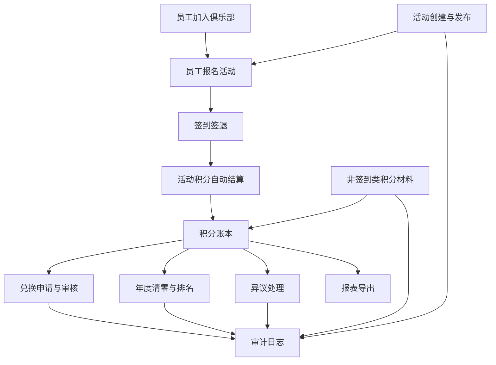
```mermaid
flowchart TD
    accTitle: Business Flow Overview
    accDescr: End-to-end business overview from club membership and activity operations to point settlement, redemption, annual clearing, reports, and audit.

    employee_join["员工加入俱乐部"]
    activity_publish["活动创建与发布"]
    activity_register["员工报名活动"]
    attendance["签到签退"]
    settlement["活动积分自动结算"]
    contribution["非签到类积分材料"]
    ledger["积分账本"]
    redemption["兑换申请与审核"]
    annual["年度清零与排名"]
    dispute["异议处理"]
    report["报表导出"]
    audit["审计日志"]

    employee_join --> activity_register
    activity_publish --> activity_register
    activity_register --> attendance
    attendance --> settlement
    settlement --> ledger
    contribution --> ledger
    ledger --> redemption
    ledger --> annual
    ledger --> dispute
    ledger --> report
    activity_publish --> audit
    contribution --> audit
    redemption --> audit
    annual --> audit
    dispute --> audit
```

## 角色协作总览

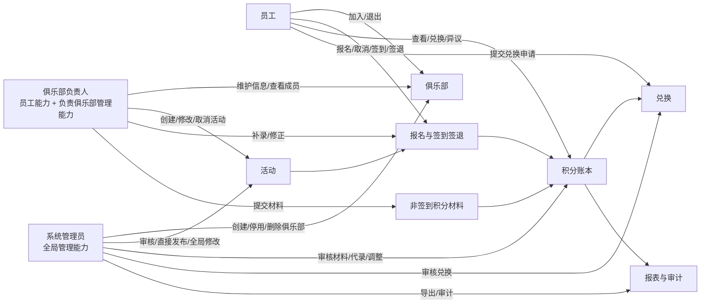
```mermaid
flowchart LR
    accTitle: Role Collaboration Overview
    accDescr: Role-level collaboration showing what employees, club leaders, and system administrators do in the full points system.

    employee["员工"]
    leader["俱乐部负责人\n员工能力 + 负责俱乐部管理能力"]
    admin["系统管理员\n全局管理能力"]

    club["俱乐部"]
    activity["活动"]
    attendance["报名与签到签退"]
    material["非签到积分材料"]
    ledger["积分账本"]
    redemption["兑换"]
    report["报表与审计"]

    employee -->|"加入/退出"| club
    employee -->|"报名/取消/签到/签退"| attendance
    employee -->|"查看/兑换/异议"| ledger
    employee -->|"提交兑换申请"| redemption

    leader -->|"维护信息/查看成员"| club
    leader -->|"创建/修改/取消活动"| activity
    leader -->|"补录/修正"| attendance
    leader -->|"提交材料"| material

    admin -->|"创建/停用/删除俱乐部"| club
    admin -->|"审核/直接发布/全局修改"| activity
    admin -->|"审核材料/代录/调整"| ledger
    admin -->|"审核兑换"| redemption
    admin -->|"导出/审计"| report

    activity --> attendance
    attendance --> ledger
    material --> ledger
    ledger --> redemption
    ledger --> report
```

## 俱乐部与成员流程

### 员工加入和退出俱乐部

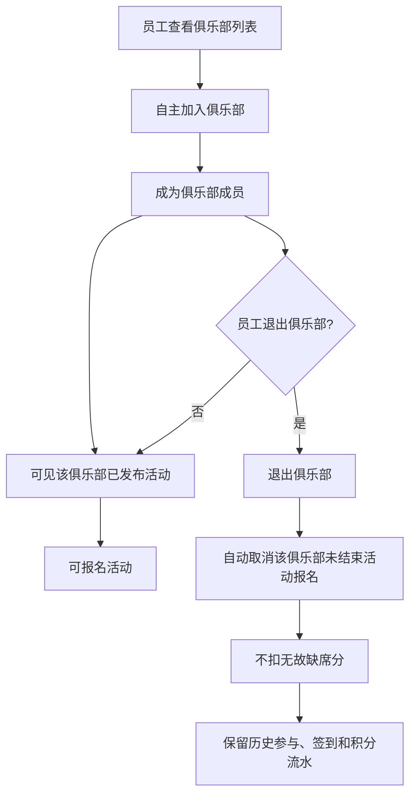
```mermaid
flowchart TD
    accTitle: Club Membership Flow
    accDescr: Employee joins and exits a club directly, while unfinished registrations in that club are automatically cancelled without absence deduction.

    browse["员工查看俱乐部列表"]
    join["自主加入俱乐部"]
    member["成为俱乐部成员"]
    see_activity["可见该俱乐部已发布活动"]
    register["可报名活动"]
    exit_decision{"员工退出俱乐部?"}
    exit_club["退出俱乐部"]
    cancel_future["自动取消该俱乐部未结束活动报名"]
    keep_history["保留历史参与、签到和积分流水"]
    no_absent["不扣无故缺席分"]

    browse --> join --> member --> see_activity --> register
    member --> exit_decision
    exit_decision -->|"是"| exit_club --> cancel_future --> no_absent --> keep_history
    exit_decision -->|"否"| see_activity
```

### 管理员移除成员

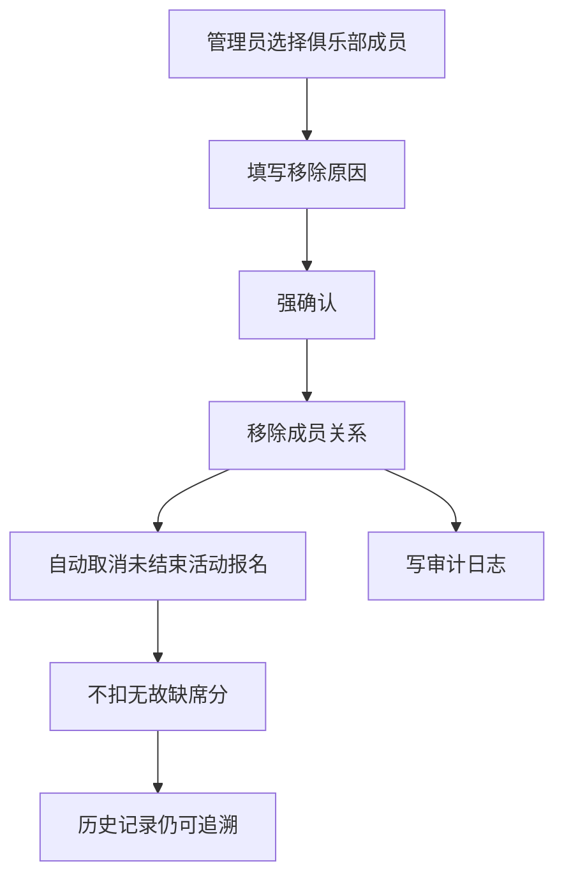
```mermaid
flowchart TD
    accTitle: Member Removal Flow
    accDescr: Only system administrators can remove club members; unfinished registrations are cancelled and no absence deduction is generated.

    admin_select["管理员选择俱乐部成员"]
    input_reason["填写移除原因"]
    confirm["强确认"]
    remove["移除成员关系"]
    cancel_future["自动取消未结束活动报名"]
    no_absent["不扣无故缺席分"]
    audit["写审计日志"]
    history["历史记录仍可追溯"]

    admin_select --> input_reason --> confirm --> remove
    remove --> cancel_future --> no_absent --> history
    remove --> audit
```

### 俱乐部停用和物理删除

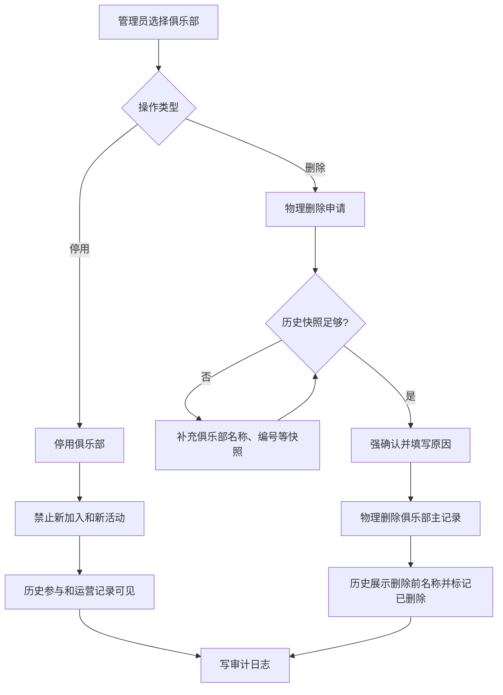
```mermaid
flowchart TD
    accTitle: Club Disable Delete Flow
    accDescr: Club disable blocks future operations while physical deletion requires snapshots so historical reports and audit remain readable.

    admin_action["管理员选择俱乐部"]
    action_type{"操作类型"}
    disable["停用俱乐部"]
    block_join["禁止新加入和新活动"]
    keep_history["历史参与和运营记录可见"]
    delete_request["物理删除申请"]
    snapshot_check{"历史快照足够?"}
    write_snapshot["补充俱乐部名称、编号等快照"]
    strong_confirm["强确认并填写原因"]
    physical_delete["物理删除俱乐部主记录"]
    deleted_view["历史展示删除前名称并标记已删除"]
    audit["写审计日志"]

    admin_action --> action_type
    action_type -->|"停用"| disable --> block_join --> keep_history --> audit
    action_type -->|"删除"| delete_request --> snapshot_check
    snapshot_check -->|"否"| write_snapshot --> snapshot_check
    snapshot_check -->|"是"| strong_confirm --> physical_delete --> deleted_view --> audit
```

## 活动流程

### 活动创建、审核和发布

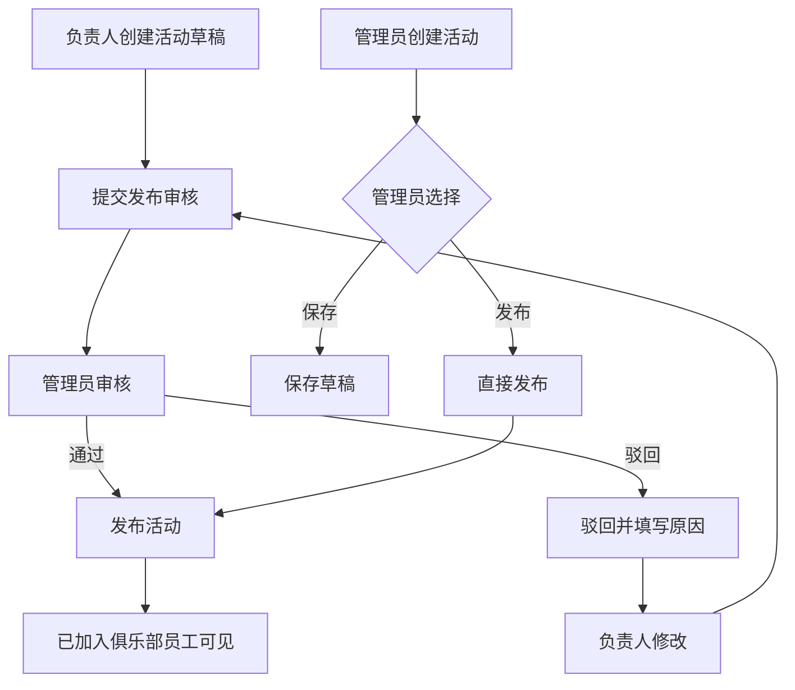
```mermaid
flowchart TD
    accTitle: Activity Publishing Flow
    accDescr: Club leaders submit activities for administrator review, while administrators can directly publish or save drafts.

    leader_draft["负责人创建活动草稿"]
    submit["提交发布审核"]
    admin_review["管理员审核"]
    reject["驳回并填写原因"]
    revise["负责人修改"]
    published["发布活动"]
    visible["已加入俱乐部员工可见"]

    admin_create["管理员创建活动"]
    admin_choice{"管理员选择"}
    admin_draft["保存草稿"]
    admin_publish["直接发布"]

    leader_draft --> submit --> admin_review
    admin_review -->|"通过"| published --> visible
    admin_review -->|"驳回"| reject --> revise --> submit

    admin_create --> admin_choice
    admin_choice -->|"保存"| admin_draft
    admin_choice -->|"发布"| admin_publish --> published
```

### 活动发布后修改

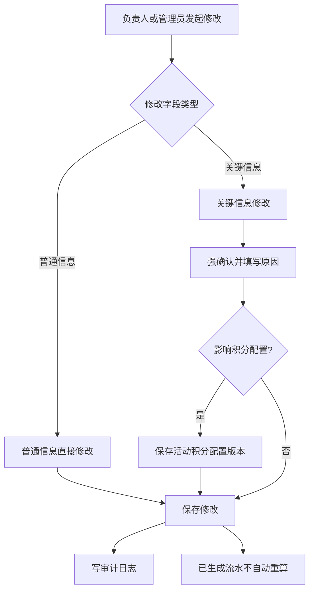
```mermaid
flowchart TD
    accTitle: Published Activity Edit Flow
    accDescr: Published activities can be edited by leaders or administrators, with stronger confirmation for key fields and config versions for point-related changes.

    edit_request["负责人或管理员发起修改"]
    field_type{"修改字段类型"}
    normal_edit["普通信息直接修改"]
    key_edit["关键信息修改"]
    strong_confirm["强确认并填写原因"]
    point_related{"影响积分配置?"}
    save_version["保存活动积分配置版本"]
    save_change["保存修改"]
    audit["写审计日志"]
    no_recalc["已生成流水不自动重算"]

    edit_request --> field_type
    field_type -->|"普通信息"| normal_edit --> save_change --> audit
    field_type -->|"关键信息"| key_edit --> strong_confirm --> point_related
    point_related -->|"是"| save_version --> save_change
    point_related -->|"否"| save_change
    save_change --> no_recalc
```

### 活动取消

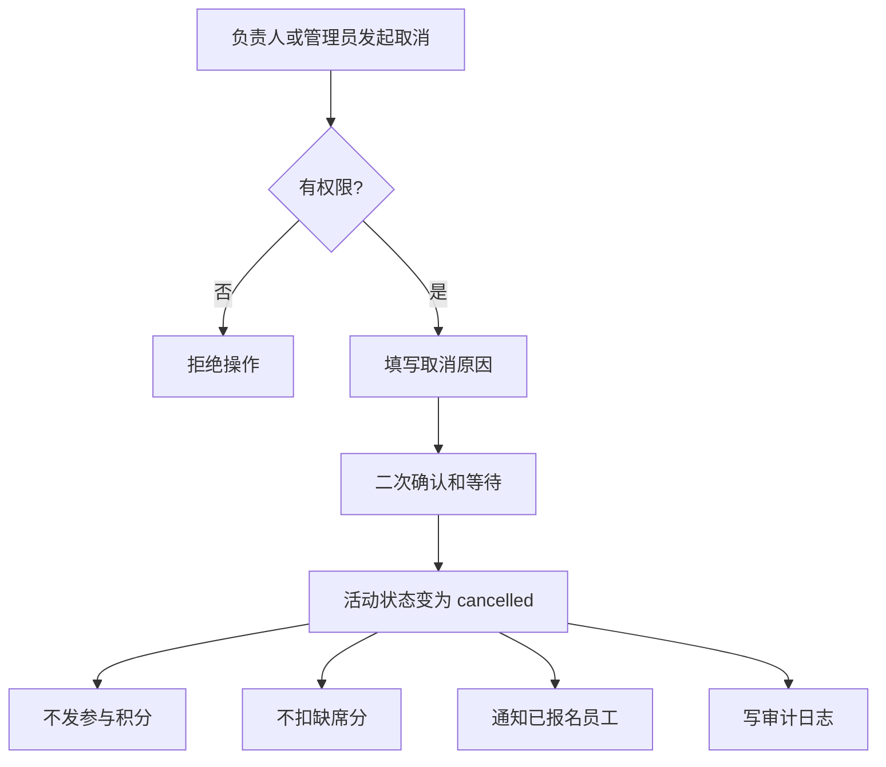
```mermaid
flowchart TD
    accTitle: Activity Cancellation Flow
    accDescr: Leaders and administrators can cancel published activities directly after strong confirmation, and cancellation prevents both points and absence deductions.

    cancel_request["负责人或管理员发起取消"]
    permission_check{"有权限?"}
    reject["拒绝操作"]
    reason["填写取消原因"]
    wait_confirm["二次确认和等待"]
    cancelled["活动状态变为 cancelled"]
    stop_points["不发参与积分"]
    stop_absent["不扣缺席分"]
    notify["通知已报名员工"]
    audit["写审计日志"]

    cancel_request --> permission_check
    permission_check -->|"否"| reject
    permission_check -->|"是"| reason --> wait_confirm --> cancelled
    cancelled --> stop_points
    cancelled --> stop_absent
    cancelled --> notify
    cancelled --> audit
```

### 活动物理删除

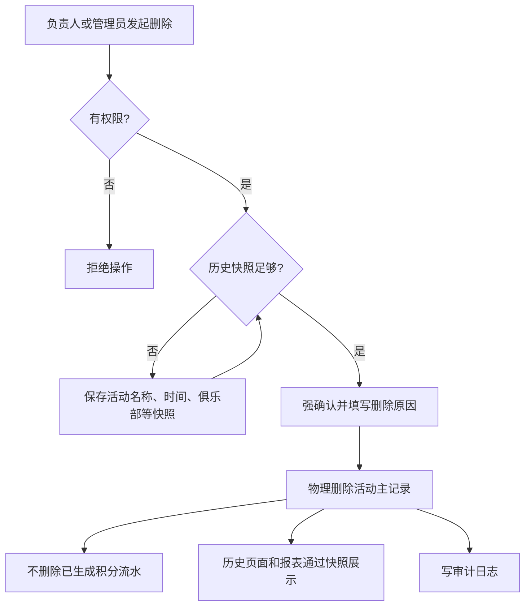
```mermaid
flowchart TD
    accTitle: Activity Physical Delete Flow
    accDescr: Activity physical deletion is allowed only after snapshots preserve historical activity, ledger, report, and audit readability.

    delete_request["负责人或管理员发起删除"]
    permission_check{"有权限?"}
    reject["拒绝操作"]
    snapshot_check{"历史快照足够?"}
    write_snapshot["保存活动名称、时间、俱乐部等快照"]
    strong_confirm["强确认并填写删除原因"]
    physical_delete["物理删除活动主记录"]
    keep_ledger["不删除已生成积分流水"]
    history_view["历史页面和报表通过快照展示"]
    audit["写审计日志"]

    delete_request --> permission_check
    permission_check -->|"否"| reject
    permission_check -->|"是"| snapshot_check
    snapshot_check -->|"否"| write_snapshot --> snapshot_check
    snapshot_check -->|"是"| strong_confirm --> physical_delete
    physical_delete --> keep_ledger
    physical_delete --> history_view
    physical_delete --> audit
```

## 报名、签到和结算流程

### 报名和取消

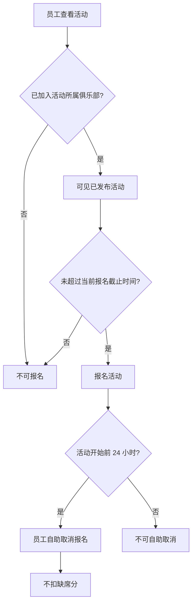
```mermaid
flowchart TD
    accTitle: Activity Registration Flow
    accDescr: Employees can register only for published activities in joined clubs before the current effective registration deadline.

    view_activity["员工查看活动"]
    joined_check{"已加入活动所属俱乐部?"}
    visible["可见已发布活动"]
    deadline_check{"未超过当前报名截止时间?"}
    register["报名活动"]
    cancel_check{"活动开始前 24 小时?"}
    cancel["员工自助取消报名"]
    no_absent["不扣缺席分"]
    cannot_register["不可报名"]
    cannot_cancel["不可自助取消"]

    view_activity --> joined_check
    joined_check -->|"否"| cannot_register
    joined_check -->|"是"| visible --> deadline_check
    deadline_check -->|"否"| cannot_register
    deadline_check -->|"是"| register --> cancel_check
    cancel_check -->|"是"| cancel --> no_absent
    cancel_check -->|"否"| cannot_cancel
```

### 签到签退窗口配置

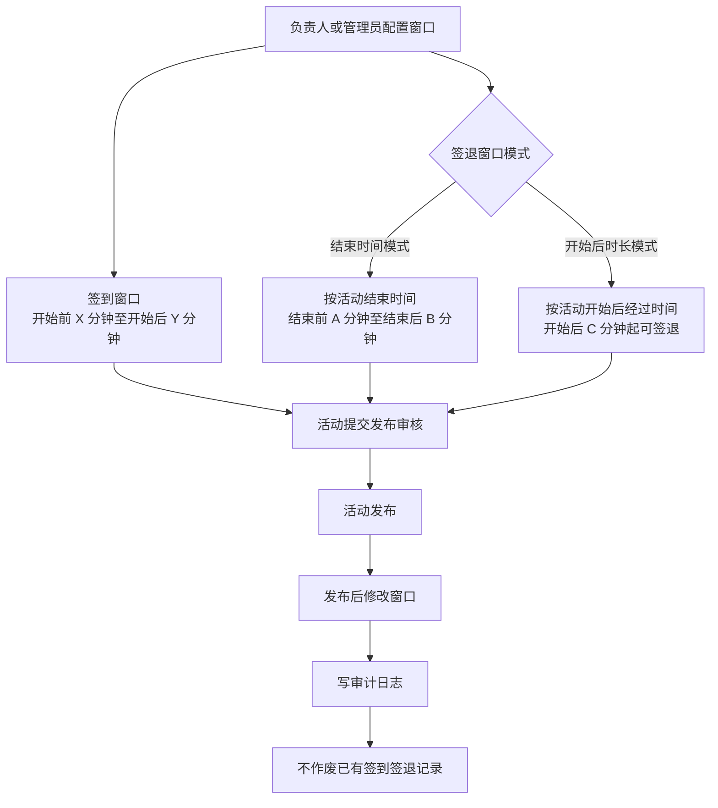
```mermaid
flowchart TD
    accTitle: Attendance Window Configuration
    accDescr: Leaders and administrators configure check-in and check-out windows before review and can modify them after publishing with audit.

    config["负责人或管理员配置窗口"]
    checkin["签到窗口\n开始前 X 分钟至开始后 Y 分钟"]
    checkout_mode{"签退窗口模式"}
    by_end["按活动结束时间\n结束前 A 分钟至结束后 B 分钟"]
    by_start["按活动开始后经过时间\n开始后 C 分钟起可签退"]
    submit_review["活动提交发布审核"]
    published["活动发布"]
    edit_after_publish["发布后修改窗口"]
    audit["写审计日志"]
    keep_existing["不作废已有签到签退记录"]

    config --> checkin --> submit_review
    config --> checkout_mode
    checkout_mode -->|"结束时间模式"| by_end --> submit_review
    checkout_mode -->|"开始后时长模式"| by_start --> submit_review
    submit_review --> published --> edit_after_publish --> audit --> keep_existing
```

### 员工签到签退

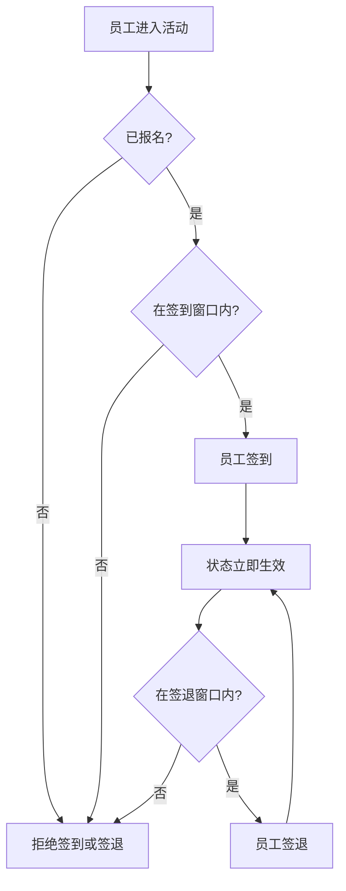
```mermaid
flowchart TD
    accTitle: Employee Attendance Flow
    accDescr: Employees can check in and check out only after registration, and attendance records take effect immediately without administrator approval.

    start["员工进入活动"]
    registered_check{"已报名?"}
    window_check{"在签到窗口内?"}
    checkin["员工签到"]
    checkout_window{"在签退窗口内?"}
    checkout["员工签退"]
    status_effective["状态立即生效"]
    reject["拒绝签到或签退"]

    start --> registered_check
    registered_check -->|"否"| reject
    registered_check -->|"是"| window_check
    window_check -->|"是"| checkin --> status_effective
    window_check -->|"否"| reject
    status_effective --> checkout_window
    checkout_window -->|"是"| checkout --> status_effective
    checkout_window -->|"否"| reject
```

### 负责人和管理员补录修正

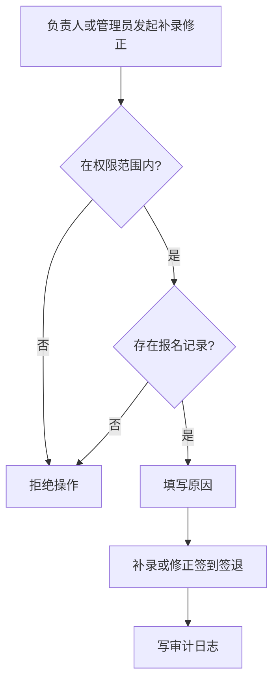
```mermaid
flowchart TD
    accTitle: Attendance Correction Flow
    accDescr: Leaders and administrators can supplement or correct attendance only for existing registrations, with audit logging.

    correction_request["负责人或管理员发起补录修正"]
    scope_check{"在权限范围内?"}
    registration_check{"存在报名记录?"}
    edit_record["补录或修正签到签退"]
    reason["填写原因"]
    audit["写审计日志"]
    reject["拒绝操作"]

    correction_request --> scope_check
    scope_check -->|"否"| reject
    scope_check -->|"是"| registration_check
    registration_check -->|"否"| reject
    registration_check -->|"是"| reason --> edit_record --> audit
```

### 活动积分自动结算

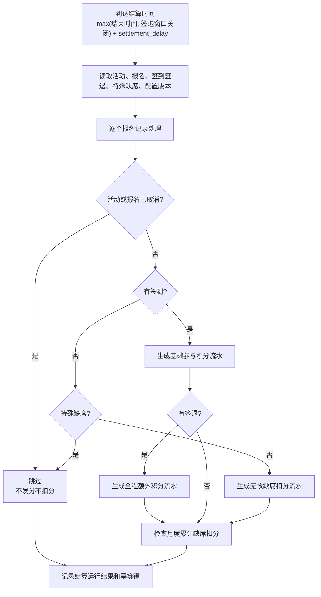
```mermaid
flowchart TD
    accTitle: Activity Settlement Flow
    accDescr: Settlement runs after checkout window close plus delay, generating participation points or absence deductions idempotently.

    trigger["到达结算时间\nmax(结束时间, 签退窗口关闭) + settlement_delay"]
    load_data["读取活动、报名、签到签退、特殊缺席、配置版本"]
    each_registration["逐个报名记录处理"]
    cancelled_check{"活动或报名已取消?"}
    skip["跳过\n不发分不扣分"]
    checkin_check{"有签到?"}
    excused_check{"特殊缺席?"}
    base_points["生成基础参与积分流水"]
    checkout_check{"有签退?"}
    full_points["生成全程额外积分流水"]
    absent_deduct["生成无故缺席扣分流水"]
    monthly_check["检查月度累计缺席扣分"]
    settlement_record["记录结算运行结果和幂等键"]

    trigger --> load_data --> each_registration
    each_registration --> cancelled_check
    cancelled_check -->|"是"| skip --> settlement_record
    cancelled_check -->|"否"| checkin_check
    checkin_check -->|"是"| base_points --> checkout_check
    checkout_check -->|"是"| full_points --> monthly_check
    checkout_check -->|"否"| monthly_check
    checkin_check -->|"否"| excused_check
    excused_check -->|"是"| skip
    excused_check -->|"否"| absent_deduct --> monthly_check
    monthly_check --> settlement_record
```

## 非签到类积分流程

### 材料提交和审核

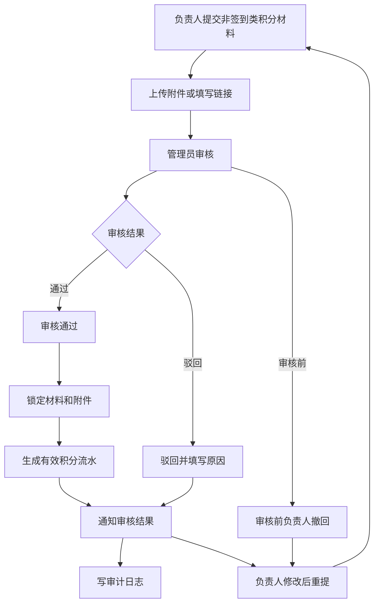
```mermaid
flowchart TD
    accTitle: Contribution Review Flow
    accDescr: Club leaders submit non-attendance point materials, administrators review them, and approved items create effective point transactions.

    submit["负责人提交非签到类积分材料"]
    attach["上传附件或填写链接"]
    admin_review["管理员审核"]
    decision{"审核结果"}
    approve["审核通过"]
    reject["驳回并填写原因"]
    withdraw["审核前负责人撤回"]
    revise["负责人修改后重提"]
    lock_material["锁定材料和附件"]
    create_ledger["生成有效积分流水"]
    notify["通知审核结果"]
    audit["写审计日志"]

    submit --> attach --> admin_review
    admin_review --> decision
    decision -->|"通过"| approve --> lock_material --> create_ledger --> notify --> audit
    decision -->|"驳回"| reject --> notify --> revise --> submit
    admin_review -->|"审核前"| withdraw --> revise
```

### 管理员代录非签到类积分

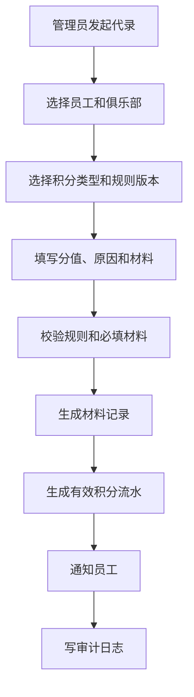
```mermaid
flowchart TD
    accTitle: Admin Direct Point Entry
    accDescr: Administrators can directly enter non-attendance points, but must provide reason, material, rule version, and audit record.

    admin_start["管理员发起代录"]
    choose_employee["选择员工和俱乐部"]
    choose_type["选择积分类型和规则版本"]
    input_points["填写分值、原因和材料"]
    validate["校验规则和必填材料"]
    create_material["生成材料记录"]
    create_ledger["生成有效积分流水"]
    notify["通知员工"]
    audit["写审计日志"]

    admin_start --> choose_employee --> choose_type --> input_points --> validate
    validate --> create_material --> create_ledger --> notify --> audit
```

### 非签到材料物理删除

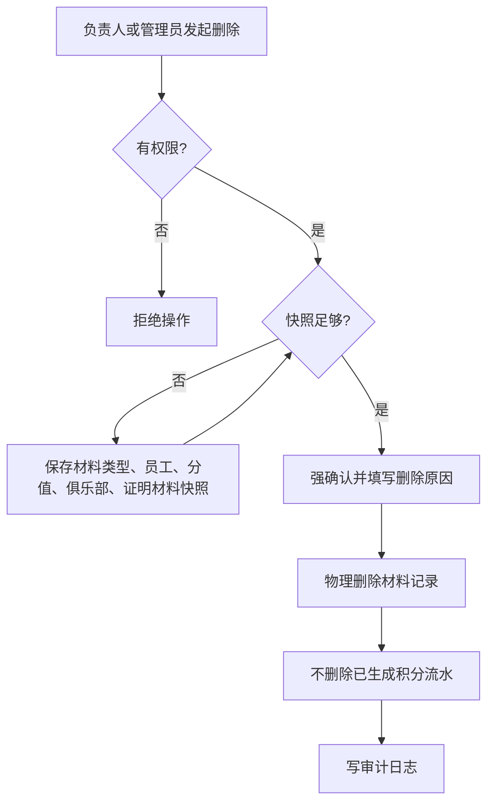
```mermaid
flowchart TD
    accTitle: Contribution Material Delete Flow
    accDescr: Non-attendance point materials can be physically deleted only after snapshots keep ledger, report, and audit readable.

    delete_request["负责人或管理员发起删除"]
    permission_check{"有权限?"}
    reject["拒绝操作"]
    snapshot_check{"快照足够?"}
    write_snapshot["保存材料类型、员工、分值、俱乐部、证明材料快照"]
    strong_confirm["强确认并填写删除原因"]
    physical_delete["物理删除材料记录"]
    keep_ledger["不删除已生成积分流水"]
    audit["写审计日志"]

    delete_request --> permission_check
    permission_check -->|"否"| reject
    permission_check -->|"是"| snapshot_check
    snapshot_check -->|"否"| write_snapshot --> snapshot_check
    snapshot_check -->|"是"| strong_confirm --> physical_delete --> keep_ledger --> audit
```

## 兑换流程

### 兑换批次配置

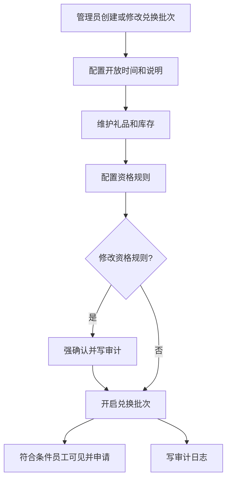
```mermaid
flowchart TD
    accTitle: Redemption Batch Setup Flow
    accDescr: Only administrators create and control redemption batches, with strong confirmation for eligibility rule changes.

    admin_start["管理员创建或修改兑换批次"]
    configure_time["配置开放时间和说明"]
    configure_gift["维护礼品和库存"]
    configure_rule["配置资格规则"]
    rule_change{"修改资格规则?"}
    strong_confirm["强确认并写审计"]
    open_batch["开启兑换批次"]
    employee_visible["符合条件员工可见并申请"]
    audit["写审计日志"]

    admin_start --> configure_time --> configure_gift --> configure_rule --> rule_change
    rule_change -->|"是"| strong_confirm --> open_batch
    rule_change -->|"否"| open_batch
    open_batch --> employee_visible
    open_batch --> audit
```

### 员工提交兑换申请

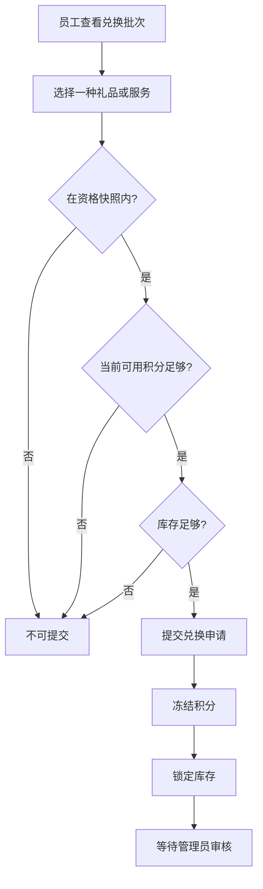
```mermaid
flowchart TD
    accTitle: Redemption Application Flow
    accDescr: Employees apply for one gift, and the system validates eligibility, current available points, and stock before freezing points and locking stock.

    view_batch["员工查看兑换批次"]
    choose_gift["选择一种礼品或服务"]
    eligibility_check{"在资格快照内?"}
    balance_check{"当前可用积分足够?"}
    stock_check{"库存足够?"}
    submit["提交兑换申请"]
    freeze["冻结积分"]
    lock_stock["锁定库存"]
    pending_review["等待管理员审核"]
    reject_submit["不可提交"]

    view_batch --> choose_gift --> eligibility_check
    eligibility_check -->|"否"| reject_submit
    eligibility_check -->|"是"| balance_check
    balance_check -->|"否"| reject_submit
    balance_check -->|"是"| stock_check
    stock_check -->|"否"| reject_submit
    stock_check -->|"是"| submit --> freeze --> lock_stock --> pending_review
```

### 兑换审核

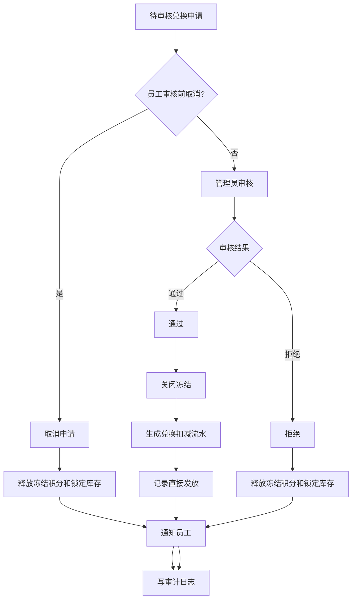
```mermaid
flowchart TD
    accTitle: Redemption Review Flow
    accDescr: Administrators can only approve or reject redemption applications; approval closes the freeze and creates a deduction transaction with direct issuance.

    pending["待审核兑换申请"]
    employee_cancel{"员工审核前取消?"}
    cancel["取消申请"]
    release_cancel["释放冻结积分和锁定库存"]
    admin_review["管理员审核"]
    decision{"审核结果"}
    approve["通过"]
    reject["拒绝"]
    close_freeze["关闭冻结"]
    deduct["生成兑换扣减流水"]
    direct_issue["记录直接发放"]
    release_reject["释放冻结积分和锁定库存"]
    notify["通知员工"]
    audit["写审计日志"]

    pending --> employee_cancel
    employee_cancel -->|"是"| cancel --> release_cancel --> notify
    employee_cancel -->|"否"| admin_review --> decision
    decision -->|"通过"| approve --> close_freeze --> deduct --> direct_issue --> notify --> audit
    decision -->|"拒绝"| reject --> release_reject --> notify --> audit
```

## 账本调整和撤销流程

```mermaid
flowchart TD
    accTitle: Ledger Adjustment Flow
    accDescr: Administrators cannot edit balances directly; all corrections use adjustment or reversal transactions with reason, material, and audit.

    admin_start["管理员发起积分修正"]
    choose_type{"修正类型"}
    reversal["撤销原流水"]
    adjustment["新增调整流水"]
    require_reason["填写原因、材料、规则版本"]
    create_transaction["生成撤销或调整流水"]
    update_stats["余额和统计由流水重算"]
    notify["通知员工"]
    audit["写审计日志"]

    admin_start --> choose_type
    choose_type -->|"撤销"| reversal --> require_reason
    choose_type -->|"调整"| adjustment --> require_reason
    require_reason --> create_transaction --> update_stats --> notify --> audit
```

## 年度清零和排名流程

### 年度清零

```mermaid
flowchart TD
    accTitle: Annual Clearing Flow
    accDescr: Annual clearing automatically clears only unfrozen available points while preserving frozen redemption points until review result.

    schedule["每年 1 月 1 日 00:00:00\nAsia/Hong_Kong 自动触发"]
    load_balance["计算账户净积分和有效冻结"]
    clearable["计算未冻结可用积分"]
    create_expire["生成年度清零负向流水"]
    keep_frozen["冻结兑换积分不参与清零"]
    later_review["管理员后续审核冻结兑换"]
    approve["审核通过\n按原申请扣减并直接发放"]
    reject["审核拒绝\n释放冻结积分回账户"]
    run_record["记录清零批次和幂等键"]

    schedule --> load_balance --> clearable --> create_expire --> run_record
    schedule --> keep_frozen --> later_review
    later_review -->|"通过"| approve
    later_review -->|"拒绝"| reject
```

### 俱乐部年度排名和激励建议

```mermaid
flowchart TD
    accTitle: Club Annual Ranking Flow
    accDescr: Club annual ranking is based on effective positive issuing transactions minus reversals, then creates incentive suggestions for administrator confirmation.

    period_end["年度结束或管理员触发"]
    aggregate["汇总俱乐部有效正向发放积分"]
    subtract_reversal["扣除对应撤销流水"]
    rank["生成俱乐部排名"]
    incentive["生成激励建议记录"]
    admin_confirm["管理员确认"]
    budget_record["登记预算经费记录"]

    period_end --> aggregate --> subtract_reversal --> rank --> incentive --> admin_confirm --> budget_record
```

## 异议处理流程

```mermaid
flowchart TD
    accTitle: Dispute Handling Flow
    accDescr: Employees submit disputes with materials, administrators reply, and any point correction must use ledger adjustment or reversal.

    submit["员工提交异议"]
    attach["上传附件或填写链接"]
    admin_review["管理员处理"]
    need_adjust{"需要调整积分?"}
    adjust["生成调整流水或撤销流水"]
    reply["管理员回复处理结论"]
    notify["通知员工"]
    close["关闭异议"]
    audit["写审计日志"]

    submit --> attach --> admin_review --> need_adjust
    need_adjust -->|"是"| adjust --> reply
    need_adjust -->|"否"| reply
    reply --> notify --> close --> audit
```

## 报表导出流程

```mermaid
flowchart TD
    accTitle: Report Export Flow
    accDescr: Only system administrators can export reports; exports read from business records and ledger, then record export metadata.

    admin_start["管理员进入报表"]
    choose_report["选择报表类型"]
    set_filter["设置筛选条件"]
    read_data["读取流水和业务记录"]
    generate_file["生成导出文件"]
    write_log["记录导出人、时间、类型和筛选条件"]
    download["管理员下载文件"]

    admin_start --> choose_report --> set_filter --> read_data --> generate_file --> write_log --> download
```

## 规则版本流程

```mermaid
flowchart TD
    accTitle: Rule Version Publishing Flow
    accDescr: Administrators create, publish, withdraw, disable, or supersede rule versions while historical point transactions keep their original rule version.

    draft["管理员创建规则版本草稿"]
    edit["编辑规则摘要、生效说明和附件"]
    publish_decision{"发布?"}
    withdraw["未生效版本撤回"]
    publish["发布后立即生效"]
    new_business["新活动、积分、扣分、兑换引用新版本"]
    old_ledger["历史流水保留原 rule_version_id"]
    disable_decision{"后续停用或替代?"}
    disable["停用当前版本"]
    supersede["发布新版本替代"]
    audit["写审计日志"]

    draft --> edit --> publish_decision
    publish_decision -->|"否"| withdraw --> audit
    publish_decision -->|"是"| publish --> new_business --> old_ledger --> disable_decision
    disable_decision -->|"停用"| disable --> audit
    disable_decision -->|"替代"| supersede --> audit
```

## 附件和链接流程

```mermaid
flowchart TD
    accTitle: Attachment Lifecycle Flow
    accDescr: Attachments and external links can be changed before review but become locked after approval, with only administrators allowed to append supplements.

    upload["上传附件或填写外部链接"]
    bind_owner["关联积分材料、异议或预算记录"]
    review_state{"业务是否已审核通过?"}
    uploader_edit["上传人删除或替换"]
    lock["附件锁定"]
    admin_append["管理员追加备注或补充附件"]
    audit["关键变更写审计日志"]

    upload --> bind_owner --> review_state
    review_state -->|"否"| uploader_edit --> bind_owner
    review_state -->|"是"| lock --> admin_append --> audit
```

## 待办和通知流程

### 负责人待办

```mermaid
flowchart TD
    accTitle: Leader Todo Flow
    accDescr: Leader dashboard aggregates operational todos from activity drafts, rejected activities, attendance exceptions, and pending contribution materials.

    dashboard["负责人进入首页"]
    load_scope["加载负责俱乐部范围"]
    rejected_activity["活动草稿和驳回活动"]
    attendance_exception["活动签到异常"]
    material_todo["待提交非签到积分材料"]
    club_summary["负责俱乐部概览"]
    handle["进入对应业务处理"]
    clear_todo["状态变化后待办消失"]

    dashboard --> load_scope
    load_scope --> rejected_activity --> handle
    load_scope --> attendance_exception --> handle
    load_scope --> material_todo --> handle
    load_scope --> club_summary
    handle --> clear_todo
```

### 管理员待办

```mermaid
flowchart TD
    accTitle: Admin Todo Flow
    accDescr: Administrator dashboard aggregates review and exception workloads across activities, contribution materials, redemption applications, disputes, and settlement anomalies.

    dashboard["管理员进入首页"]
    pending_activity["待审核活动"]
    pending_material["待审核非签到积分"]
    pending_redemption["待审核兑换"]
    pending_dispute["待处理异议"]
    anomaly["异常结算和撤销记录"]
    process["进入对应处理页面"]
    refresh["处理完成后刷新待办"]

    dashboard --> pending_activity --> process
    dashboard --> pending_material --> process
    dashboard --> pending_redemption --> process
    dashboard --> pending_dispute --> process
    dashboard --> anomaly --> process
    process --> refresh
```

### 通知生成和补偿

```mermaid
flowchart TD
    accTitle: Notification Compensation Flow
    accDescr: Business operations write their main result first, then create notifications; failed notification creation is retried without changing business state.

    business_event["业务事件完成"]
    need_notify{"需要系统内通知?"}
    create_notify["创建通知记录"]
    success{"通知创建成功?"}
    done["通知可见"]
    retry_queue["进入通知补偿队列"]
    retry_job["补偿任务重试"]
    manual_check["多次失败后管理员查看异常"]

    business_event --> need_notify
    need_notify -->|"否"| done
    need_notify -->|"是"| create_notify --> success
    success -->|"是"| done
    success -->|"否"| retry_queue --> retry_job --> create_notify
    retry_queue --> manual_check
```

## 强确认和审计流程

### 强确认通用流程

```mermaid
flowchart TD
    accTitle: Strong Confirmation Flow
    accDescr: Dangerous operations require reason input, explicit confirmation, optional waiting period, and audit before the business result is accepted.

    request["发起关键操作"]
    show_impact["展示影响范围"]
    input_reason["填写操作原因"]
    second_confirm["二次确认"]
    wait["等待 10 秒或强确认"]
    execute["执行业务操作"]
    audit["写审计日志"]
    result["返回操作结果"]
    cancel["用户取消操作"]

    request --> show_impact --> input_reason --> second_confirm
    second_confirm -->|"取消"| cancel
    second_confirm -->|"确认"| wait --> execute --> audit --> result
```

### 审计失败阻断流程

```mermaid
flowchart TD
    accTitle: Audit Failure Blocking Flow
    accDescr: Critical business writes must fail if audit logging fails, preventing untraceable administrator or leader operations.

    critical_write["关键写操作"]
    transaction["开启业务事务"]
    business_change["写业务变更"]
    write_audit["写审计日志"]
    audit_ok{"审计成功?"}
    commit["提交事务"]
    rollback["回滚业务变更"]
    error["返回失败并提示重试"]

    critical_write --> transaction --> business_change --> write_audit --> audit_ok
    audit_ok -->|"是"| commit
    audit_ok -->|"否"| rollback --> error
```

### 快照生成流程

```mermaid
flowchart TD
    accTitle: Historical Snapshot Flow
    accDescr: Physical deletion requires snapshots to preserve names, times, clubs, employees, materials, and rule context for ledger, reports, and audit.

    delete_request["发起物理删除"]
    list_dependencies["检查历史依赖"]
    snapshot_enough{"快照足够?"}
    write_snapshot["补写必要历史快照"]
    verify_snapshot["校验历史页面和报表可读"]
    strong_confirm["强确认删除"]
    physical_delete["执行物理删除"]
    audit["写审计日志"]

    delete_request --> list_dependencies --> snapshot_enough
    snapshot_enough -->|"否"| write_snapshot --> verify_snapshot --> snapshot_enough
    snapshot_enough -->|"是"| strong_confirm --> physical_delete --> audit
```

## 并发和幂等流程

### 兑换并发提交

```mermaid
sequenceDiagram
    accTitle: Concurrent Redemption Submission
    accDescr: Two employees compete for limited gift stock; the transaction lock ensures only one application freezes points and locks stock.

    participant employee_a as 员工 A
    participant employee_b as 员工 B
    participant redemption as 兑换模块
    participant ledger as 积分账本
    participant stock as 库存记录

    employee_a->>redemption: 提交礼品兑换
    employee_b->>redemption: 同时提交同一礼品
    redemption->>stock: 锁定礼品库存行
    stock-->>redemption: 员工 A 获得锁
    redemption->>ledger: 校验可用积分并冻结
    ledger-->>redemption: 冻结成功
    redemption->>stock: 创建库存锁定
    redemption-->>employee_a: 申请成功，待审核
    redemption->>stock: 员工 B 尝试锁定库存
    stock-->>redemption: 库存不足
    redemption-->>employee_b: 提示已兑完或库存不足
```

### 活动结算幂等

```mermaid
flowchart TD
    accTitle: Settlement Idempotency Flow
    accDescr: Activity settlement uses a run key and per-employee idempotency keys so retrying failed jobs does not duplicate point transactions.

    job_start["结算任务启动"]
    run_key["生成活动结算 run_key"]
    run_exists{"结算批次已成功?"}
    skip_run["跳过整批"]
    load_registrations["加载报名记录"]
    each_employee["处理单个员工"]
    idempotency_key["生成员工积分类型幂等键"]
    ledger_exists{"流水已存在?"}
    skip_employee["跳过该员工该类型"]
    create_ledger["生成积分或扣分流水"]
    mark_done["记录员工处理结果"]
    finish_run["标记结算批次完成"]

    job_start --> run_key --> run_exists
    run_exists -->|"是"| skip_run
    run_exists -->|"否"| load_registrations --> each_employee --> idempotency_key --> ledger_exists
    ledger_exists -->|"是"| skip_employee --> mark_done
    ledger_exists -->|"否"| create_ledger --> mark_done
    mark_done --> finish_run
```

### 后台任务失败重试

```mermaid
flowchart TD
    accTitle: Background Job Retry Flow
    accDescr: Background jobs record every run, retry transient failures, and expose repeated failures for administrator handling without creating duplicate business effects.

    schedule["调度器触发任务"]
    create_run["创建任务运行记录"]
    execute["执行业务处理"]
    success{"执行成功?"}
    mark_success["标记成功"]
    classify_error["记录错误类型"]
    retryable{"可重试?"}
    retry["按退避策略重试"]
    max_retry{"超过重试上限?"}
    mark_failed["标记失败"]
    admin_todo["进入管理员异常待办"]

    schedule --> create_run --> execute --> success
    success -->|"是"| mark_success
    success -->|"否"| classify_error --> retryable
    retryable -->|"否"| mark_failed --> admin_todo
    retryable -->|"是"| max_retry
    max_retry -->|"否"| retry --> execute
    max_retry -->|"是"| mark_failed
```

## 预算经费流程

```mermaid
flowchart TD
    accTitle: Budget Record Flow
    accDescr: Administrators maintain budget and spending records directly; club ranking suggestions can create budget records after administrator confirmation.

    source{"记录来源"}
    manual["管理员手动登记预算记录"]
    suggestion["俱乐部排名生成激励建议"]
    confirm["管理员确认激励建议"]
    input_budget["填写分类、预算金额、实际支出、备注"]
    attach["上传附件或填写链接"]
    save["保存预算经费记录"]
    report["进入预算统计报表"]

    source -->|"手动"| manual --> input_budget
    source -->|"激励建议"| suggestion --> confirm --> input_budget
    input_budget --> attach --> save --> report
```

## 状态机

### 活动状态

```mermaid
stateDiagram-v2
    accTitle: Activity State Machine
    accDescr: Activity lifecycle from draft through review, publishing, cancellation, settlement, and physical deletion.

    state "草稿" as Draft
    state "待审核" as PendingReview
    state "已发布" as Published
    state "已取消" as Cancelled
    state "已结束" as Ended
    state "已结算" as Settled
    state "已删除" as Deleted

    [*] --> Draft: 创建活动
    Draft --> PendingReview: 负责人提交审核
    PendingReview --> Published: 管理员通过
    PendingReview --> Draft: 管理员驳回
    Published --> Cancelled: 强确认取消
    Published --> Ended: 到达结束时间
    Ended --> Settled: 自动结算完成
    Draft --> Deleted: 物理删除
    PendingReview --> Deleted: 物理删除
    Published --> Deleted: 物理删除
    Cancelled --> Deleted: 物理删除
    Ended --> Deleted: 物理删除
    Settled --> Deleted: 物理删除
```

### 报名和参与状态

```mermaid
stateDiagram-v2
    accTitle: Participation State Machine
    accDescr: Participation lifecycle from registration through cancellation, attendance, absence, and excused absence.

    state "已报名" as Registered
    state "员工已取消" as CancelledByEmployee
    state "系统自动取消" as AutoCancelled
    state "已签到" as CheckedIn
    state "已签退" as CheckedOut
    state "缺席" as Absent
    state "特殊缺席" as ExcusedAbsent

    [*] --> Registered: 报名成功
    Registered --> CancelledByEmployee: 开始前 24 小时取消
    Registered --> AutoCancelled: 退出或被移出俱乐部
    Registered --> CheckedIn: 员工签到
    CheckedIn --> CheckedOut: 员工签退
    Registered --> Absent: 活动结束仍未签到
    Absent --> ExcusedAbsent: 负责人或管理员标记特殊情况
```

### 非签到类积分材料状态

```mermaid
stateDiagram-v2
    accTitle: Contribution Material State Machine
    accDescr: Non-attendance material lifecycle from submission through withdrawal, rejection, approval, ledger creation, and physical deletion.

    state "已提交" as Submitted
    state "已撤回" as Withdrawn
    state "已驳回" as Rejected
    state "已通过" as Approved
    state "已生成流水" as EffectiveTransactionCreated
    state "已删除" as Deleted

    [*] --> Submitted: 负责人提交
    Submitted --> Withdrawn: 负责人撤回
    Withdrawn --> Submitted: 修改后重提
    Submitted --> Approved: 管理员通过
    Submitted --> Rejected: 管理员驳回
    Rejected --> Submitted: 修改后重提
    Approved --> EffectiveTransactionCreated: 生成有效积分流水
    Submitted --> Deleted: 物理删除
    Withdrawn --> Deleted: 物理删除
    Rejected --> Deleted: 物理删除
    Approved --> Deleted: 物理删除
    EffectiveTransactionCreated --> Deleted: 物理删除
```

### 兑换申请状态

```mermaid
stateDiagram-v2
    accTitle: Redemption Application State Machine
    accDescr: Redemption lifecycle from application submission through pending review, cancellation, approval, direct issuance, or rejection.

    state "待审核" as PendingReview
    state "审核前取消" as CancelledBeforeReview
    state "已拒绝" as Rejected
    state "已通过" as Approved
    state "已直接发放" as DirectIssued

    [*] --> PendingReview: 提交申请并冻结积分锁定库存
    PendingReview --> CancelledBeforeReview: 员工取消
    CancelledBeforeReview --> [*]: 释放冻结和库存
    PendingReview --> Rejected: 管理员拒绝
    Rejected --> [*]: 释放冻结和库存
    PendingReview --> Approved: 管理员通过
    Approved --> DirectIssued: 生成扣减流水并直接发放
    DirectIssued --> [*]: 交易完成
```

### 积分冻结状态

```mermaid
stateDiagram-v2
    accTitle: Point Freeze State Machine
    accDescr: Point freeze lifecycle showing that freeze is not a ledger transaction and is closed or released based on redemption result.

    state "有效冻结" as Active
    state "已释放" as Released
    state "已转扣减" as Converted

    [*] --> Active: 兑换申请提交
    Active --> Released: 申请取消或审核拒绝
    Active --> Converted: 审核通过并生成扣减流水
    Released --> [*]: 当前可用积分恢复
    Converted --> [*]: 账户净积分被流水扣减
```
