# 俱乐部员工积分系统流程图设计

## 流程总览

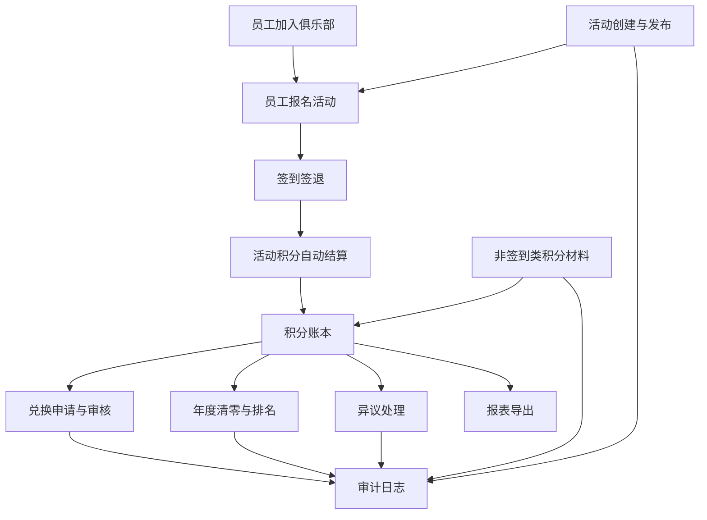
```mermaid
flowchart TD
    accTitle: 业务流程总览
    accDescr: 展示从俱乐部成员、活动运营、积分发放、兑换、年度清零到报表和审计的完整业务流程。

    employee_join["员工加入俱乐部"]
    activity_publish["活动创建与发布"]
    activity_register["员工报名活动"]
    attendance["签到签退"]
    settlement["活动积分自动结算"]
    contribution["非签到类积分材料"]
    ledger["积分账本"]
    redemption["兑换申请与审核"]
    annual["年度清零与排名"]
    dispute["异议处理"]
    report["报表导出"]
    audit["审计日志"]

    employee_join --> activity_register
    activity_publish --> activity_register
    activity_register --> attendance
    attendance --> settlement
    settlement --> ledger
    contribution --> ledger
    ledger --> redemption
    ledger --> annual
    ledger --> dispute
    ledger --> report
    activity_publish --> audit
    contribution --> audit
    redemption --> audit
    annual --> audit
    dispute --> audit
```

## 角色协作总览

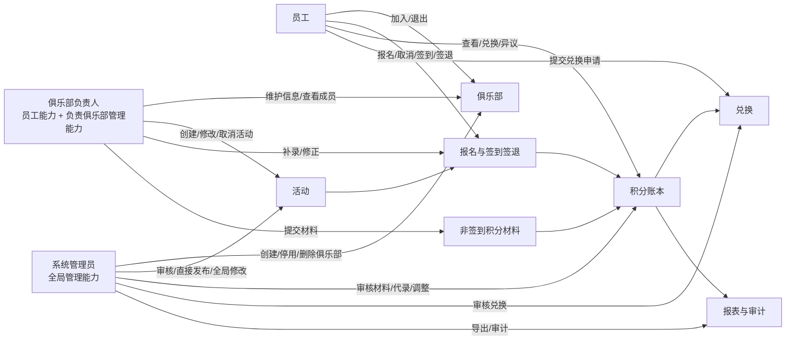
```mermaid
flowchart LR
    accTitle: 角色协作总览
    accDescr: 展示员工、俱乐部负责人和系统管理员在完整积分系统中的职责分工和协作关系。

    employee["员工"]
    leader["俱乐部负责人\n员工能力 + 负责俱乐部管理能力"]
    admin["系统管理员\n全局管理能力"]

    club["俱乐部"]
    activity["活动"]
    attendance["报名与签到签退"]
    material["非签到积分材料"]
    ledger["积分账本"]
    redemption["兑换"]
    report["报表与审计"]

    employee -->|"加入/退出"| club
    employee -->|"报名/取消/签到/签退"| attendance
    employee -->|"查看/兑换/异议"| ledger
    employee -->|"提交兑换申请"| redemption

    leader -->|"维护信息/查看成员"| club
    leader -->|"创建/修改/取消活动"| activity
    leader -->|"补录/修正"| attendance
    leader -->|"提交材料"| material

    admin -->|"创建/停用/删除俱乐部"| club
    admin -->|"审核/直接发布/全局修改"| activity
    admin -->|"审核材料/代录/调整"| ledger
    admin -->|"审核兑换"| redemption
    admin -->|"导出/审计"| report

    activity --> attendance
    attendance --> ledger
    material --> ledger
    ledger --> redemption
    ledger --> report
```

## 俱乐部与成员流程

### 员工加入和退出俱乐部

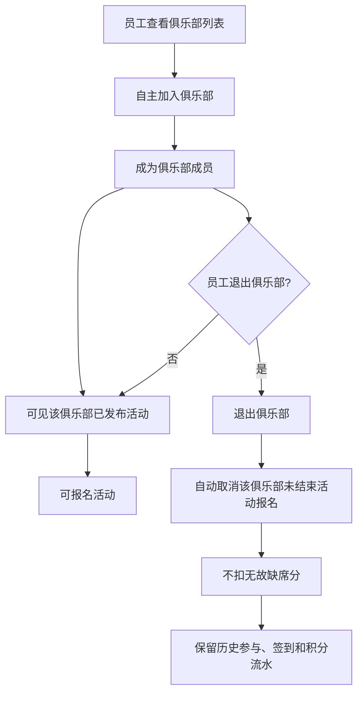
```mermaid
flowchart TD
    accTitle: 俱乐部成员流程
    accDescr: 展示员工直接加入和退出俱乐部，以及退出后自动取消该俱乐部未完成报名且不扣缺席分的流程。

    browse["员工查看俱乐部列表"]
    join["自主加入俱乐部"]
    member["成为俱乐部成员"]
    see_activity["可见该俱乐部已发布活动"]
    register["可报名活动"]
    exit_decision{"员工退出俱乐部?"}
    exit_club["退出俱乐部"]
    cancel_future["自动取消该俱乐部未结束活动报名"]
    keep_history["保留历史参与、签到和积分流水"]
    no_absent["不扣无故缺席分"]

    browse --> join --> member --> see_activity --> register
    member --> exit_decision
    exit_decision -->|"是"| exit_club --> cancel_future --> no_absent --> keep_history
    exit_decision -->|"否"| see_activity
```

### 管理员移除成员

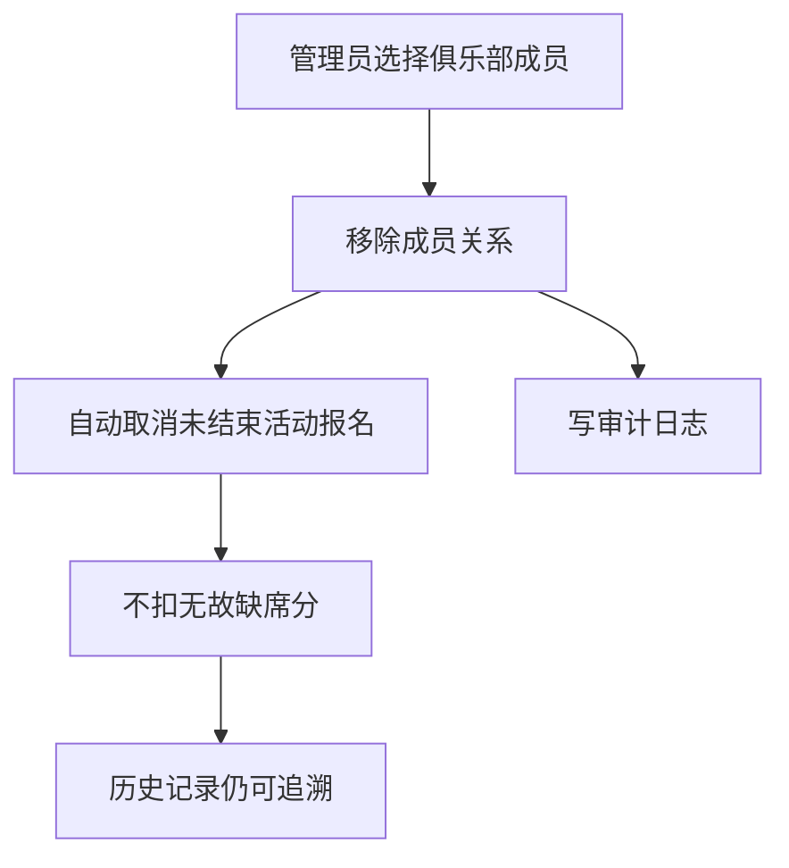
```mermaid
flowchart TD
    accTitle: 成员移除流程
    accDescr: 展示只有系统管理员可以移除俱乐部成员，未完成报名会自动取消且不产生缺席扣分。

    admin_select["管理员选择俱乐部成员"]
    remove["移除成员关系"]
    cancel_future["自动取消未结束活动报名"]
    no_absent["不扣无故缺席分"]
    audit["写审计日志"]
    history["历史记录仍可追溯"]

    admin_select --> remove
    remove --> cancel_future --> no_absent --> history
    remove --> audit
```

### 俱乐部停用和物理删除

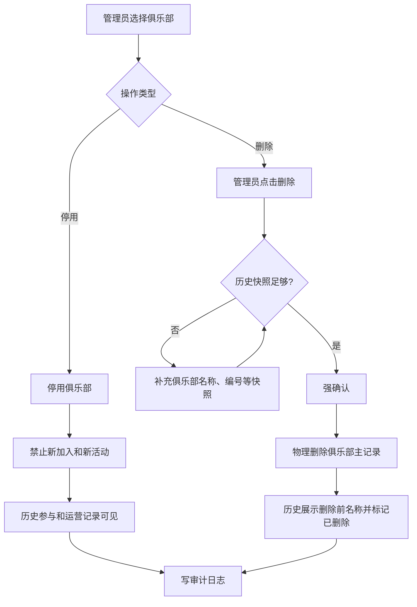
```mermaid
flowchart TD
    accTitle: 俱乐部停用删除流程
    accDescr: 展示俱乐部停用会阻断后续运营，物理删除前必须生成快照以保证历史报表和审计可读。

    admin_action["管理员选择俱乐部"]
    action_type{"操作类型"}
    disable["停用俱乐部"]
    block_join["禁止新加入和新活动"]
    keep_history["历史参与和运营记录可见"]
    delete_request["管理员点击删除"]
    snapshot_check{"历史快照足够?"}
    write_snapshot["补充俱乐部名称、编号等快照"]
    strong_confirm["强确认"]
    physical_delete["物理删除俱乐部主记录"]
    deleted_view["历史展示删除前名称并标记已删除"]
    audit["写审计日志"]

    admin_action --> action_type
    action_type -->|"停用"| disable --> block_join --> keep_history --> audit
    action_type -->|"删除"| delete_request --> snapshot_check
    snapshot_check -->|"否"| write_snapshot --> snapshot_check
    snapshot_check -->|"是"| strong_confirm --> physical_delete --> deleted_view --> audit
```

## 活动流程

### 活动创建、审核和发布

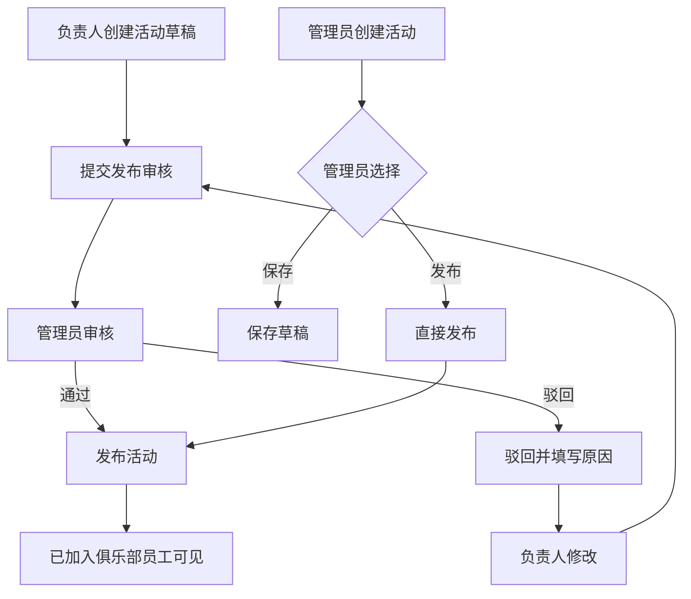
```mermaid
flowchart TD
    accTitle: 活动发布流程
    accDescr: 展示俱乐部负责人提交活动给管理员审核，以及管理员可以直接发布或保存草稿的流程。

    leader_draft["负责人创建活动草稿"]
    submit["提交发布审核"]
    admin_review["管理员审核"]
    reject["驳回并填写原因"]
    revise["负责人修改"]
    published["发布活动"]
    visible["已加入俱乐部员工可见"]

    admin_create["管理员创建活动"]
    admin_choice{"管理员选择"}
    admin_draft["保存草稿"]
    admin_publish["直接发布"]

    leader_draft --> submit --> admin_review
    admin_review -->|"通过"| published --> visible
    admin_review -->|"驳回"| reject --> revise --> submit

    admin_create --> admin_choice
    admin_choice -->|"保存"| admin_draft
    admin_choice -->|"发布"| admin_publish --> published
```

### 活动发布后修改

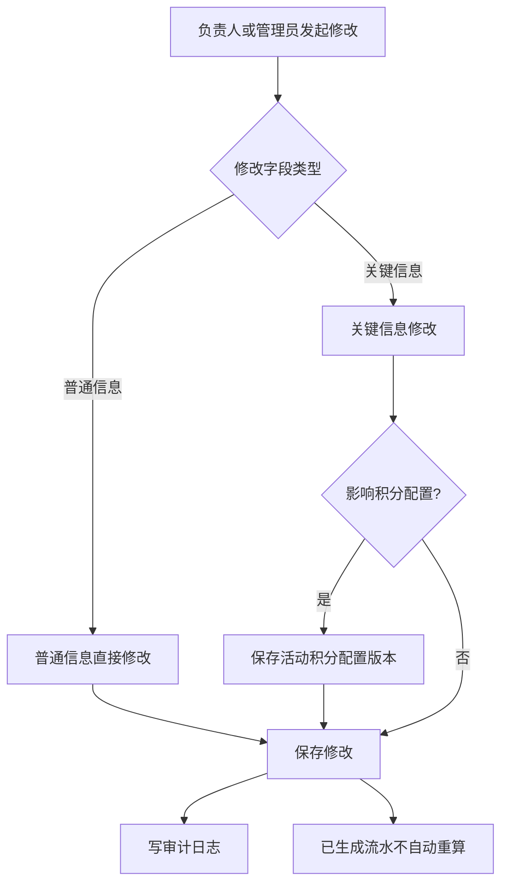
```mermaid
flowchart TD
    accTitle: 已发布活动修改流程
    accDescr: 展示已发布活动可由负责人或管理员修改，积分相关修改需要保存配置版本。

    edit_request["负责人或管理员发起修改"]
    field_type{"修改字段类型"}
    normal_edit["普通信息直接修改"]
    key_edit["关键信息修改"]
    point_related{"影响积分配置?"}
    save_version["保存活动积分配置版本"]
    save_change["保存修改"]
    audit["写审计日志"]
    no_recalc["已生成流水不自动重算"]

    edit_request --> field_type
    field_type -->|"普通信息"| normal_edit --> save_change --> audit
    field_type -->|"关键信息"| key_edit --> point_related
    point_related -->|"是"| save_version --> save_change
    point_related -->|"否"| save_change
    save_change --> no_recalc
```

### 活动取消

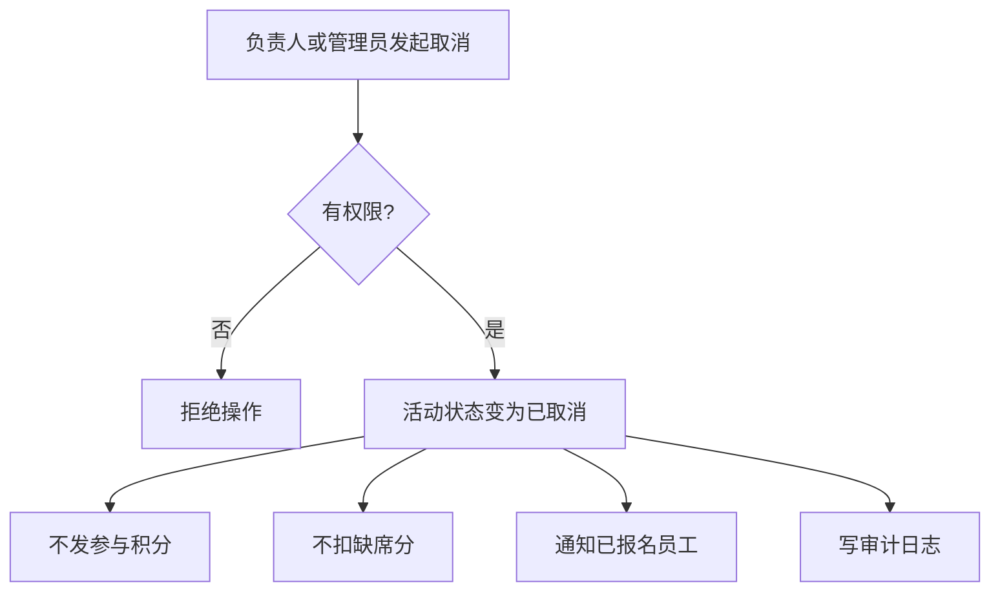
```mermaid
flowchart TD
    accTitle: 活动取消流程
    accDescr: 展示负责人和管理员可直接取消已发布活动，取消后不发积分也不扣缺席分。

    cancel_request["负责人或管理员发起取消"]
    permission_check{"有权限?"}
    reject["拒绝操作"]
    已取消状态["活动状态变为已取消"]
    stop_points["不发参与积分"]
    stop_absent["不扣缺席分"]
    notify["通知已报名员工"]
    audit["写审计日志"]

    cancel_request --> permission_check
    permission_check -->|"否"| reject
    permission_check -->|"是"| 已取消状态
    已取消状态 --> stop_points
    已取消状态 --> stop_absent
    已取消状态 --> notify
    已取消状态 --> audit
```

### 活动物理删除（当前 MVP 不开放，后续预留）

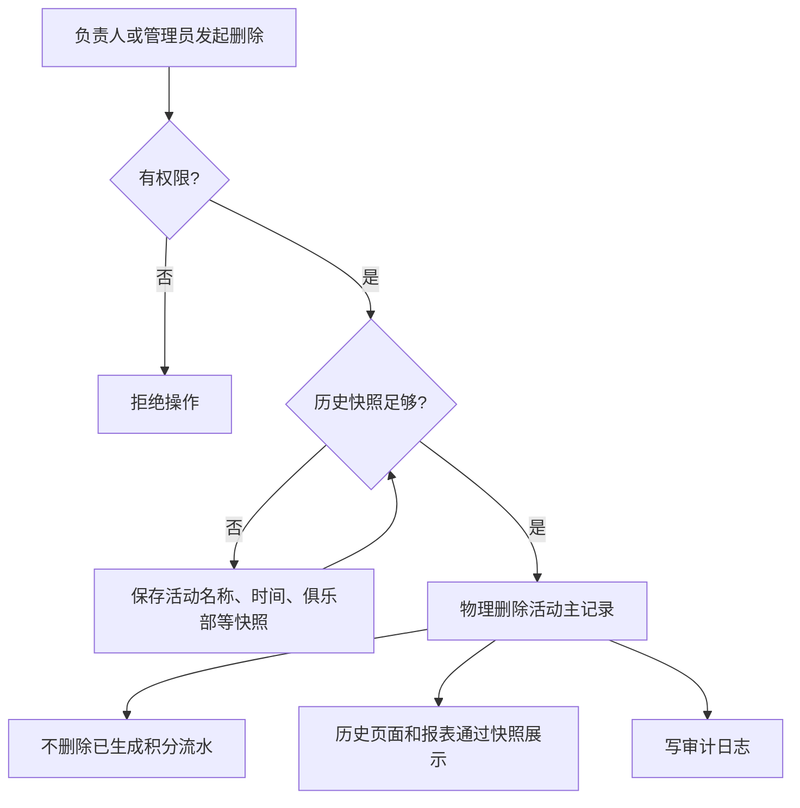
```mermaid
flowchart TD
    accTitle: 活动物理删除后续预留流程
    accDescr: 当前 MVP 不开放活动物理删除。后续如恢复，必须先用快照保证历史活动、账本、报表和审计仍可读。

    delete_request["负责人或管理员发起删除"]
    permission_check{"有权限?"}
    reject["拒绝操作"]
    snapshot_check{"历史快照足够?"}
    write_snapshot["保存活动名称、时间、俱乐部等快照"]
    physical_delete["物理删除活动主记录"]
    keep_ledger["不删除已生成积分流水"]
    history_view["历史页面和报表通过快照展示"]
    audit["写审计日志"]

    delete_request --> permission_check
    permission_check -->|"否"| reject
    permission_check -->|"是"| snapshot_check
    snapshot_check -->|"否"| write_snapshot --> snapshot_check
    snapshot_check -->|"是"| physical_delete
    physical_delete --> keep_ledger
    physical_delete --> history_view
    physical_delete --> audit
```

## 报名、签到和结算流程

### 报名和取消

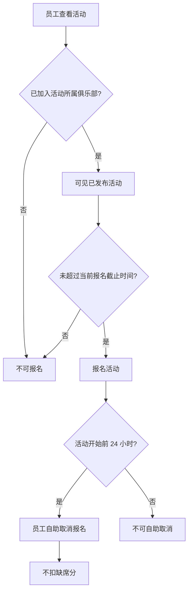
```mermaid
flowchart TD
    accTitle: 活动报名流程
    accDescr: 展示员工只能在当前有效报名截止时间前，报名自己已加入俱乐部的已发布活动。

    view_activity["员工查看活动"]
    joined_check{"已加入活动所属俱乐部?"}
    visible["可见已发布活动"]
    deadline_check{"未超过当前报名截止时间?"}
    register["报名活动"]
    cancel_check{"活动开始前 24 小时?"}
    cancel["员工自助取消报名"]
    no_absent["不扣缺席分"]
    cannot_register["不可报名"]
    cannot_cancel["不可自助取消"]

    view_activity --> joined_check
    joined_check -->|"否"| cannot_register
    joined_check -->|"是"| visible --> deadline_check
    deadline_check -->|"否"| cannot_register
    deadline_check -->|"是"| register --> cancel_check
    cancel_check -->|"是"| cancel --> no_absent
    cancel_check -->|"否"| cannot_cancel
```

### 签到签退窗口配置

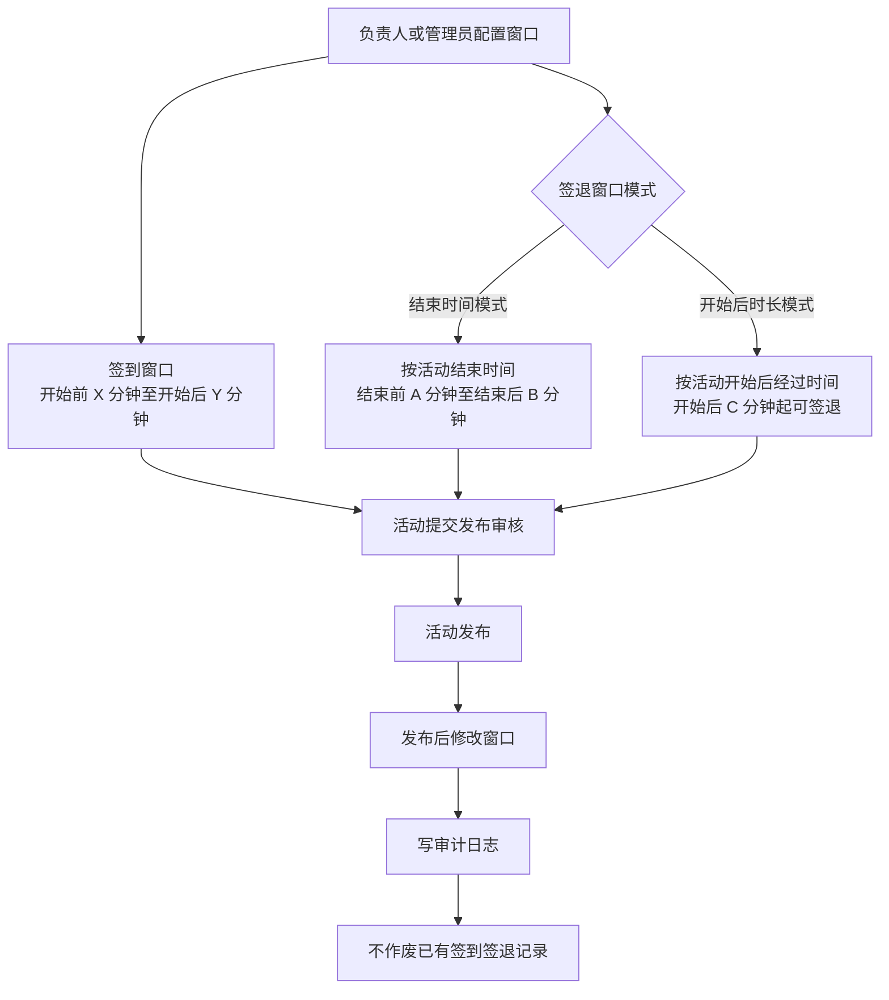
```mermaid
flowchart TD
    accTitle: 签到窗口配置
    accDescr: 展示负责人和管理员如何配置签到签退窗口，以及发布后修改窗口时需要记录审计。

    config["负责人或管理员配置窗口"]
    checkin["签到窗口\n开始前 X 分钟至开始后 Y 分钟"]
    checkout_mode{"签退窗口模式"}
    by_end["按活动结束时间\n结束前 A 分钟至结束后 B 分钟"]
    by_start["按活动开始后经过时间\n开始后 C 分钟起可签退"]
    submit_review["活动提交发布审核"]
    published["活动发布"]
    edit_after_publish["发布后修改窗口"]
    audit["写审计日志"]
    keep_existing["不作废已有签到签退记录"]

    config --> checkin --> submit_review
    config --> checkout_mode
    checkout_mode -->|"结束时间模式"| by_end --> submit_review
    checkout_mode -->|"开始后时长模式"| by_start --> submit_review
    submit_review --> published --> edit_after_publish --> audit --> keep_existing
```

### 员工签到签退

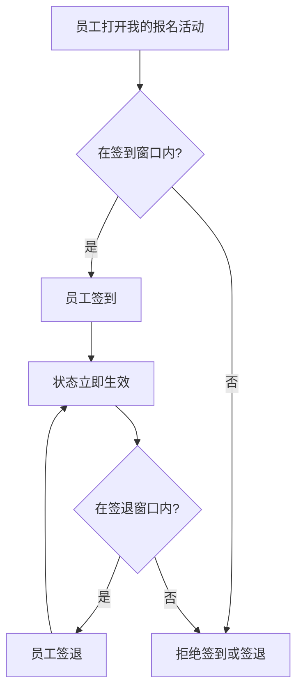
```mermaid
flowchart TD
    accTitle: 员工签到流程
    accDescr: 展示员工从本人报名记录进入签到签退，签到签退记录由员工操作后立即生效且不需要管理员审核。

    start["员工打开我的报名活动"]
    window_check{"在签到窗口内?"}
    checkin["员工签到"]
    checkout_window{"在签退窗口内?"}
    checkout["员工签退"]
    status_effective["状态立即生效"]
    reject["拒绝签到或签退"]

    start --> window_check
    window_check -->|"是"| checkin --> status_effective
    window_check -->|"否"| reject
    status_effective --> checkout_window
    checkout_window -->|"是"| checkout --> status_effective
    checkout_window -->|"否"| reject
```

### 负责人和管理员补录修正

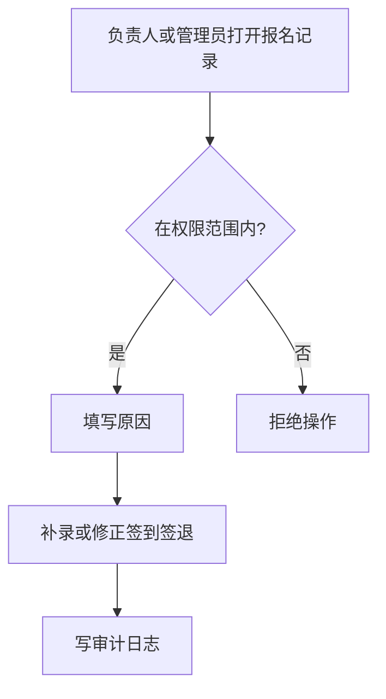
```mermaid
flowchart TD
    accTitle: 签到修正流程
    accDescr: 展示负责人和管理员从报名记录入口补录或修正签到签退，并且必须记录审计。

    correction_request["负责人或管理员打开报名记录"]
    scope_check{"在权限范围内?"}
    edit_record["补录或修正签到签退"]
    reason["填写原因"]
    audit["写审计日志"]
    reject["拒绝操作"]

    correction_request --> scope_check
    scope_check -->|"否"| reject
    scope_check -->|"是"| reason --> edit_record --> audit
```

### 活动积分自动发放

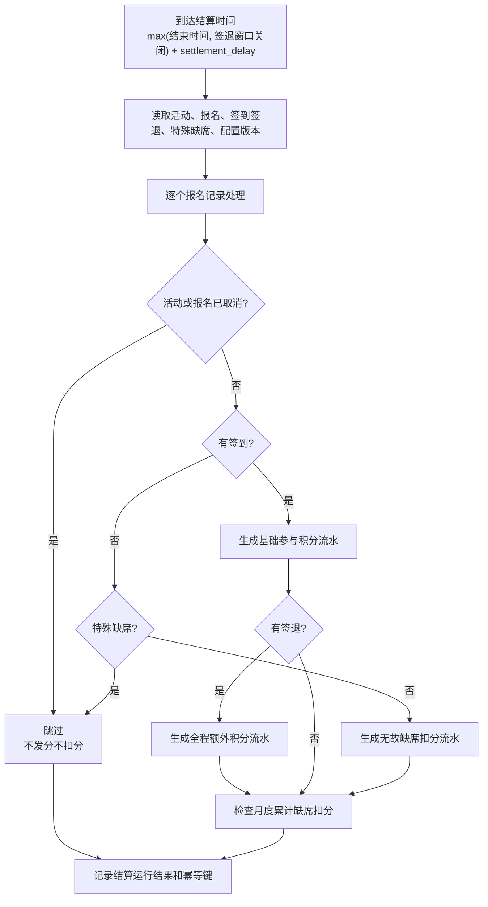
```mermaid
flowchart TD
    accTitle: 活动积分发放流程
    accDescr: 展示活动在签退窗口关闭并经过延迟后自动发放积分，幂等生成参与积分或缺席扣分。

    trigger["到达结算时间\nmax(结束时间, 签退窗口关闭) + settlement_delay"]
    load_data["读取活动、报名、签到签退、特殊缺席、配置版本"]
    each_registration["逐个报名记录处理"]
    cancelled_check{"活动或报名已取消?"}
    skip["跳过\n不发分不扣分"]
    checkin_check{"有签到?"}
    excused_check{"特殊缺席?"}
    base_points["生成基础参与积分流水"]
    checkout_check{"有签退?"}
    full_points["生成全程额外积分流水"]
    absent_deduct["生成无故缺席扣分流水"]
    monthly_check["检查月度累计缺席扣分"]
    settlement_record["记录结算运行结果和幂等键"]

    trigger --> load_data --> each_registration
    each_registration --> cancelled_check
    cancelled_check -->|"是"| skip --> settlement_record
    cancelled_check -->|"否"| checkin_check
    checkin_check -->|"是"| base_points --> checkout_check
    checkout_check -->|"是"| full_points --> monthly_check
    checkout_check -->|"否"| monthly_check
    checkin_check -->|"否"| excused_check
    excused_check -->|"是"| skip
    excused_check -->|"否"| absent_deduct --> monthly_check
    monthly_check --> settlement_record
```

## 非签到类积分流程

### 材料提交和审核

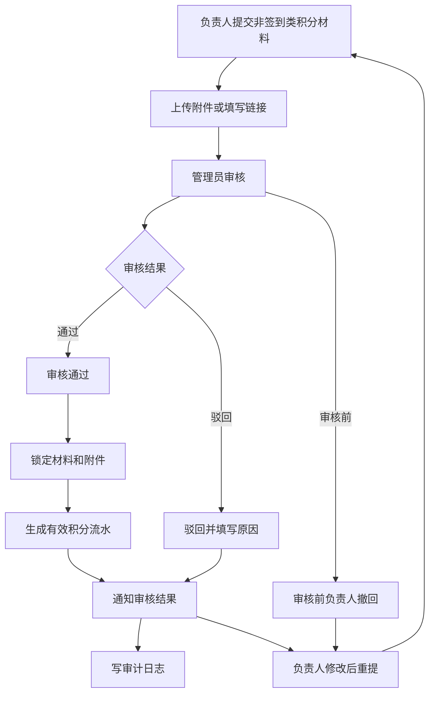
```mermaid
flowchart TD
    accTitle: 非签到材料审核流程
    accDescr: 展示俱乐部负责人提交非签到类积分材料，管理员审核后通过项生成有效积分流水。

    submit["负责人提交非签到类积分材料"]
    attach["上传附件或填写链接"]
    admin_review["管理员审核"]
    decision{"审核结果"}
    approve["审核通过"]
    reject["驳回并填写原因"]
    withdraw["审核前负责人撤回"]
    revise["负责人修改后重提"]
    lock_material["锁定材料和附件"]
    create_ledger["生成有效积分流水"]
    notify["通知审核结果"]
    audit["写审计日志"]

    submit --> attach --> admin_review
    admin_review --> decision
    decision -->|"通过"| approve --> lock_material --> create_ledger --> notify --> audit
    decision -->|"驳回"| reject --> notify --> revise --> submit
    admin_review -->|"审核前"| withdraw --> revise
```

### 管理员代录非签到类积分

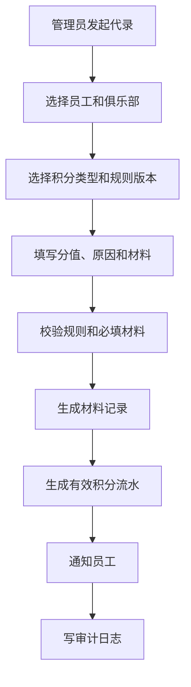
```mermaid
flowchart TD
    accTitle: 管理员代录积分
    accDescr: 展示管理员可以直接代录非签到类积分，但必须填写原因、材料、规则版本并写审计。

    admin_start["管理员发起代录"]
    choose_employee["选择员工和俱乐部"]
    choose_type["选择积分类型和规则版本"]
    input_points["填写分值、原因和材料"]
    validate["校验规则和必填材料"]
    create_material["生成材料记录"]
    create_ledger["生成有效积分流水"]
    notify["通知员工"]
    audit["写审计日志"]

    admin_start --> choose_employee --> choose_type --> input_points --> validate
    validate --> create_material --> create_ledger --> notify --> audit
```

### 非签到材料物理删除（当前 MVP 不开放，后续预留）

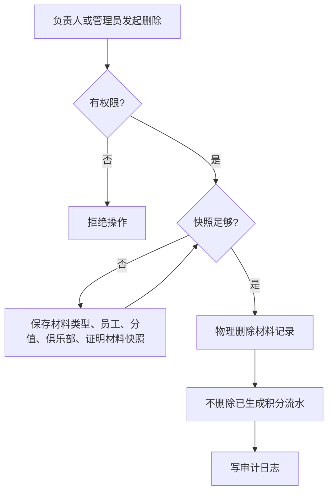
```mermaid
flowchart TD
    accTitle: 非签到材料删除后续预留流程
    accDescr: 当前 MVP 不开放非签到材料物理删除。后续如恢复，必须先保存快照以保证账本、报表和审计可读。

    delete_request["负责人或管理员发起删除"]
    permission_check{"有权限?"}
    reject["拒绝操作"]
    snapshot_check{"快照足够?"}
    write_snapshot["保存材料类型、员工、分值、俱乐部、证明材料快照"]
    physical_delete["物理删除材料记录"]
    keep_ledger["不删除已生成积分流水"]
    audit["写审计日志"]

    delete_request --> permission_check
    permission_check -->|"否"| reject
    permission_check -->|"是"| snapshot_check
    snapshot_check -->|"否"| write_snapshot --> snapshot_check
    snapshot_check -->|"是"| physical_delete --> keep_ledger --> audit
```

## 兑换流程

### 兑换批次配置

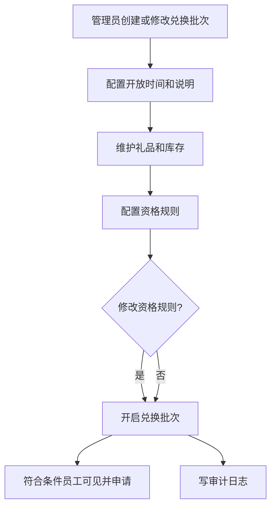
```mermaid
flowchart TD
    accTitle: 兑换批次配置流程
    accDescr: 展示只有管理员可以创建和控制兑换批次，修改资格规则时必须写审计。

    admin_start["管理员创建或修改兑换批次"]
    configure_time["配置开放时间和说明"]
    configure_gift["维护礼品和库存"]
    configure_rule["配置资格规则"]
    rule_change{"修改资格规则?"}
    open_batch["开启兑换批次"]
    employee_visible["符合条件员工可见并申请"]
    audit["写审计日志"]

    admin_start --> configure_time --> configure_gift --> configure_rule --> rule_change
    rule_change -->|"是"| open_batch
    rule_change -->|"否"| open_batch
    open_batch --> employee_visible
    open_batch --> audit
```

### 员工提交兑换申请

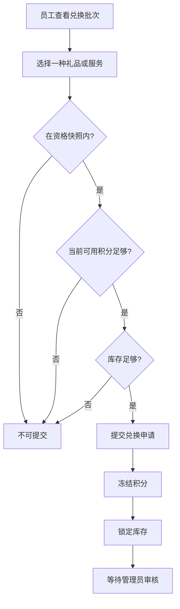
```mermaid
flowchart TD
    accTitle: 兑换申请流程
    accDescr: 展示员工申请单个礼品时，系统先校验资格、当前可用积分和库存，再冻结积分并锁定库存。

    view_batch["员工查看兑换批次"]
    choose_gift["选择一种礼品或服务"]
    eligibility_check{"在资格快照内?"}
    balance_check{"当前可用积分足够?"}
    stock_check{"库存足够?"}
    submit["提交兑换申请"]
    freeze["冻结积分"]
    lock_stock["锁定库存"]
    pending_review["等待管理员审核"]
    reject_submit["不可提交"]

    view_batch --> choose_gift --> eligibility_check
    eligibility_check -->|"否"| reject_submit
    eligibility_check -->|"是"| balance_check
    balance_check -->|"否"| reject_submit
    balance_check -->|"是"| stock_check
    stock_check -->|"否"| reject_submit
    stock_check -->|"是"| submit --> freeze --> lock_stock --> pending_review
```

### 兑换审核

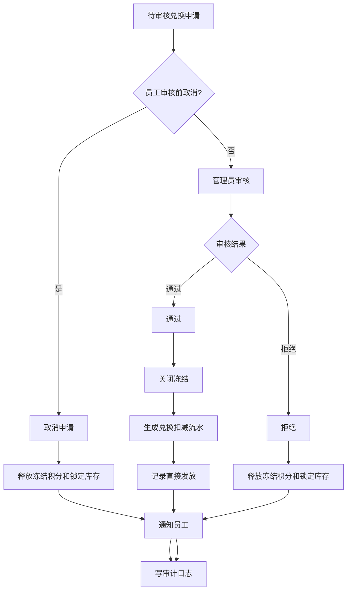
```mermaid
flowchart TD
    accTitle: 兑换审核流程
    accDescr: 展示管理员只能通过或拒绝兑换申请，通过后关闭冻结并生成扣减流水，同时视为直接发放。

    pending["待审核兑换申请"]
    employee_cancel{"员工审核前取消?"}
    cancel["取消申请"]
    release_cancel["释放冻结积分和锁定库存"]
    admin_review["管理员审核"]
    decision{"审核结果"}
    approve["通过"]
    reject["拒绝"]
    close_freeze["关闭冻结"]
    deduct["生成兑换扣减流水"]
    direct_issue["记录直接发放"]
    release_reject["释放冻结积分和锁定库存"]
    notify["通知员工"]
    audit["写审计日志"]

    pending --> employee_cancel
    employee_cancel -->|"是"| cancel --> release_cancel --> notify
    employee_cancel -->|"否"| admin_review --> decision
    decision -->|"通过"| approve --> close_freeze --> deduct --> direct_issue --> notify --> audit
    decision -->|"拒绝"| reject --> release_reject --> notify --> audit
```

## 账本调整和撤销流程

```mermaid
flowchart TD
    accTitle: 账本调整流程
    accDescr: 展示管理员不能直接修改余额，所有修正都必须通过调整流水或撤销流水，并记录原因、材料和审计。

    admin_start["管理员发起积分修正"]
    choose_type{"修正类型"}
    撤销流水["撤销原流水"]
    adjustment["新增调整流水"]
    require_reason["填写原因、材料、规则版本"]
    create_transaction["生成撤销或调整流水"]
    update_stats["余额和统计由流水重算"]
    notify["通知员工"]
    audit["写审计日志"]

    admin_start --> choose_type
    choose_type -->|"撤销"| 撤销流水 --> require_reason
    choose_type -->|"调整"| adjustment --> require_reason
    require_reason --> create_transaction --> update_stats --> notify --> audit
```

## 年度清零和排名流程

### 年度清零

```mermaid
flowchart TD
    accTitle: 年度清零流程
    accDescr: 展示年度清零只自动清理未冻结的可用积分，冻结中的兑换积分保留到审核结果产生。

    schedule["每年 1 月 1 日 00:00:00\n北京时间（Asia/Shanghai）自动触发"]
    load_balance["计算账户净积分和有效冻结"]
    clearable["计算未冻结可用积分"]
    create_expire["生成年度清零负向流水"]
    keep_frozen["冻结兑换积分不参与清零"]
    later_review["管理员后续审核冻结兑换"]
    approve["审核通过\n按原申请扣减并直接发放"]
    reject["审核拒绝\n释放冻结积分回账户"]
    run_record["记录清零批次和幂等键"]

    schedule --> load_balance --> clearable --> create_expire --> run_record
    schedule --> keep_frozen --> later_review
    later_review -->|"通过"| approve
    later_review -->|"拒绝"| reject
```

### 俱乐部年度排名和激励建议

```mermaid
flowchart TD
    accTitle: 俱乐部年度排名流程
    accDescr: 展示俱乐部年度排名按有效正向发放流水扣除撤销流水计算，并生成待管理员确认的激励建议。

    period_end["年度结束或管理员触发"]
    aggregate["汇总俱乐部有效正向发放积分"]
    subtract_reversal["扣除对应撤销流水"]
    rank["生成俱乐部排名"]
    incentive["生成激励建议记录"]
    admin_confirm["管理员确认"]
    budget_record["登记预算经费记录"]

    period_end --> aggregate --> subtract_reversal --> rank --> incentive --> admin_confirm --> budget_record
```

## 异议处理流程

```mermaid
flowchart TD
    accTitle: 异议处理流程
    accDescr: 展示员工提交带材料的异议，管理员回复，如需改积分必须通过账本调整或撤销处理。

    submit["员工提交异议"]
    attach["上传附件或填写链接"]
    admin_review["管理员处理"]
    need_adjust{"需要调整积分?"}
    adjust["生成调整流水或撤销流水"]
    reply["管理员回复处理结论"]
    notify["通知员工"]
    close["关闭异议"]
    audit["写审计日志"]

    submit --> attach --> admin_review --> need_adjust
    need_adjust -->|"是"| adjust --> reply
    need_adjust -->|"否"| reply
    reply --> notify --> close --> audit
```

## 报表导出流程

```mermaid
flowchart TD
    accTitle: 报表导出流程
    accDescr: 展示只有系统管理员可以导出报表，导出从业务记录和账本读取数据，并写入导出强审计。

    admin_start["管理员进入报表"]
    choose_report["选择报表类型"]
    set_filter["设置筛选条件"]
    read_data["读取流水和业务记录"]
    generate_file["生成导出文件"]
    write_log["写导出强审计\n导出人、时间、类型和筛选条件"]
    download["管理员下载文件"]

    admin_start --> choose_report --> set_filter --> read_data --> generate_file --> write_log --> download
```

## 规则版本流程

```mermaid
flowchart TD
    accTitle: 规则版本发布流程
    accDescr: 展示管理员创建、发布、撤回、停用或替代规则版本，历史积分流水保留原规则版本。

    draft["管理员创建规则版本草稿"]
    edit["编辑规则摘要、生效说明和附件"]
    publish_decision{"发布?"}
    withdraw["未生效版本撤回"]
    publish["发布后立即生效"]
    new_business["新活动、积分、扣分、兑换引用新版本"]
    old_ledger["历史流水保留原 rule_version_id"]
    disable_decision{"后续停用或替代?"}
    disable["停用当前版本"]
    supersede["发布新版本替代"]
    audit["写审计日志"]

    draft --> edit --> publish_decision
    publish_decision -->|"否"| withdraw --> audit
    publish_decision -->|"是"| publish --> new_business --> old_ledger --> disable_decision
    disable_decision -->|"停用"| disable --> audit
    disable_decision -->|"替代"| supersede --> audit
```

## 附件和链接流程

```mermaid
flowchart TD
    accTitle: 附件生命周期流程
    accDescr: 展示附件和外部链接在审核前可修改，审核通过后锁定，只有管理员可以追加补充。

    upload["上传附件或填写外部链接"]
    bind_owner["关联积分材料、异议或预算记录"]
    review_state{"业务是否已审核通过?"}
    uploader_edit["上传人删除或替换"]
    lock["附件锁定"]
    admin_append["管理员追加备注或补充附件"]
    audit["关键变更写审计日志"]

    upload --> bind_owner --> review_state
    review_state -->|"否"| uploader_edit --> bind_owner
    review_state -->|"是"| lock --> admin_append --> audit
```

## 待办和通知流程

### 负责人待办

```mermaid
flowchart TD
    accTitle: 负责人待办流程
    accDescr: 展示负责人工作台如何聚合活动草稿、驳回活动、签到异常和待提交积分材料等运营待办。

    dashboard["负责人进入首页"]
    load_scope["加载负责俱乐部范围"]
    rejected_activity["活动草稿和驳回活动"]
    attendance_exception["活动签到异常"]
    material_todo["待提交非签到积分材料"]
    club_summary["负责俱乐部概览"]
    handle["进入对应业务处理"]
    clear_todo["状态变化后待办消失"]

    dashboard --> load_scope
    load_scope --> rejected_activity --> handle
    load_scope --> attendance_exception --> handle
    load_scope --> material_todo --> handle
    load_scope --> club_summary
    handle --> clear_todo
```

### 管理员待办

```mermaid
flowchart TD
    accTitle: 管理员待办流程
    accDescr: 展示管理员工作台如何聚合活动、积分材料、兑换申请、异议和结算异常等审核与异常处理事项。

    dashboard["管理员进入首页"]
    pending_activity["待审核活动"]
    pending_material["待审核非签到积分"]
    pending_redemption["待审核兑换"]
    pending_dispute["待处理异议"]
    anomaly["异常结算和撤销记录"]
    process["进入对应处理页面"]
    refresh["处理完成后刷新待办"]

    dashboard --> pending_activity --> process
    dashboard --> pending_material --> process
    dashboard --> pending_redemption --> process
    dashboard --> pending_dispute --> process
    dashboard --> anomaly --> process
    process --> refresh
```

### 通知生成

业务结果产生时（活动审核结果、非签到积分审核结果、兑换审核结果、异议回复、管理员手工调整积分），员工或管理员要收到对应的系统内通知，通知有已读/未读。

通知只是“告知”，不承载业务状态。具体如何投递、失败如何重试属于实施细节，不在功能文档范围内。

## 强确认和审计流程

### 删除俱乐部强确认流程

```mermaid
flowchart TD
    accTitle: 删除俱乐部强确认流程
    accDescr: 展示只有物理删除俱乐部需要强确认；其他删除不走强确认。

    request["管理员点击删除俱乐部"]
    show_impact["展示影响范围"]
    second_confirm["强确认"]
    execute["物理删除俱乐部"]
    audit["写审计日志"]
    result["返回操作结果"]
    cancel["用户取消操作"]

    request --> show_impact --> second_confirm
    second_confirm -->|"取消"| cancel
    second_confirm -->|"确认"| execute --> audit --> result
```

### 审计失败阻断流程

```mermaid
flowchart TD
    accTitle: 审计失败阻断流程
    accDescr: 展示关键业务写入在审计失败时必须失败，避免产生不可追溯的管理员或负责人操作。

    critical_write["关键写操作"]
    transaction["开启业务事务"]
    business_change["写业务变更"]
    write_audit["写审计日志"]
    audit_ok{"审计成功?"}
    commit["提交事务"]
    rollback["回滚业务变更"]
    error["返回失败并提示重试"]

    critical_write --> transaction --> business_change --> write_audit --> audit_ok
    audit_ok -->|"是"| commit
    audit_ok -->|"否"| rollback --> error
```

### 快照生成流程

```mermaid
flowchart TD
    accTitle: 历史快照流程
    accDescr: 展示物理删除前必须保存名称、时间、俱乐部、员工、材料和规则上下文，保证账本、报表和审计可追溯。

    delete_request["发起物理删除"]
    list_dependencies["检查历史依赖"]
    snapshot_enough{"快照足够?"}
    write_snapshot["补写必要历史快照"]
    verify_snapshot["校验历史页面和报表可读"]
    physical_delete["执行物理删除"]
    audit["写审计日志"]

    delete_request --> list_dependencies --> snapshot_enough
    snapshot_enough -->|"否"| write_snapshot --> verify_snapshot --> snapshot_enough
    snapshot_enough -->|"是"| physical_delete --> audit
```

## 并发和幂等流程

### 兑换并发提交

```mermaid
sequenceDiagram
    accTitle: 并发兑换提交
    accDescr: 展示两个员工竞争有限礼品库存时，事务锁保证只有一个申请能冻结积分并锁定库存。

    participant employee_a as 员工 A
    participant employee_b as 员工 B
    participant redemption as 兑换模块
    participant ledger as 积分账本
    participant stock as 库存记录

    employee_a->>redemption: 提交礼品兑换
    employee_b->>redemption: 同时提交同一礼品
    redemption->>stock: 锁定礼品库存行
    stock-->>redemption: 员工 A 获得锁
    redemption->>ledger: 校验可用积分并冻结
    ledger-->>redemption: 冻结成功
    redemption->>stock: 创建库存锁定
    redemption-->>employee_a: 申请成功，待审核
    redemption->>stock: 员工 B 尝试锁定库存
    stock-->>redemption: 库存不足
    redemption-->>employee_b: 提示已兑完或库存不足
```

### 活动积分发放幂等

```mermaid
flowchart TD
    accTitle: 活动积分发放幂等流程
    accDescr: 展示活动积分发放通过运行键和员工维度幂等键保证失败任务重试不会重复生成积分流水。

    job_start["积分发放任务启动"]
    run_key["生成活动积分发放 run_key"]
    run_exists{"发放批次已成功?"}
    skip_run["跳过整批"]
    load_registrations["加载报名记录"]
    each_employee["处理单个员工"]
    idempotency_key["生成员工积分类型幂等键"]
    ledger_exists{"流水已存在?"}
    skip_employee["跳过该员工该类型"]
    create_ledger["生成积分或扣分流水"]
    mark_done["记录员工处理结果"]
    finish_run["标记结算批次完成"]

    job_start --> run_key --> run_exists
    run_exists -->|"是"| skip_run
    run_exists -->|"否"| load_registrations --> each_employee --> idempotency_key --> ledger_exists
    ledger_exists -->|"是"| skip_employee --> mark_done
    ledger_exists -->|"否"| create_ledger --> mark_done
    mark_done --> finish_run
```

### 后台任务失败重试

```mermaid
flowchart TD
    accTitle: 后台任务重试流程
    accDescr: 展示后台任务记录每次运行、重试临时失败，并把重复失败暴露给管理员处理且不产生重复业务结果。

    schedule["调度器触发任务"]
    create_run["创建任务运行记录"]
    execute["执行业务处理"]
    success{"执行成功?"}
    mark_success["标记成功"]
    classify_error["记录错误类型"]
    retryable{"可重试?"}
    retry["按退避策略重试"]
    max_retry{"超过重试上限?"}
    mark_failed["标记失败"]
    admin_todo["进入管理员异常待办"]

    schedule --> create_run --> execute --> success
    success -->|"是"| mark_success
    success -->|"否"| classify_error --> retryable
    retryable -->|"否"| mark_failed --> admin_todo
    retryable -->|"是"| max_retry
    max_retry -->|"否"| retry --> execute
    max_retry -->|"是"| mark_failed
```

## 预算经费流程

```mermaid
flowchart TD
    accTitle: 预算记录流程
    accDescr: 展示管理员直接维护预算和支出记录，俱乐部排名激励建议经管理员确认后可生成经费记录。

    source{"记录来源"}
    manual["管理员手动登记预算记录"]
    suggestion["俱乐部排名生成激励建议"]
    confirm["管理员确认激励建议"]
    input_budget["填写分类、预算金额、实际支出、备注"]
    attach["上传附件或填写链接"]
    save["保存预算经费记录"]
    report["进入预算统计报表"]

    source -->|"手动"| manual --> input_budget
    source -->|"激励建议"| suggestion --> confirm --> input_budget
    input_budget --> attach --> save --> report
```

## 状态机

### 活动状态

```mermaid
stateDiagram-v2
    accTitle: 活动状态机
    accDescr: 展示活动从草稿、审核、发布、取消、结算到物理删除的生命周期。

    state "草稿" as Draft
    state "待审核" as PendingReview
    state "已发布" as Published
    state "已取消" as Cancelled
    state "已结束" as Ended
    state "已结算" as Settled
    state "已删除" as Deleted

    [*] --> Draft: 创建活动
    Draft --> PendingReview: 负责人提交审核
    PendingReview --> Published: 管理员通过
    PendingReview --> Draft: 管理员驳回
    Published --> Cancelled: 取消
    Published --> Ended: 到达结束时间
    Ended --> Settled: 自动结算完成
    Draft --> Deleted: 物理删除
    PendingReview --> Deleted: 物理删除
    Published --> Deleted: 物理删除
    Cancelled --> Deleted: 物理删除
    Ended --> Deleted: 物理删除
    Settled --> Deleted: 物理删除
```

### 报名状态与签到签退事实

报名状态只有两个：已报名、已取消。取消原因（员工自助、退出俱乐部自动、管理员移除、活动取消）单独记录，不混进报名状态。

签到、签退是报名记录上的两个独立二元事实（未签到/已签到、未签退/已签退），各自带来源（自助、补录、修正），不是报名状态的一部分。缺席不是独立状态，而是结算时由“已报名 ∧ 未签到 ∧ 非特殊缺席”推导；特殊缺席是一个不计入无故缺席的标记。

```mermaid
stateDiagram-v2
    accTitle: 报名状态机
    accDescr: 展示报名记录从报名到取消的生命周期，取消原因决定是否计入无故缺席，签到签退作为独立事实不进入报名状态。

    state "已报名" as Registered
    state "已取消" as Cancelled

    [*] --> Registered: 报名成功
    Registered --> Cancelled: 员工自助取消 / 退出或被移出俱乐部 / 活动取消
```

签到签退事实判定：

| 事实 | 取值 | 来源 |
| --- | --- | --- |
| 签到 | 未签到 / 已签到 | 自助 / 补录 / 修正 |
| 签退 | 未签退 / 已签退 | 自助 / 补录 / 修正 |

### 非签到类积分材料状态

```mermaid
stateDiagram-v2
    accTitle: 非签到材料状态机
    accDescr: 展示非签到类积分材料从提交、撤回、驳回、通过、生成流水到物理删除的生命周期。

    state "已提交" as Submitted
    state "已撤回" as Withdrawn
    state "已驳回" as Rejected
    state "已通过" as Approved
    state "已生成流水" as EffectiveTransactionCreated
    state "已删除" as Deleted

    [*] --> Submitted: 负责人提交
    Submitted --> Withdrawn: 负责人撤回
    Withdrawn --> Submitted: 修改后重提
    Submitted --> Approved: 管理员通过
    Submitted --> Rejected: 管理员驳回
    Rejected --> Submitted: 修改后重提
    Approved --> EffectiveTransactionCreated: 生成有效积分流水
    Submitted --> Deleted: 物理删除
    Withdrawn --> Deleted: 物理删除
    Rejected --> Deleted: 物理删除
    Approved --> Deleted: 物理删除
    EffectiveTransactionCreated --> Deleted: 物理删除
```

### 兑换申请状态

```mermaid
stateDiagram-v2
    accTitle: 兑换申请状态机
    accDescr: 展示兑换申请从提交、待审核、取消、通过、直接发放到拒绝的生命周期。

    state "待审核" as PendingReview
    state "审核前取消" as CancelledBeforeReview
    state "已拒绝" as Rejected
    state "已通过" as Approved
    state "已直接发放" as DirectIssued

    [*] --> PendingReview: 提交申请并冻结积分锁定库存
    PendingReview --> CancelledBeforeReview: 员工取消
    CancelledBeforeReview --> [*]: 释放冻结和库存
    PendingReview --> Rejected: 管理员拒绝
    Rejected --> [*]: 释放冻结和库存
    PendingReview --> Approved: 管理员通过
    Approved --> DirectIssued: 生成扣减流水并直接发放
    DirectIssued --> [*]: 交易完成
```

### 积分冻结状态

```mermaid
stateDiagram-v2
    accTitle: 积分冻结状态机
    accDescr: 展示积分冻结不是账本流水，并根据兑换结果关闭或释放的生命周期。

    state "有效冻结" as Active
    state "已释放" as Released
    state "已转扣减" as Converted

    [*] --> Active: 兑换申请提交
    Active --> Released: 申请取消或审核拒绝
    Active --> Converted: 审核通过并生成扣减流水
    Released --> [*]: 当前可用积分恢复
    Converted --> [*]: 账户净积分被流水扣减
```
