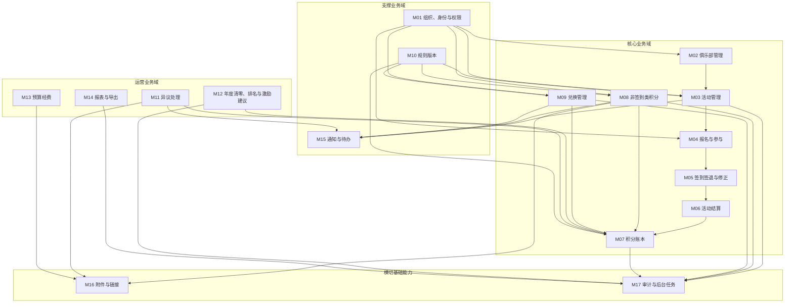

# 俱乐部员工积分系统模块拆分设计

_本文档回答“系统一共哪些模块、模块边界是什么、模块之间怎么依赖”。产品需求见 `club-points-prd.md`，流程图见 `club-points-flow-design.md`，架构约束见 `club-points-architecture-design.md`。_

---

## 结论

第一版建议规划为 17 个一级模块：

| 编号 | 一级模块 | 类型 | 第一版结论 |
| --- | --- | --- | --- |
| M01 | 组织、身份与权限 | 支撑业务域 | 必做 |
| M02 | 俱乐部管理 | 核心业务域 | 必做 |
| M03 | 活动管理 | 核心业务域 | 必做 |
| M04 | 报名与参与 | 核心业务域 | 必做 |
| M05 | 签到签退与修正 | 核心业务域 | 必做 |
| M06 | 活动结算 | 核心业务域 | 必做 |
| M07 | 积分账本 | 核心业务域 | 必做 |
| M08 | 非签到类积分 | 核心业务域 | 必做 |
| M09 | 兑换管理 | 核心业务域 | 必做 |
| M10 | 规则版本 | 支撑业务域 | 必做 |
| M11 | 异议处理 | 运营业务域 | 必做 |
| M12 | 年度清零、排名与激励建议 | 运营业务域 | 必做 |
| M13 | 预算经费 | 运营业务域 | 必做但不做审批流 |
| M14 | 报表与导出 | 运营业务域 | 必做 |
| M15 | 通知与待办 | 支撑业务域 | 必做最小版 |
| M16 | 附件与链接 | 横切基础能力 | 必做 |
| M17 | 审计与后台任务 | 横切基础能力 | 必做 |

不要把“员工端、负责人端、管理员端”当成后台业务模块。三端是入口和权限视角，不是领域边界。

不要把“积分明细表、兑换记录、积分总台账”当成底层模块。它们是报表视图和导出结果，不是事实源。

## 拆分原则

模块边界按业务事实和生命周期拆，不按页面拆。

- 活动、报名、签到签退、结算不是同一个事实，必须拆开看。
- 积分流水、积分冻结、兑换申请、库存锁定不是同一个事实，必须拆开看。
- 材料审核和积分流水不是同一个事实，必须拆开看。
- 附件、通知、审计是横切能力，不能承载业务主状态。
- 报表导出只读，不反向影响业务状态。
- 余额缓存可以有，但不能成为事实源。

## 模块总览

## 模块分层

| 分层 | 模块 | 说明 |
| --- | --- | --- |
| 核心业务域 | M02-M09 | 系统闭环的主业务，直接决定积分、活动、兑换是否正确 |
| 运营业务域 | M11-M14 | 管理、争议、年度、预算和报表能力 |
| 支撑业务域 | M01、M10、M15 | 提供身份权限、规则版本、通知待办 |
| 横切基础能力 | M16、M17 | 附件、审计、后台任务，给多个模块复用 |

优先实现顺序不完全等于模块编号。M07 积分账本必须尽早设计，因为活动结算、非签到积分、兑换、年度清零都会依赖它。

## 模块明细

### M01 组织、身份与权限

职责：

- 维护员工、部门、联系方式、外部组织字段预留。
- 识别员工、俱乐部负责人、系统管理员三类角色。
- 提供本人范围、负责俱乐部范围、管理员全局范围的权限判断。
- 支撑负责人多俱乐部、多负责人场景。

不负责：

- 不计算积分余额。
- 不保存活动报名、签到、兑换、材料审核状态。

核心对象：

- 员工。
- 部门。
- 角色。
- 权限范围。
- 外部组织映射。

### M02 俱乐部管理

职责：

- 管理俱乐部创建、停用、物理删除。
- 管理员工加入、退出俱乐部。
- 管理员移除成员。
- 管理俱乐部负责人任免。
- 维护俱乐部业务信息和成员名单。
- 物理删除前补齐俱乐部快照。

不负责：

- 不发积分。
- 不处理签到签退。
- 不处理兑换。

核心对象：

- 俱乐部。
- 俱乐部成员关系。
- 负责人任命关系。
- 俱乐部删除快照。

### M03 活动管理

职责：

- 管理活动草稿、提交审核、驳回、发布、取消、修改、物理删除。
- 管理活动归属俱乐部。
- 管理活动普通信息和关键信息。
- 管理活动积分配置版本。
- 管理活动发布后的变更审计。

不负责：

- 不保存员工签到签退事实。
- 不直接生成积分流水。

核心对象：

- 活动。
- 活动审核记录。
- 活动变更记录。
- 活动积分配置版本。
- 活动删除快照。

### M04 报名与参与

职责：

- 校验员工必须已加入俱乐部才能看到和报名活动。
- 管理活动报名。
- 管理员工自助取消报名。
- 处理退出俱乐部或管理员移除成员后的自动取消。
- 保存报名状态和参与资格事实。

不负责：

- 不判断签到签退是否有效。
- 不生成活动参与积分。

核心对象：

- 活动报名。
- 报名取消记录。
- 自动取消记录。
- 特殊缺席标记。

### M05 签到签退与修正

职责：

- 管理签到窗口和签退窗口配置的使用。
- 员工自助签到签退。
- 俱乐部负责人补录或修正本俱乐部活动签到签退。
- 系统管理员补录或修正全部活动签到签退。
- 保存签到签退原始事实和修正审计。

不负责：

- 不发放积分。
- 不自动补报名。
- 不允许为未报名员工补录签到签退。

核心对象：

- 签到记录。
- 签退记录。
- 签到签退修正记录。
- 签到签退窗口配置快照。

### M06 活动结算

职责：

- 在签退窗口关闭后加 `settlement_delay` 自动结算活动积分。
- 根据报名、签到、签退、取消、特殊缺席生成结算结果。
- 调用积分账本生成基础参与积分、全程额外积分和无故缺席扣分。
- 检查月度累计缺席扣分。
- 保证活动、员工、积分类型维度幂等。

不负责：

- 不保存积分余额。
- 不修改签到签退事实。

核心对象：

- 活动结算批次。
- 员工结算结果。
- 结算幂等键。
- 结算异常记录。

### M07 积分账本

职责：

- 保存所有有效积分流水。
- 保存积分冻结记录。
- 管理撤销流水和调整流水。
- 推导账户净积分、冻结积分、当前可用积分。
- 支撑来源统计、俱乐部发放积分统计、年度清零。
- 提供幂等写入能力。

不负责：

- 不保存活动报名事实。
- 不保存兑换申请状态。
- 不保存非签到类材料原文。
- 不允许直接改员工余额。

核心对象：

- 积分流水。
- 积分冻结。
- 撤销关系。
- 调整原因和材料。
- 余额缓存。

### M08 非签到类积分

职责：

- 管理月度履职、策划执行、宣传分享、建议、获奖、推荐、特殊贡献等材料。
- 由俱乐部负责人提交材料。
- 管理审核前撤回、修改、重提。
- 管理员审核通过后调用积分账本生成流水。
- 管理员代录非签到类积分并直接生效。
- 物理删除材料前保存快照。

不负责：

- 不处理基础参与积分。
- 不处理员工直接提交材料。

核心对象：

- 非签到类积分材料。
- 材料明细。
- 审核记录。
- 材料附件。
- 材料删除快照。

### M09 兑换管理

职责：

- 管理兑换批次、礼品、库存、上下架。
- 管理兑换资格快照。
- 员工提交兑换申请。
- 提交时校验资格、当前可用积分、库存。
- 提交时冻结积分并锁定库存。
- 管理员审核通过或拒绝。
- 通过时关闭冻结并生成兑换扣减流水。
- 拒绝或审核前取消时释放冻结和库存。

不负责：

- 第一版不做领取状态。
- 第一版不做签收状态。
- 第一版不做逾期未领取和自动放弃。
- 第一版不做质量问题记录。
- 第一版不处理撤销兑换扣减后是否自动恢复库存。

核心对象：

- 兑换批次。
- 礼品。
- 库存。
- 资格快照。
- 兑换申请。
- 库存锁定。

### M10 规则版本

职责：

- 管理积分规则版本草稿、发布、撤回、停用、替代。
- 为活动、非签到类积分、扣分、兑换提供规则版本引用。
- 保证历史流水保留原规则版本。

不负责：

- 不自动重算历史流水。
- 不替代业务审核。

核心对象：

- 规则版本。
- 规则附件。
- 规则发布记录。
- 规则停用记录。

### M11 异议处理

职责：

- 员工提交异议。
- 员工上传附件或填写链接。
- 管理员处理异议并回复。
- 需要改积分时调用积分账本生成调整流水或撤销流水。
- 通知员工处理结果。

不负责：

- 不直接修改原积分流水。
- 不替代非签到材料审核。

核心对象：

- 异议单。
- 异议附件。
- 处理记录。
- 关联调整或撤销流水。

### M12 年度清零、排名与激励建议

职责：

- 每年 1 月 1 日自动清零未冻结可用积分。
- 跨年冻结兑换按审核结果处理。
- 统计俱乐部年度发放积分排名。
- 生成激励建议记录。
- 支撑管理员确认后登记经费。

不负责：

- 不直接维护预算支出。
- 不修改历史正向发放积分。

核心对象：

- 年度清零批次。
- 年度清零流水引用。
- 俱乐部年度排名。
- 激励建议。

### M13 预算经费

职责：

- 管理预算分类、预算金额、实际支出、附件和备注。
- 管理员确认激励建议后登记经费记录。
- 提供预算统计数据。

不负责：

- 第一版不做预算审批流。
- 第一版不做自动预算压缩。

核心对象：

- 预算记录。
- 支出记录。
- 激励经费记录。
- 预算附件。

### M14 报表与导出

职责：

- 提供积分明细、兑换记录、积分总台账、俱乐部发放积分排名、预算统计。
- 仅系统管理员可导出。
- 导出时记录导出人、时间、类型、筛选条件。

不负责：

- 不作为事实源。
- 不反向修改业务状态。
- 不给员工和负责人提供导出。

核心对象：

- 报表查询模型。
- 导出任务。
- 导出日志。
- 导出文件引用。

### M15 通知与待办

职责：

- 生成系统内通知。
- 管理已读和未读。
- 生成负责人待办和管理员待办。
- 支持通知失败补偿。

不负责：

- 不承载业务主状态。
- 不做外部消息系统强依赖。
- 第一版不提供通知删除。

核心对象：

- 通知。
- 通知接收人。
- 待办项。
- 通知补偿记录。

### M16 附件与链接

职责：

- 支持文件上传。
- 支持外部链接。
- 绑定积分材料、异议、预算记录等业务对象。
- 管理审核前删除或替换。
- 管理审核后锁定和管理员追加。

不负责：

- 不决定审核结果。
- 不承载业务主状态。

核心对象：

- 附件元数据。
- 外部链接。
- 附件绑定关系。
- 附件锁定状态。

### M17 审计与后台任务

职责：

- 记录关键操作审计。
- 系统管理员查看审计日志。
- 管理活动结算、年度清零、通知补偿、异常扫描等后台任务。
- 管理任务运行状态、失败重试、人工处理。
- 保证关键操作审计失败时业务回滚。

不负责：

- 不替代积分流水。
- 不替代业务状态机。

核心对象：

- 审计日志。
- 任务定义。
- 任务运行记录。
- 任务幂等键。
- 异常处理记录。

## 模块依赖矩阵

| 模块 | 直接依赖 | 被谁依赖 | 关键风险 |
| --- | --- | --- | --- |
| M01 组织、身份与权限 | 无 | 几乎所有模块 | 权限只在前端控制会越权 |
| M02 俱乐部管理 | M01、M17 | M03、M04、M08、M12、M14 | 物理删除后历史不可读 |
| M03 活动管理 | M01、M02、M10、M17 | M04、M05、M06、M14 | 发布后修改影响结算口径 |
| M04 报名与参与 | M01、M02、M03、M17 | M05、M06 | 未报名签到会破坏规则 |
| M05 签到签退与修正 | M01、M03、M04、M17 | M06 | 修正后重算口径不清 |
| M06 活动结算 | M03、M04、M05、M07、M10、M17 | M12、M14 | 重跑任务重复发分 |
| M07 积分账本 | M01、M10、M16、M17 | M06、M08、M09、M11、M12、M14 | 直接改余额会账实不一致 |
| M08 非签到类积分 | M01、M02、M07、M10、M16、M17 | M14、M15 | 材料和流水混成一张表 |
| M09 兑换管理 | M01、M07、M10、M17 | M14、M15 | 库存和冻结不同事务导致超兑 |
| M10 规则版本 | M16、M17 | M03、M06、M07、M08、M09、M12 | 新规则误改历史流水 |
| M11 异议处理 | M01、M07、M16、M17 | M15、M14 | 异议直接改流水 |
| M12 年度清零、排名与激励建议 | M07、M09、M13、M17 | M14 | 冻结兑换跨年释放口径不清 |
| M13 预算经费 | M12、M16、M17 | M14 | 引入审批流导致范围膨胀 |
| M14 报表与导出 | M02、M03、M07、M08、M09、M12、M13、M17 | 管理员端 | 把报表当事实源 |
| M15 通知与待办 | M03、M08、M09、M11、M17 | 三端首页 | 通知失败影响业务主流程 |
| M16 附件与链接 | 文件存储 | M08、M10、M11、M13 | 审核后附件被随意改 |
| M17 审计与后台任务 | 时钟、调度器 | 几乎所有模块 | 无审计关键变更、任务重复执行 |

## 页面分组和模块关系

页面不是模块，但页面应按模块组合。

| 端 | 页面组 | 主要模块 |
| --- | --- | --- |
| 员工端 | 我的积分 | M07、M14 |
| 员工端 | 我的俱乐部 | M02、M04 |
| 员工端 | 活动列表和活动详情 | M03、M04、M05 |
| 员工端 | 兑换中心 | M09、M07 |
| 员工端 | 我的异议 | M11、M16 |
| 员工端 | 通知中心 | M15 |
| 负责人端 | 俱乐部管理 | M02、M01 |
| 负责人端 | 活动管理 | M03、M04、M05、M06 |
| 负责人端 | 非签到积分材料 | M08、M16 |
| 负责人端 | 负责人首页待办 | M15、M03、M08 |
| 管理员端 | 组织和俱乐部 | M01、M02 |
| 管理员端 | 活动审核和全局活动 | M03、M04、M05 |
| 管理员端 | 积分审核和调整 | M07、M08、M10 |
| 管理员端 | 兑换管理 | M09 |
| 管理员端 | 年度和预算 | M12、M13 |
| 管理员端 | 报表导出 | M14 |
| 管理员端 | 审计和任务 | M17 |

## MVP 模块优先级

### P0 闭环必需

第一批必须做，否则积分闭环跑不起来：

- M01 组织、身份与权限。
- M02 俱乐部管理。
- M03 活动管理。
- M04 报名与参与。
- M05 签到签退与修正。
- M06 活动结算。
- M07 积分账本。
- M08 非签到类积分。
- M09 兑换管理。
- M10 规则版本。
- M16 附件与链接。
- M17 审计与后台任务。

### P1 运营闭环必需

第一版仍应包含，但可在 P0 主闭环之后细化：

- M11 异议处理。
- M12 年度清零、排名与激励建议。
- M13 预算经费。
- M14 报表与导出。
- M15 通知与待办。

### 后续阶段

这些不进入第一版模块：

- 领取、签收、逾期未领取和自动放弃。
- 礼品质量问题线上闭环。
- 预算经费审批流。
- 领导小组线上审批流。
- 外部消息系统强集成。
- 复杂规则配置器。

## 模块验收标准

每个模块进入开发前必须回答清楚：

- 该模块拥有哪些业务事实。
- 该模块不允许拥有哪些业务事实。
- 哪些用例会写数据。
- 哪些用例必须同事务。
- 哪些用例必须幂等。
- 哪些用例必须写审计。
- 物理删除或状态变更前需要哪些快照。
- 该模块对员工、负责人、管理员分别暴露哪些能力。

如果回答不出来，说明模块边界还没定稳，不能进入数据库设计。
